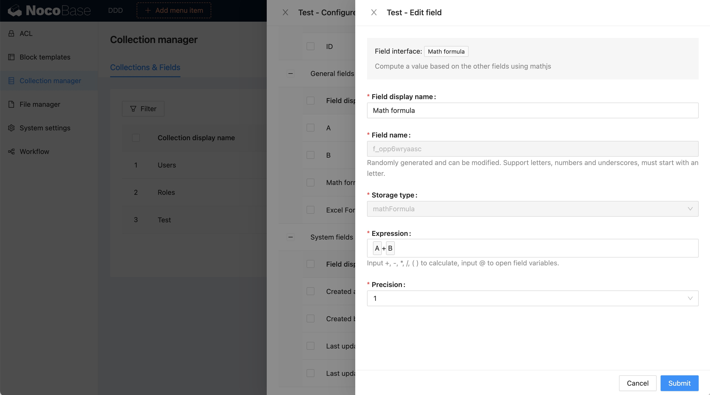
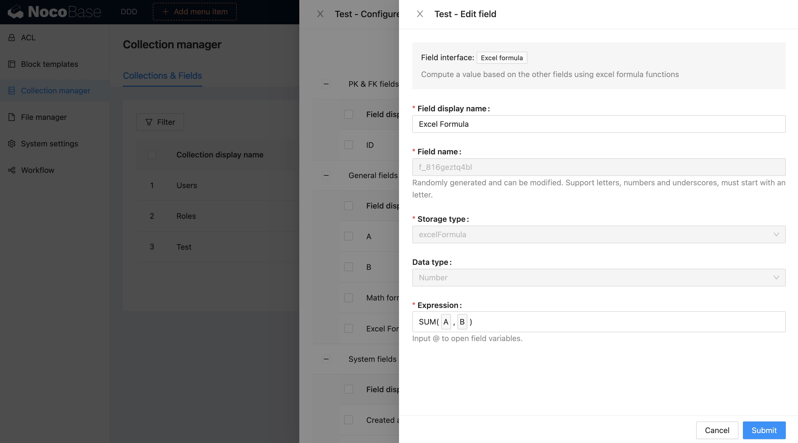

# Версия 0.9.0
# Плагины формул для полей

NocoBase предоставляет два плагина для работы с формулами:

1. `@nocobase/plugin-math-formula-field` - Математические формулы  
2. `@nocobase/plugin-excel-formula-field` - Excel-формулы (спасибо [azriel46d](https://github.com/nocobase/nocobase/pull/906) за вклад)

## Математические формулы

Реализовано на базе [Math.js](https://mathjs.org/). Основные возможности:
- Гибкий парсер выражений с поддержкой символьных вычислений
- Множество встроенных функций и констант
- Работа с разными типами данных: числа, большие числа, комплексные числа, дроби, единицы измерения, матрицы

Примеры:
```ts
import { evaluate } from 'mathjs';
evaluate('1.2 * (2 + 4.5)'); // 7.8
evaluate('12.7 cm to inch'); // 5 inch
evaluate('sin(45 deg) ^ 2'); // 0.5
evaluate('9 / 3 + 2i'); // 3 + 2i
evaluate('det([-1, 2; 3, 1])'); // -7
```



## Excel-формулы

Реализовано на базе [Formula.js](https://formulajs.info/). Подробнее:  
[Функции Formula.js](https://formulajs.info/functions/)

Примеры:
```ts
SUM(-5, 15, 32); // 42
IF(true, 'Hello!', 'Goodbye!'); // Hello!
```


