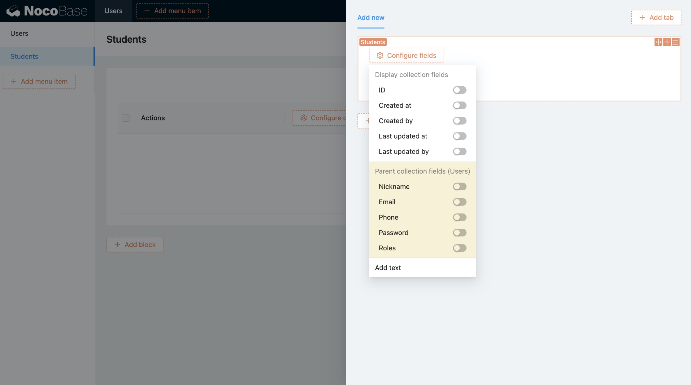

# Версия 0.9.0 
# Наследование таблиц

Наследование таблиц реализовано на основе [синтаксиса INHERITS в PostgreSQL](https://www.postgresql.org/docs/current/tutorial-inheritance.html) и доступно только при установке NocoBase с PostgreSQL.

## Пример

Рассмотрим систему обучения с тремя типами пользователей: ученики, родители и учителя.

Без наследования потребовалось бы создать отдельные таблицы:
- **Ученики**: имя, возраст, пол, ID-номер
- **Родители**: имя, возраст, пол, профессия, образование
- **Учителя**: имя, возраст, пол, стаж, семейное положение

С наследованием таблиц общие поля можно вынести в родительскую таблицу:
- **Пользователи** (базовая таблица): имя, возраст, пол
- **Ученики**: ID-номер (дополнительно к унаследованным полям)
- **Родители**: профессия, образование
- **Учителя**: стаж, семейное положение

ER-диаграмма представлена ниже:

**Ключевые особенности:**
1. Общие атрибуты хранятся один раз (в родительской таблице)
2. Дочерние таблицы автоматически получают все поля родителя
3. Поддержка полиморфных запросов через родительскую таблицу


Примечание:

ID дочерних таблиц и родительской таблицы используют общую последовательность (shared sequence)

Настройка наследования таблиц

В поле Inherits выберите таблицу, от которой нужно унаследовать структуру:


Настройка с помощью кода осуществляется следующим образом：

```ts
db.collection({
  name: 'users',
});

db.collection({
  name: 'students',
  inherits: 'users',
});
```

Внимание：

-Унаследованные таблицы не могут быть выбраны произвольно. Первичный ключ должен быть уникальной последовательностью, такой как uuid или последовательность самоустанавливающихся идентификаторов, для всех таблиц в унаследованной строке используется один и тот же ключ.
-Параметр Inherits не может быть изменен
-Если существует связь наследования, унаследованная родительская таблица не может быть удалена

## Список полей спецификации

Унаследованные поля родительской таблицы отображаются синхронно в списке полей. Поля родительской таблицы нельзя изменить, но их можно переопределить.


Меры предосторожности при перезаписи полей родительской таблицы：

-Идентификация поля дочерней таблицы переписывается, если оно совпадает с полем родительской таблицы
-Тип поля для перезаписи должен быть согласованным
-Параметры поля взаимосвязи, отличные от целевой коллекции, должны быть согласованными

## Дочерний табличный блок родительской таблицы

Блок дочерней таблицы может быть сконфигурирован в блоке родительской таблицы


## Добавьте конфигурацию унаследованного поля родительской таблицы

При наличии унаследованной родительской таблицы при настройке полей будет предоставлена конфигурация полей, унаследованных от родительской таблицы


