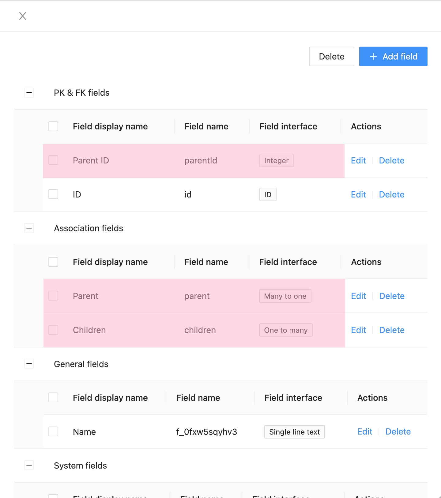
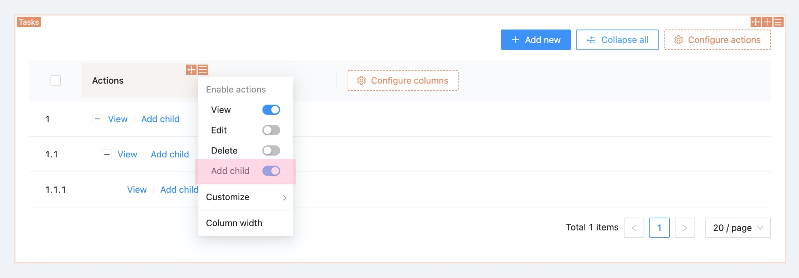

# Древовидная коллекция

## Варианты коллекции

```ts
{
  name: 'categories',
  tree: 'adjacency-list',
  fields: [
    {
      type: 'belongsTo',
      name: 'parent',
      treeParent: true,
    },
    {
      type: 'hasMany',
      name: 'children',
      treeChildren: true,
    },
  ],
}
```

## Пользовательский интерфейс

### Создать древовидную коллекцию


### Поля по умолчанию



### Табличный блок


### Добавить дочерний элемент



### Раскрыть/свернуть


