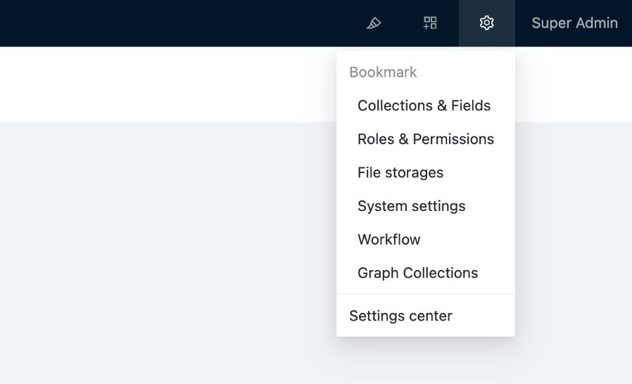

# Версия 0.8: 2022-11-01

Начиная с версии 0.8, NocoBase начинает предоставлять доступ к менеджеру плагинов и документации по разработке. Вот основные изменения в версии 0.8.

## Изменения в правом верхнем углу интерфейса

- Редактор пользовательского интерфейса
- Менеджер плагинов
- Центр настроек
- Персональный центр



## Новый менеджер плагинов

Версия 0.8 предоставляет мощный менеджер плагинов для управления плагинами без использования кода.

### Поток управления плагинами


### Интерфейс менеджера плагинов

В настоящее время он в основном используется для отключения, активации и удаления локальных плагинов. Встроенные плагины удалить невозможно.


### Команда менеджера плагинов

Помимо возможности активировать и отключать плагины из интерфейса без использования кода, вы также можете более полно управлять плагинами из командной строки.

```
# Создаем плагин
yarn pm create hello
# Регистрируем плагин
yarn pm add hello
# Активируем плагин
yarn pm enable hello
# Отключаем плагин
yarn pm disable hello
# Удаляем плагин
yarn pm remove hello

```

Примечание: Релизы и обновления для плагинов будут поддерживаться в последующих версиях.

```
# Publish the plugin
yarn pm publish hello
# Publish the plugin
yarn pm upgrade hello

```

Дополнительные примеры плагинов смотрите в разделе [пакеты/примеры](https://github.com/nocobase/nocobase/tree/main/packages/samples).

## Изменения в плагине

### Структура каталогов плагина

```
|- /hello
  |- /src
    |- /client      # Plugin client
    |- /server      # Plugin server
  |- client.d.ts
  |- client.js
  |- package.json   # Plugin package information
  |- server.d.ts
  |- server.js

```

### Спецификация имени плагина

Плагин NocoBase также является пакетом NPM, правило соответствия между именем плагина и именем пакета NPM таково: `${PLUGIN_PACKAGE_PREFIX}-${PluginName}`.

`PLUGIN_PACKAGE_PREFIX` - это префикс пакета плагина, который можно настроить в `.env`, [нажмите здесь, чтобы ознакомиться с описанием PLUGIN_PACKAGE_PREFIX](https://www.notion.so/api/env#plugin_package_prefix).

Например, проект с именем `my-nocobase-app` добавляет плагин `hello` с именем пакета `@my-nocobase-app/plugin-hello`.

`PLUGIN_PACKAGE_PREFIX` настраивается следующим образом.

```
PLUGIN_PACKAGE_PREFIX=@nocobase/plugin-,@nocobase/preset-,@my-nocobase-app/plugin-

```

Соответствие между названиями плагинов и названиями пакетов таково:

- `users` название пакета плагина - `@nocobase/plugin-users`
- `nocobase` название пакета плагина - `@nocobase/preset-nocobase`
- `hello` название пакета плагина - `@my-nocobase-app/plugin-hello`

### Жизненный цикл плагина

Версия 0.8 обеспечивает более полный подход к жизненному циклу плагина.

```
import { InstallOptions, Plugin } from '@nocobase/server';

export class HelloPlugin extends Plugin {
  afterAdd() {
    // After the plugin has been added via pm.add
  }

  beforeLoad() {
    // Before all plugins are loaded, generally used to register classes and event listeners
  }

  async load() {
    // Load configuration
  }

  async install(options?: InstallOptions) {
    // Install logic
  }

  async afterEnable() {
    // After activation
  }

  async afterDisable() {
    // After disable
  }

  async remove() {
    // Remove logic
  }
}

export default HelloPlugin;

```

### Интерфейсный и серверный вход для плагинов

Жизненный цикл плагина контролируется сервером:

```
import { Application } from '@nocobase/server';

const app = new Application({
  // ...
});

class MyPlugin extends Plugin {
  afterAdd() {}
  beforeLoad() {}
  load() {}
  install() {}
  afterEnable() {}
  afterDisable() {}
  remove() {}
}

app.plugin(MyPlugin, { name: 'my-plugin' });

```

Клиентская часть плагина существует в виде контекста. Провайдер (аналогично промежуточному программному обеспечению на стороне сервера)

```
import React from 'react';
import { Application } from '@nocobase/client';

const app = new Application({
  apiClient: {
    baseURL: process.env.API_BASE_URL,
  },
  dynamicImport: (name: string) => {
    return import(`../plugins/${name}`);
  },
});

// When you visit the /hello page, it displays Hello world!
const HelloProvider = React.memo((props) => {
  const location = useLocation();
  if (location.pathname === '/hello') {
    return <div>Hello world!</div>
  }
  return <>{props.children}</>
});
HelloProvider.displayName = 'HelloProvider'

app.use(HelloProvider);

```

## Пользовательский бизнес-код

Плагины версии 0.7 не являются полными, пользовательский бизнес-код может быть разбросан по `пакетам/приложению/клиенту` и `пакетам/приложению/серверу`, что не способствует обновлению и обслуживанию. В версии 0.8 рекомендуется организовать его в виде пакета плагинов и использовать `yarn pm` для управления плагинами.

## Предоставляется более полная документация

- **Добро пожаловать**: краткий обзор NocoBase
- **Руководство**: узнайте больше об основных функциях, предоставляемых платформой NocoBase
- **Руководство по разработке плагинов**: Углубленное изучение разработки плагинов
- **Ссылка на API**: Проверьте использование API при разработке плагинов
- **Библиотека клиентских компонентов** (в стадии подготовки): содержит примеры использования компонентов NocoBase

## Приведены дополнительные примеры плагинов

- [команда](https://github.com/nocobase/nocobase/tree/develop/packages/samples/command)
- [пользовательский блок](https://github.com/nocobase/nocobase/tree/develop/packages/samples/custom-block)
- [пользовательская страница](https://github.com/nocobase/nocobase/tree/develop/packages/samples/custom-page)
- [custom-signup-page](https://github.com/nocobase/nocobase/tree/develop/packages/samples/custom-signup-page)
- [привет](https://github.com/nocobase/nocobase/tree/develop/packages/samples/hello)
- [ограничение по ставке](https://github.com/nocobase/nocobase/tree/develop/packages/samples/ratelimit)
- [действия в магазине](https://github.com/nocobase/nocobase/tree/develop/packages/samples/shop-actions)
- [магазин-события](https://github.com/nocobase/nocobase/tree/develop/packages/samples/shop-events)
- [магазин-i18n](https://github.com/nocobase/nocobase/tree/develop/packages/samples/shop-i18n)
- [магазин-моделирование](https://github.com/nocobase/nocobase/tree/develop/packages/samples/shop-modeling)

## Другие новые возможности и функционал

- Импорт из Excel
- Массовое обновление и редактирование
- Графическая коллекция
- Поддержка рабочего процесса для просмотра истории выполнения
- Поле JSON
