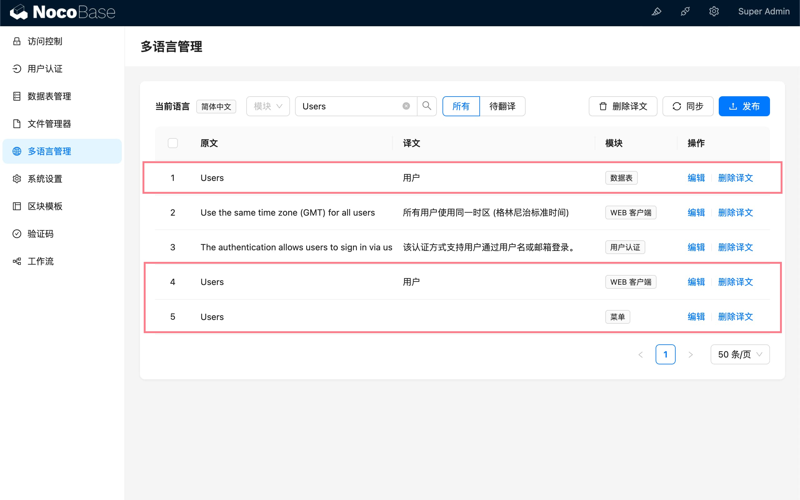

# 0.17.0-alpha.3

## 本地化管理

### 背景

参考 <a target="_blank" href="https://blog-cn.nocobase.com/posts/organize-text-namespaces-by-modules-in-localization-management/">更新（多语言管理）：按照模块划分翻译文本的命名空间</a>

### 翻译文本不去重

不同模块重复的文本不再只保留一个，需要分别添加对应的翻译



### `i18n` 实例移除 `fallbackNS` 选项

客户端 `i18n` 实例化不再配置 `fallbackNS: "client"`. 对于插件开发者，如果插件的多语言文件中省略了部分内核客户端中已有的文本，需要进行补充。如果还是想复用 `packages/core/client/src/locale` 中已有的内容，需要在使用的时候传递参数，例如：

```ts
import { useTranslation } from 'react-i18next';

export const NAMESPACE = 'localization-management';

export const useLocalTranslation = () => {
  return useTranslation([NAMESPACE, 'client'], { nsMode: 'fallback' });
};
```
