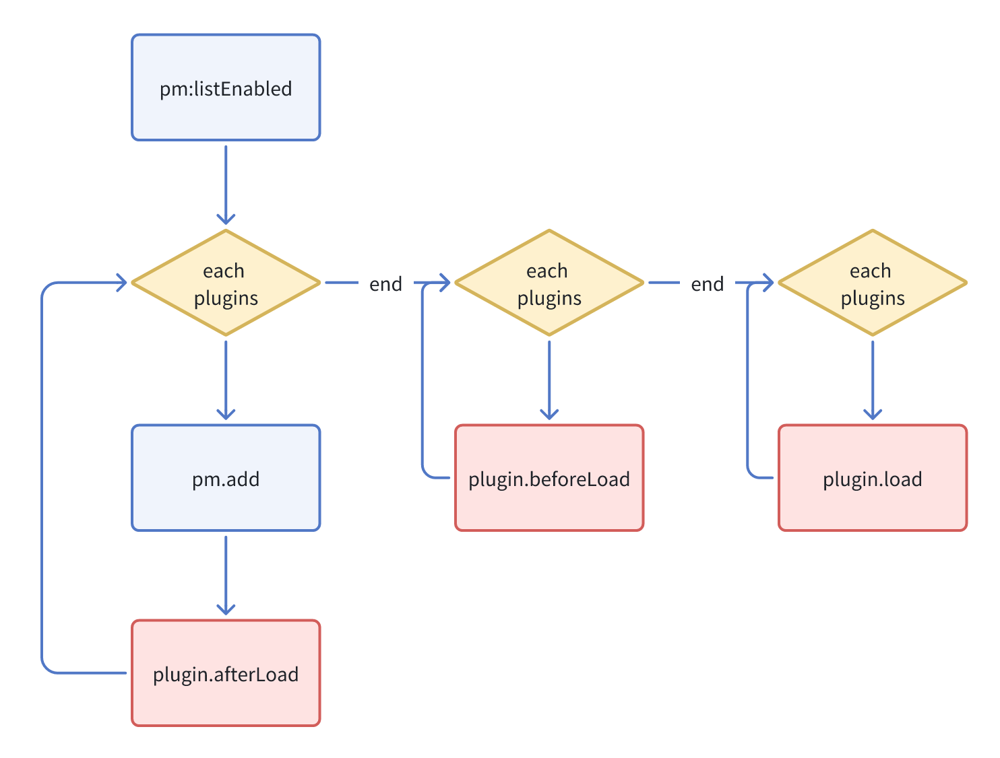

# 概述

## 目录结构

初始化的空插件，服务端相关目录结构如下：

```bash
|- /plugin-sample-hello
  |- /src
    |- /client      # 插件服务端代码
      |- plugin.tsx  # 插件类
      |- index.ts   # 服务端入口
  |- client.d.ts
  |- client.js
```

## Plugin

`plugin.tsx` 提供了插件生命周期的各种方法的调用

```ts
import { Plugin } from '@nocobase/client';

export class PluginSampleHelloClient extends Plugin {
  async afterAdd() {}

  async beforeLoad() {}

  async load() {}
}

export default PluginSampleHelloClient;
```

## 插件的生命周期



- 在插件初始化之后，触发 `afterAdd`，在 `afterAdd` 里其他插件不一定都实例化
- 在 `beforeLoad` 里所有已激活的插件都实例化了，可以通过 `app.pluginManager.get()` 获取到实例
- 在 `load` 里，所有插件的 `beforeLoad` 方法都已执行

## 插件类里常用的属性及方法

| API                          | 教程              |
| ---------------------------- | ----------------- |
| app.i18n                     | 国际化            |
| app.apiClient                | API 客户端        |
| app.pluginManager            | 插件管理器        |
| app.router                   | 路由管理          |
| app.pluginSettingsManager    | 插件配置页        |
| app.schemaInitializerManager | API 请求          |
| app.schemaSettingsManager    | UI Schema         |
| app.addProviders             | Provider 和上下文 |
| app.addComponents            | -                 |
| app.addScopes                | -                 |

## 组件里常用的 React hooks

| API            | 教程       |
| -------------- | ---------- |
| useApp()       | -          |
| usePlugin()    | -          |
| useAPIClient() | API 客户端 |
| useRequest()   | API 客户端 |
