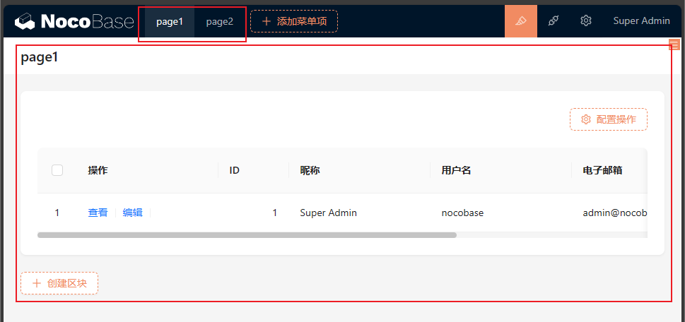
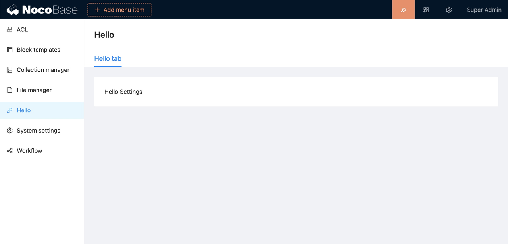

# 页面路由及扩展

NocoBase 客户端通过 `app.router.add` 扩展页面，例如：

```tsx | pure
import { Application, Plugin } from '@nocobase/client';
import React from 'react';

class PluginHello extends Plugin {
  async load() {
    this.router.add('hello', {
      path: '/',
      Component: () => <div>Hello NocoBase</div>,
    });
  }
}
```

可以通过 `app.router.getRoutes()` 方法，查看所有已经注册的页面

```tsx | pure
import { Application, Plugin } from '@nocobase/client';
import React from 'react';

class PluginHello extends Plugin {
  async load() {
    console.log(this.app.router.getRoutes());
  }
}
```

## 已有页面路由

初始安装的 NocoBase，已注册的页面路由有：

| 名称           | 路径               | 组件                |
| -------------- | ------------------ | ------------------- |
| admin          | /admin/\*          | AdminLayout         |
| admin.page     | /admin/:name       | AdminDynamicPage    |
| admin.settings | /admin/settings/\* | AdminSettingsLayout |

### AdminLayout

```ts
router.add('admin.page', {
  path: '/admin/*',
  Component: AdminLayout,
});
```

### AdminDynamicPage

```ts
router.add('admin.page', {
  path: '/admin/:name',
  Component: AdminDynamicPage,
});
```

由菜单管理动态页面，通过添加菜单项 -> 页面添加



### AdminSettingsLayout

```typescript
router.add('admin.settings', {
  path: '/admin/settings/*',
  Component: AdminSettingsLayout,
});
```

插件配置页



插件配置页的菜单及标签页通过 `app.pluginSettingsManager` 注册。

## 页面扩展

- 动态 Schema 页面，通过 `添加菜单项` -> `页面` 添加
- 常规页面通过 `app.router.add` 添加
- 插件设置页通过 `app.pluginSettingsManager.add` 添加

### 动态 Schema 页面

通过 `添加菜单项` -> `页面` 添加

### 插件设置页扩展

插件设置页通过 `app.pluginSettingsManager.add` 添加

### 常规页面扩展

通过 `app.router.add` 扩展页面路由

```typescript
import React from 'react';
import { Link, Outlet } from 'react-router-dom';
import { Application, Plugin } from '@nocobase/client';

const Home = () => <h1>Home</h1>;
const About = () => <h1>About</h1>;

const Layout = () => {
  return (
    <div>
      <div>
        <Link to={'/'}>Home</Link>, <Link to={'/about'}>About</Link>
      </div>
      <Outlet />
    </div>
  );
};

class MyPlugin extends Plugin {
    async load() {
        this.app.router.add('root', {
          element: <Layout />,
        });

        this.app.router.add('root.home', {
          path: '/',
          element: <Home />,
        });

        this.app.router.add('root.about', {
          path: '/about',
          element: <About />,
        });
    }
}

const app = new Application({
  router: {
    type: 'memory',
    initialEntries: ['/'],
  },
  plugins: [MyPlugin]
});


export default app.getRootComponent();
```
