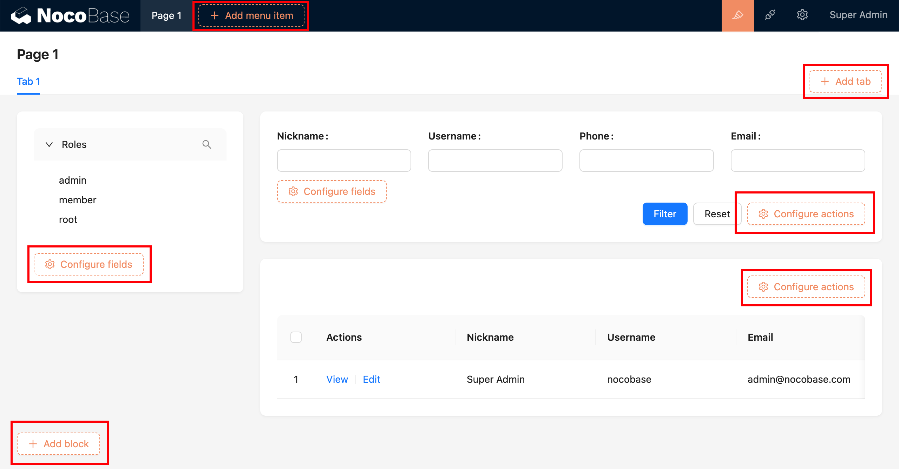
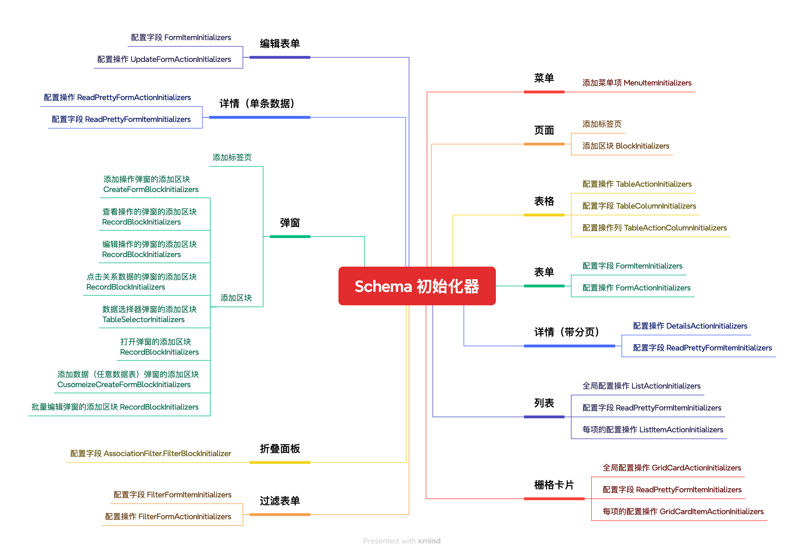

# SchemaInitializer 初始化器

当激活 UI 配置之后，界面上直观可见的各种橙色按钮就是 SchemaInitializer 初始化器，用于向界面内添加各种区块、字段、操作等。



## 常用的初始化器



## 向已有的初始化器里添加项

使用 `schemaInitializerManager.addItem()` 方法添加

```ts
class PluginSampleSchemaInitializer extends Plugin {
  async load() {
    const customItem = {
      type: 'item',
      useComponentProps() {
        const { insert } = useSchemaInitializer();
        const handleClick = () => {
          insert({
            type: 'void',
            'x-decorator': 'CardItem',
            'x-component': 'Hello',
          });
        };
        return {
          title: '测试项',
          onClick: handleClick,
        };
      },
    };
    this.schemaInitializerManager.addItem(
      'BlockInitializers',
      'otherBlocks.test1',
      customItem,
    );
  }
}
```

## 新注册一个初始化器

### 在插件的 load 方法中添加

```ts
class PluginSampleSchemaInitializer extends Plugin {
  async load() {
    const myInitializer = new SchemaInitializer({
      name: 'myInitializer',
      title: 'Add block',
      items: [
        {
          name: 'demo',
          type: 'item',
          title: 'Demo',
        },
      ],
    });
    this.schemaInitializerManager.add(myInitializer);
  }
}
```

### 在特定 Schema 中使用

SchemaInitializer 用于 Schema 的 `x-initializer` 参数中，通用的 Schema 组件中，Grid、ActionBar、Tabs 支持 x-initializer 参数。例如：

```ts
{
  type: 'void',
  'x-component': 'Grid',
  'x-initializer': 'myInitializer',
}
```

### 自主渲染初始化器按钮

自定义的组件中，可以使用 [useSchemaInitializerRender()](#) 自主处理 x-initializer 的渲染，详细用法参考 [SchemaInitializer API](#)。

## API 参考

- [SchemaInitializerManager](/)
- [SchemaInitializer](/)
