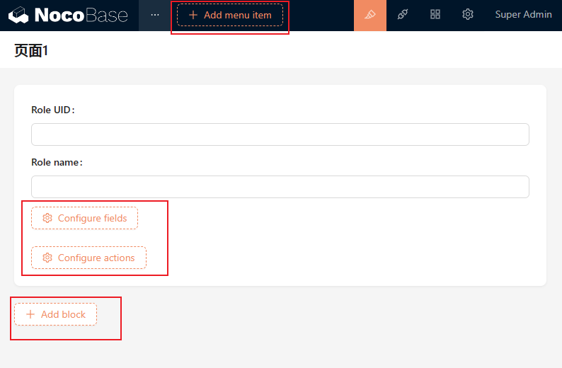
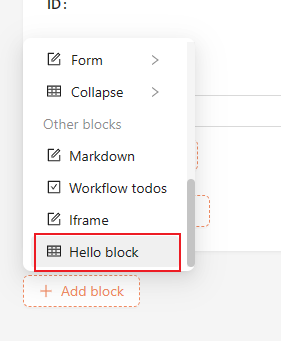
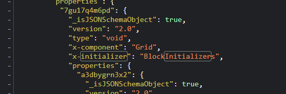
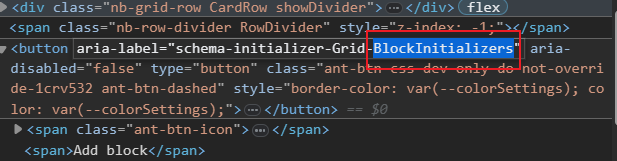

# SchemaInitializer 初始化器



SchemaInitializer 添加器就是用来往当前 Schema 节点前后插入内容的工具，整体的逻辑就是当点击对应的按钮后，通过上下文提供的 `insert` 方法，将新的 Schema 插入到对应的位置。

具体的 API 参考：[SchemaSettings](https://client.docs.nocobase.com/core/ui-schema/schema-initializer) 和 [SchemaSettingsManager](https://client.docs.nocobase.com/core/ui-schema/schema-initializer-manager)

### 定义、注册和渲染

完整实现一个 SchemaInitializers 需要有三个步骤：

1. 使用 `new SchemaInitializer()` <strong>定义</strong>一个 SchemaInitializer
2. 在插件中通过 `app.schemaInitializerManager` 进行<strong>注册</strong>
3. 通过 `useSchemaInitializerRender()` 进行<strong>渲染</strong>

```typescript
// 1.使用 new SchemaInitializer() 定义一个 SchemaInitializer
const myInitializer = new SchemaInitializer({
  name: 'MyInitializer',
  title: 'Button Text',
  items: [
    {
      name: 'demo1',
      Component: () => <div>myInitializer content</div>,
    },
    {
      name: 'demo2',
      Component: () => <div>myInitializer content 2</div>,
    },
  ],
});

class MyPlugin extends Plugin {
    async load() {
        // 2. 通过 app.schemaInitializerManager 进行注册
        this.app.schemaInitializerManager.add(mySettings)
    }
}

const MyDesigner = () => {
    const fieldSchema = useFieldSchema();
    // 3. 通过 useSchemaInitializerRender() 进行渲染
    const { render } = useSchemaInitializerRender(fieldSchema['x-initializer'], fieldSchema['x-initializer-props']);
    return <div>
        {render()}
    </div>
}
```

```typescript
import {
  Application,
  Plugin,
  SchemaInitializer,
  useSchemaInitializerRender,
} from '@nocobase/client';
import React from 'react';

const myInitializer = new SchemaInitializer({
  name: 'MyInitializer',
  designable: true,
  title: 'Button Text',
  items: [
    {
      name: 'demo1',
      Component: () => <div>myInitializer content</div>,
    },
    {
      name: 'demo2',
      Component: () => <div>myInitializer content 2</div>,
    },
  ],
});

const Root = () => {
  const { render } = useSchemaInitializerRender('MyInitializer');
  return <div>{render()}</div>;
};

class MyPlugin extends Plugin {
  async load() {
      this.app.schemaInitializerManager.add(myInitializer);
  }
}

const app = new Application({
  prodivers: [Root],
  plugins: [MyPlugin],
});

export default app.getRootComponent();
```

### 结合 Schema

```typescript
import React from 'react';
import {
  Application,
  Plugin,
  SchemaComponent,
  SchemaComponentProvider,
  SchemaInitializer,
  useSchemaInitializer,
  useSchemaInitializerItem,
  useSchemaInitializerRender,
} from '@nocobase/client';
import { observer, useField } from '@formily/react';
import { Field } from '@formily/core';

const Hello = observer(() => {
  const field = useField<Field>();
  return (
    <div <em>style</em>={{ marginBottom: 20, padding: '0 20px', height: 50, lineHeight: '50px', background: '#f1f1f1' }}>
      {field.title}
    </div>
  );
});

function Demo() {
  const itemConfig = useSchemaInitializerItem();
  <em>// 调用插入功能</em>
  const { insert } = useSchemaInitializer();
  const handleClick = () => {
    insert({
      type: 'void',
      title: itemConfig.title,
      'x-component': 'Hello',
    });
  };
  return <div <em>onClick</em>={handleClick}>{itemConfig.title}</div>;
}

const myInitializer = new SchemaInitializer({
  name: 'MyInitializer',
  title: 'Add Block',
  <em>// 插入位置</em>
  insertPosition: 'beforeEnd',
  items: [
    {
      name: 'a',
      title: 'Item A',
      Component: Demo,
    },
    {
      name: 'b',
      title: 'Item B',
      Component: Demo,
    },
  ],
});

const AddBlockButton = observer(() => {
  const { render } = useSchemaInitializerRender('MyInitializer');
  return render();
});

const Page = observer(
  (props) => {
    return (
      <div>
        {props.children}
        <AddBlockButton />
      </div>
    );
  },
  { displayName: 'Page' },
);

const Root = () => {
  return (
    <div>
      <SchemaComponentProvider <em>designable</em>>
        <SchemaComponent
          <em>components</em>={{ Page, Hello, AddBlockButton }}
          <em>schema</em>={{
            type: 'void',
            name: 'page',
            'x-component': 'Page',
            properties: {
              hello1: {
                type: 'void',
                title: 'Test1',
                'x-component': 'Hello',
              },
              hello2: {
                type: 'void',
                title: 'Test2',
                'x-component': 'Hello',
              },
            },
          }}
        ></SchemaComponent>
      </SchemaComponentProvider>
    </div>
  );
};

class MyPlugin extends Plugin {
  async load() {
    this.app.schemaInitializerManager.add(myInitializer);
    this.app.router.add('root', {
      path: '/',
      Component: Root,
    });
  }
}

const app = new Application({
  router: {
    type: 'memory',
    initialEntries: ['/'],
  },
  plugins: [MyPlugin],
});

export default app.getRootComponent();
```

### 扩展已有的 SchemaInitializer



很多情况下我们都是扩展已有的 SchemaInitializer，例如往 `Add block` 这个对应的 Initializer 中添加一项。具体的操作操作步骤如下：

1. 通过 `addItem` 实现往列表中添加内容
2. 实现列表项组件

name 可以从 Schema 接口中获取到，或者开发者控制台。





```typescript
import { Plugin,  } from '@nocobase/client';

// 2.实现列表项组件
const schema = {
  type: 'void',
  'x-component': 'CardItem',
  properties: {
    hello: {
      type: 'void',
      'x-component': 'div',
      'x-content': 'Hello World',
    },
  },
}
const HelloInitializer = () => {
    const { insert } = useSchemaInitializer<strong>()</strong>;
    // SchemaInitializerItem 提供了基本的样式
    return <SchemaInitializerItem
      title='Hello Block'
      onClick={() => {
          insert(schema); // 点击时，插入 Schema
      }}
    />
}


class MyPlugin extends Plugin {
    async load() {
       // 1. 通过 addItem 实现往列表中添加内容

       // BlockInitializers 为列表的名字
       // otherBlocks.hello 中 otherBlocks 是父级的 name，hello 为自身的 name
       this.app.schemaInitializerManager.addItem('BlockInitializers', 'otherBlocks.hello', {
           Component: HelloInitializer,
       })
    }
}
```

### 动态显示隐藏和动态列表

我们可以使用 `useVisible()` 实现动态显示、隐藏某列表项，通过 `useChildren()` 通过获取列表。

```typescript
import {
  Application,
  Plugin,
  SchemaComponentPlugin,
  SchemaInitializer,
  useSchemaInitializerRender,
} from '@nocobase/client';
import React from 'react';

const myInitializer = new SchemaInitializer({
  name: 'MyInitializer',
  designable: true,
  title: 'Button Text',
  items: [
    {
      name: 'a',
      type: 'itemGroup',
      title: 'Group a',
      <em>// 动态加载子项</em>
      useChildren() {
        return [
          {
            name: 'a1',
            type: 'item',
            title: 'A 1',
            onClick: () => {
              alert('a-1');
            },
          },
          {
            name: 'a2',
            type: 'item',
            title: 'A 2',
          },
        ];
      },
    },
    {
      name: 'divider',
      type: 'divider',
    },
    {
      name: 'b',
      type: 'item',
      title: 'Item B',
      useVisible() {
        return false;
      },
    },
    {
      name: 'c',
      type: 'item',
      title: 'Item C',
      useVisible() {
        return true;
      },
    },
  ],
});

const Root = () => {
  const { render } = useSchemaInitializerRender('MyInitializer');
  return <div>{render()}</div>;
};

class MyPlugin extends Plugin {
  async load() {
    this.app.schemaInitializerManager.add(myInitializer);
    this.app.router.add('root', {
      path: '/',
      Component: Root,
    });
  }
}

const app = new Application({
  router: {
    type: 'memory',
    initialEntries: ['/'],
  },
  plugins: [MyPlugin, SchemaComponentPlugin],
});

export default app.getRootComponent();
```
