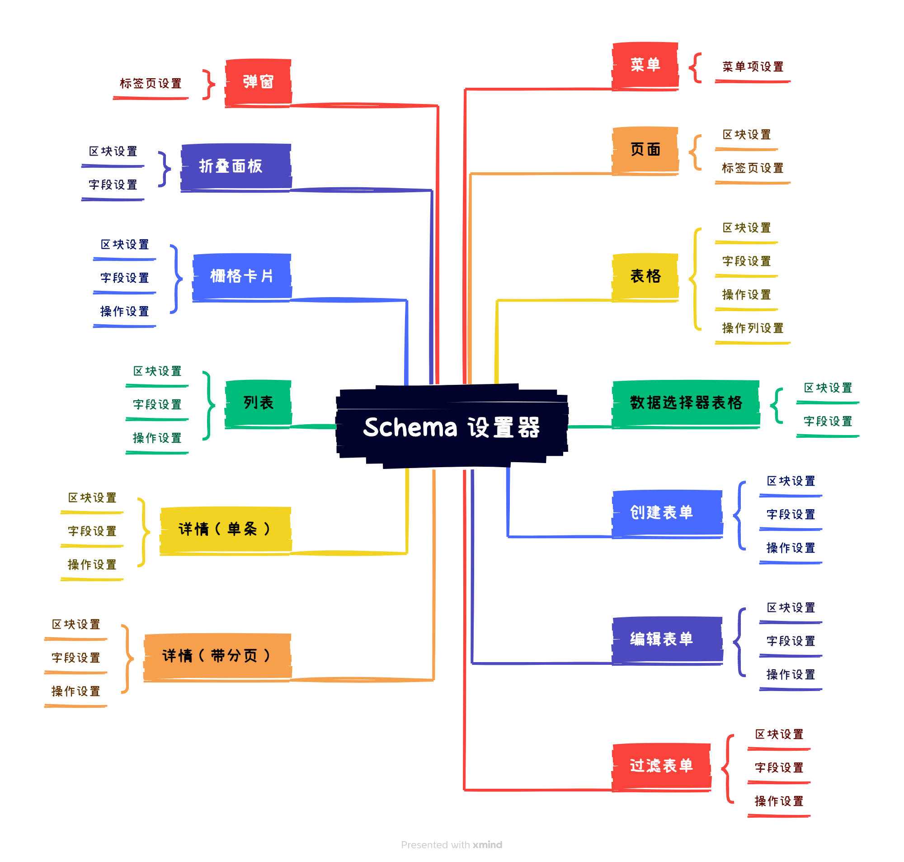

# SchemaSettings 设置器

激活 UI 配置之后，鼠标移动到指定区块、字段、操作上方时，会显示对应的 Schema 工具栏，工具栏的设置按钮就是当前 Schema 的设置器。


## 内置的设置器



## 向已有的设置器里添加设置项

推荐使用 `schemaSettingsManager.addItem()` 方法添加设置项，item 的详细配置参考 [SchemaSettings Item API](#)

```ts
class PluginDemoAddSchemaSettingsItem extends Plugin {
  async load() {
    this.schemaSettingsManager.addItem(
      'mySettings', // 示例，已存在的 schema settings
      'customItem',
      {
        type: 'item',
        useComponentProps() {},
      },
    );
  }
}
```

<code src="./demos/schema-settings-manager-add-item/index.tsx"></code>

## 添加新的设置器

SchemaSettings 的详细参数参考 [SchemaSettingsOptions API](https://client.docs-cn.nocobase.com/core/ui-schema/schema-settings#new-schemasettingsoptions)

```ts
const mySettings = new SchemaSettings({
  // 必须是唯一标识
  name: 'mySettings',
  // 下拉菜单项
  items: [
    {
      name: 'edit',
      type: 'item',
      useComponentProps() {},
    },
  ],
});
```

### 在插件的 load 方法中添加

推荐使用 `schemaSettingsManager.add()` 将新增的设置器添加到应用里

```ts
class PluginDemoAddSchemaSettings extends Plugin {
  async load() {
    // 注册全局组件
    this.app.addComponents({ CardItem, HomePage });
    const mySettings = new SchemaSettings({
      name: 'mySettings',
      items: [
        {
          type: 'item',
          name: 'edit',
          useComponentProps() {
            // TODO: 补充相关设置逻辑
            return {
              title: 'Edit',
              onClick() {
                // todo
              },
            };
          },
        },
      ],
    });
    this.schemaSettingsManager.add(mySettings);
  }
}
```

### 如何使用新添加的设置器

添加进来的 SchemaSettings，可以用于 Schema 的 `x-settings` 参数中，并不是所有的组件都支持 `x-settings`，通常需要和 BlockItem、FormItem、CardItem 这类包装器组件结合使用。自定义的组件中，也可以使用 `useSchemaSettingsRender()` 自主处理 `x-settings` 的渲染。

#### 现有支持 `x-settings` 的 Schema 组件

大部分场景 `x-settings` 需要和 BlockItem、FormItem、CardItem 这类包装器组件结合使用。例如：

```ts
{
  type: 'void',
  'x-settings': 'mySettings',
  'x-decorator': 'CardItem',
  'x-component': 'Hello',
}
```

<code src="./demos/schema-settings-manager-add/index.tsx"></code>

#### 自定义组件如何支持 `x-settings` 参数

如果 BlockItem、FormItem、CardItem 这类包装器组件并不满足需求时，也可以使用 `useSchemaSettingsRender()` 处理 `x-settings` 的渲染。

<code src="./demos/use-schema-settings-render/index.tsx"></code>

大部分场景 settings 都是放在 SchemaToolbar 上的，所以为自定义组件支持 `x-toolbar`，也可以变相的支持 `x-settings`，更多用法参考 [Schema 工具栏](/development/client/ui-schema/toolbar)

<code src="./demos/schema-toolbar-basic/button.tsx"></code>

## 如何实现 Schema 的设置？

通过 `useSchemaSettings()` 获取当前 Schema 的 `Designable`，通过 `Designable` 来操作 Schema，常用 api 有

- `dn.insertAdjacent()`
- `dn.getSchemaAttribute()`
- `dn.shallowMerge()`
- `dn.deepMerge()`
- `dn.findOne()`
- `dn.find()`
- `dn.remove()`
- `dn.remove()`

更多细节参考

- [Designable 设计器](/development/client/ui-schema/designable)
- [Designable API](https://client.docs-cn.nocobase.com/core/ui-schema/designable)

<code src="./demos/schema-settings-basic/index.tsx"></code>

## API 参考

- [SchemaSettingsManager](https://client.docs-cn.nocobase.com/core/ui-schema/schema-settings-manager)
- [SchemaSettings](https://client.docs-cn.nocobase.com/core/ui-schema/schema-settings)
- [Designable](https://client.docs-cn.nocobase.com/core/ui-schema/designable)