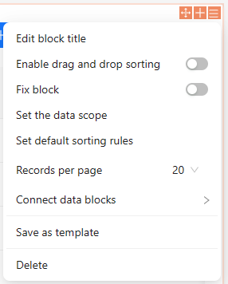
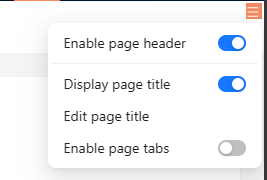

# SchemaSettings 设置器



SchemaSettings 用于设置区块的相关信息，比如上图中的设置标题、设置 Table 的分页数量等。

具体的 API 参考：[SchemaSettings](https://client.docs.nocobase.com/core/ui-schema/schema-settings) 和 [SchemaSettingsManager](https://client.docs.nocobase.com/core/ui-schema/schema-settings-manager)

## 定义、注册和渲染

完整实现一个 SchemaSettings 需要有三个步骤：

1. 使用 `new SchemaSetting()` <strong>定义</strong>一个 SchemaSettings
2. 在插件中通过 `app.schemaSettingsManager` 进行<strong>注册</strong>
3. 通过 `useSchemaSettingsRender()` 进行<strong>渲染</strong>

> 关于 API 的具体参数，请查看文章开头的链接

```typescript
// 1.使用 new SchemaSetting() 定义一个 SchemaSettings
const mySettings = new SchemaSetting({
    name: 'MySettings',
    items: [
        // 定义方式1：使用 type + componentProps/usComponentProps（仅内置类型可以这样）
        {
            name: 'demo1',
            type: 'item',
            componentProps: {
                title: 'Demo'
            }
        },
        // 定义方式2：使用 Component + [componentProps/useComponent](可选)
        {
            name: 'demo2',
            Component: () => <SchemaSettings.Item <em>title</em>="DEMO2" />
        }
    ]
})

class MyPlugin extends Plugin {
    async load() {
        // 2. 通过 app.schemaSettingsManager 进行注册
        this.app.schemaSettingsManager.add(mySettings)
    }
}

const MyDesigner = () => {
    const fieldSchema = useFieldSchema();
    // 3. 通过 useSchemaSettingsRender() 进行渲染
    const { render } = useSchemaSettingsRender(fieldSchema['x-settings'], fieldSchema['x-settings-props']);
    return <div>
        {render()}
    </div>
}
```

```typescript
import React from 'react';
import { Application, Plugin, SchemaSetting, SchemaSettings, useSchemaSettingsRender } from '@nocobase/client';

const mySchemaSettings = new SchemaSetting({
  name: 'MySchemaSettings',
  items: [
    {
      name: 'demo1',
      type: 'item',
      componentProps: {
        title: 'DEMO1',
        onClick() {
          alert('DEMO1');
        },
      },
    },
    {
      name: 'demo2',
      Component: () => <SchemaSettings.Item <em>title</em>="DEMO2" <em>onClick</em>={() => alert('DEMO2')} />, <em>// 直接使用 Component 组件</em>
    },
  ],
});

const Root = () => {
  const { render } = useSchemaSettingsRender('MySchemaSettings');
  return <div>{render()}</div>;
};

class MyPlugin extends Plugin {
  async load() {
    this.app.schemaSettingsManager.add(mySchemaSettings);
  }
}

const app = new Application({
  plugins: [MyPlugin],
  providers: [Root],
});

export default app.getRootComponent();
```

## 扩展已有的 SchemaSettings



很多情况下我们都是扩展已有的 SchemaSettings，例如往 Page 对应的 Initializer 中添加一项。具体的操作操作步骤如下：

1. 通过 `addItem` 方法往可以添加新的列表项
2. 实现列表项组件

name 可以从 Schema 接口中获取到，或者开发者控制台。

```typescript
import { Plugin, SchemaSettings } from '@nocobase/client';

// 3.实现列表项组件
const HelloSetting = () => {
    // 用于操作 Schema
    const { dn } = useDesignable();
    // 当前节点 Schema
    const fieldSchema = useFieldSchema();

    // SchemaSettings.SwitchItem 提供了基本的样式
    return <SchemaSettings.SwitchItem
      title='Display page title'
      checked={!fieldSchema['x-component-props']?.hidePageTitle} // 当前状态
      onChange={(v) => {
        // 修改 Schema
        fieldSchema['x-component-props'] = fieldSchema['x-component-props'] || {};
        fieldSchema['x-component-props']['hidePageTitle'] = !v;

        // 更新到数据库
        dn.emit('patch', {
          schema: {
            ['x-uid']: fieldSchema['x-uid'],
            ['x-component-props']: fieldSchema['x-component-props'],
          },
        });

        // 刷新页面
        dn.refresh();
      }}
    />
}


class MyPlugin extends Plugin {
    async load() {
       // 1. 通过 addItem 方法添加新的列表项
       // PageSettings 是列表的名字
       // hello 是自己的名字
       this.app.schemaSettingsManager.addItem('PageSettings', 'hello', {
           Component: HelloSetting,
           // 如果这是一个公共组件，还可以添加其他属性
       })
    }
}
```

## Designer 上下文

如果 SchemaSettings 的 Item 需要使用了 Designer 的的内容，我们可以通过 `SchemaDesignerProvider` 进行传递， 然后使用 `useSchemaDesigner` 获取。

```typescript
import { SchemaSetting, SchemaSettings, SchemaDesignerProvider, SchemaDesignerProvider, useSchemaDesigner } from '@nocobase/client';

const MyDesigner = () => {
    const fieldSchema = useFieldSchema();
    const { render } = useSchemaSettingsRender(fieldSchema['x-settings']);
    return <SchemaDesignerProvider color='red'>
        {render()}
    </SchemaDesignerProvider>
}


const mySettings = new SchemaSetting({
    name: 'MySettings',
    items: [
        {
            name: 'demo1',
            type: 'item',
            useComponentProps() {
                const { color } = useSchemaDesigner();
                return {
                    title: color,
                }
            }
        },
        {
            name: 'demo2',
            Component: () => {
                const { color } = useSchemaDesigner();
                return <SchemaSettings.Item <em>title</em>={color} />;
            }
        }
    ]
})
```
