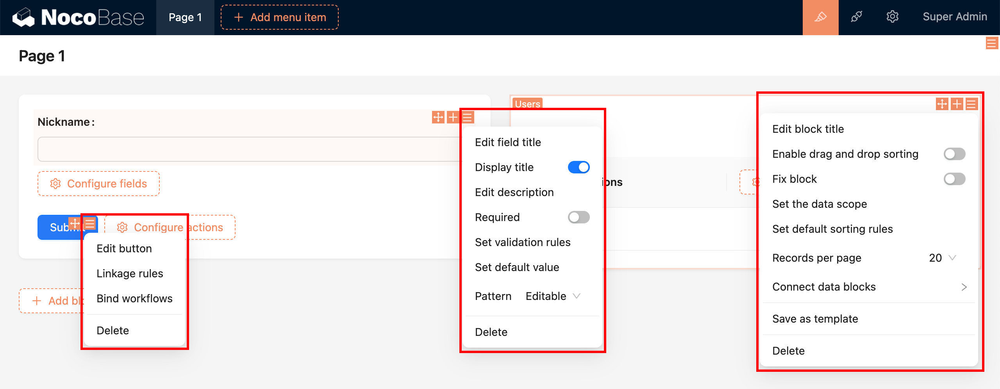
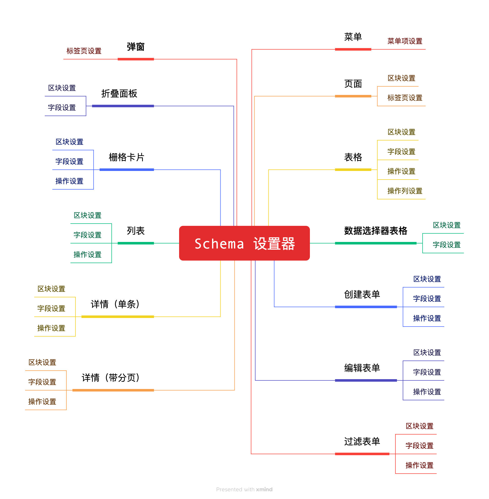

# SchemaSettings 设置器

激活 UI 配置之后，鼠标移动到指定区块、字段、操作上方时，会显示对应的 Schema 工具栏，工具栏的设置按钮就是当前 Schema 的设置器。



## 内置的设置器



## 向已有的设置器里添加设置项

推荐使用 `schemaSettingsManager.addItem()` 方法向已有设计器里添加设置项

```ts
class PluginSampleSchemaSettings extends Plugin {
  async load() {
    const customItem = {
      type: 'item',
      useComponentProps() {
        const { insert } = useSchemaSettings();
        const handleClick = () => {
          insert({
            type: 'void',
            'x-decorator': 'CardItem',
            'x-component': 'Hello',
          });
        };
        return {
          title: '测试项',
          onClick: handleClick,
        };
      },
    };
    this.schemaSettingsManager.addItem(
      'BlockInitializers',
      'otherBlocks.test1',
      customItem,
    );
  }
}
```

## 添加新的设置器

### 在插件的 load 方法中添加

推荐在插件 load 方法里使用 `schemaSettingsManager.add()` 方法添加设置器

```ts
class PluginSampleSchemaSettings extends Plugin {
  async load() {
    const myInitializer = new SchemaInitializer({
      name: 'myInitializer',
      title: 'Add block',
      items: [
        {
          name: 'demo',
          type: 'item',
          title: 'Demo',
        },
      ],
    });
    this.schemaSettingsManager.add(myInitializer);
  }
}
```

### 如何使用新添加的设置器

添加进来的 SchemaSettings，可以用于 Schema 的 `x-settings` 参数中，并不是所有的组件都支持 `x-settings`，通常需要和 BlockItem、FormItem、CardItem 这类包装器组件结合使用。自定义的组件中，也可以使用 `useSchemaSettingsRender()` 自主处理 `x-settings` 的渲染。

#### 现有支持 `x-settings` 的 Schema 组件

大部分场景 `x-settings` 需要和 BlockItem、FormItem、CardItem 这类包装器组件结合使用。例如：

```ts
{
  type: 'void',
  'x-settings': 'mySettings',
  'x-decorator': 'CardItem',
  'x-component': 'Hello',
}
```

#### 自定义组件如何支持 `x-settings` 参数

如果 BlockItem、FormItem、CardItem 这类包装器组件并不满足需求时，也可以使用 `useSchemaSettingsRender()` 处理 `x-settings` 的渲染。

## API 参考

- [SchemaSettingsManager](/)
- [SchemaSettings](/)
