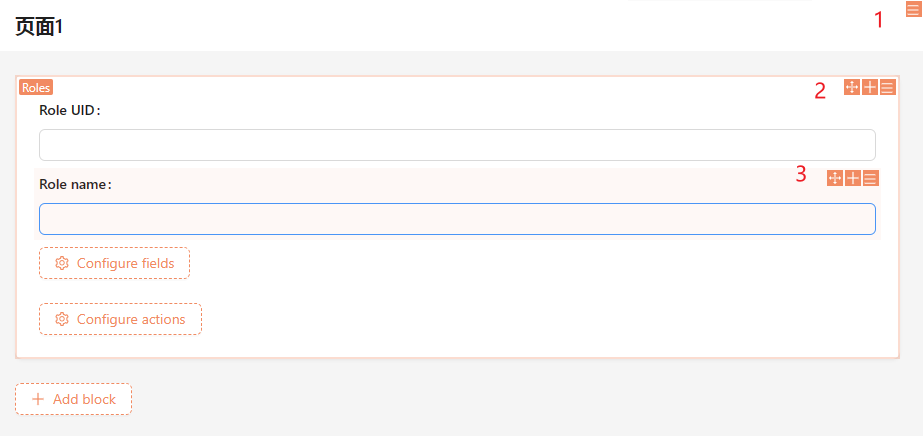
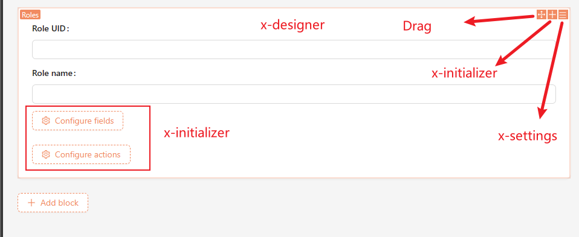

# SchemaToolbar 工具栏



我们已经知道了 NocoBase 的主界面是由 Schema 组成的，并且 NocoBase 的理念就是所见即所得，通过界面操作就可以生成页面。这些对 Schema 操作的部分我们称之为 Designer，也就是界面上橘色的部分。

具体的 API 参考：[SchemaToolbar 组件](https://client.docs.nocobase.com/core/ui-schema/schema-toolbar)

## Designer 的组成

以下是顶部菜单的 Schema：

```typescript
{
    "type": 'void',
    "x-component": "Menu",
    "x-designer": "Menu.Designer",
    "x-initializer": "MenuItemInitializers",
    "x-settings": "MenuSettings",
    "properties": {
        // ...
    }
}
```

其中 `type`、`x-component` 和 `properties` 我们已知道其含义，其他几个则就是 NocoBase 扩展的属性：

- x-designer：设计器
- x-initializer：添加器
- x-settings：设置器

三者的关系为：

- x-designer 里面会自动渲染
- x-initializer：添加器
- x-settings：设置器
- Drag: 拖拽工具

对应到界面就是：



想要完整的定义一个区块必须实现：

- [组件自身](https://www.baidu.com)[，如果是表单项组件还为组件添加 ReadPretty 模式，并且让数据响应式](https://www.baidu.com)
- x-designer

  - Drag（NocoBase 提供了组件）
  - x-settings
  - x-initializer

下面是一个完整的区块定义。

```typescript
{
    "type": 'void',
    "x-component": "MyBlock",
    "x-designer": "MyBlockDesigner",
    "x-initializer": "MyBlockInitializer",
    "x-settings": "MyBlockSettings",
    "properties": {
        // ...
    }
}
```

```typescript
const MyBlock = () => <div>hello world</div>
const MyBlockDesigner = () => {
    // 内部会自动渲染 MyBlockInitializer 和 MyBlockSettings
    return <GeneralSchemaDesigner></GeneralSchemaDesigner>
}
const myBlockInitializer = new SchemaInitializer({
    name: 'MyBlockInitializer',
    items: [
        {
            // ...
        }
    ]
});

const myBlockSettings = new SchemaSetting({
    name: 'MyBlockSettings',
    items: [
        // ...
    ]
});


class MyPlugin extends Plugin {
    async load() {
        this.app.addComponents({ MyBlock, MyBlockDesigner })
        this.app.schemaSettingsManager.add(myBlockSettings);
        this.app.schemaInitializerManager.add(myBlockInitializer);
    }
}
```

关于 Settings 和 Initializer 可详见：SchemaInitializer 添加工具 和 SchemaSettings 配置工具

## `GeneralSchemaDesigner` 组件说明

`GeneralSchemaDesigner` 的参数如下：

```typescript
export interface <em>GeneralSchemaDesignerProps</em> {
  title?: <em>string</em>; // 名称
  disableInitializer?: <em>boolean</em>; // 是否禁用 Initializer
  <em>/**</em>
<em>   * @default true</em>
<em>   */</em>
  draggable?: <em>boolean</em>; // 是否禁用拖拽
  schemaSettings?: <em>string</em>; // 如果 x-settings 无值的情况下，默认使用 schemaSettings
  contextValue?: <em>any</em>; // 通过 SchemaDesignerProvider 往下传递上下文内容
  template?: <em>any</em>;
}
```

## Drag 组件

某些情况下你需要完全自定义 Designer，不使用 `GeneralSchemaDesigner` 的情况下还需要了解一下 `Drag` 组件的使用。

Drag 组件由两部分组成 `DndContext` 和 `DragHandler`，具体使用方式如下：

```typescript
const Container = ({ children }) => {
    return <DndContext>{children }</DndContext>
}

const Demo = ({ title })=>{
    return <div>
        <DragHandler>
          <DragOutlined role="button" aria-label={getAriaLabel('drag-handler')} />
        </DragHandler>
        <div>hello {title} </div>
    </div>
}


const Page = ()=>{
    return <Container>
        <Demo title='nocobase' />
        <Demo title='world' />
    </Container>
}
```
