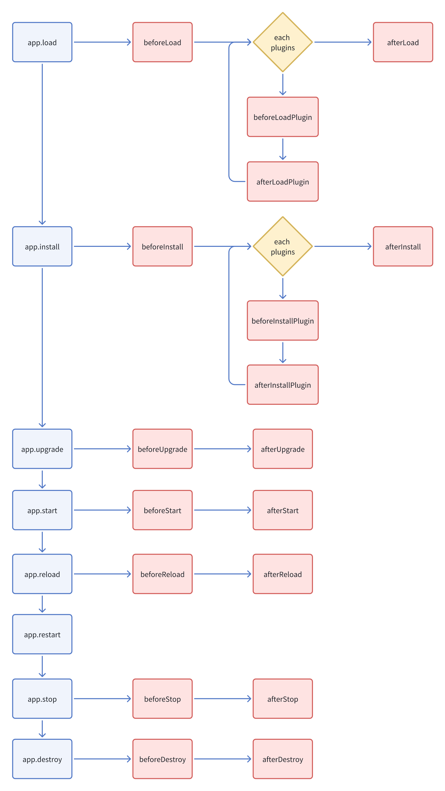

# 生命周期

## 后端应用的生命周期



通过 `app.on()` 触发，详情用法参考 [服务端 - 事件](/development/server/events) 章节

```ts
class PluginSampleHelloServer extends Plugin {
  async beforeLoad() {
    this.app.on('beforeInstall', async () => {
      // coding...
    });
  }
}
```

## 后端插件的生命周期


写在插件类里，详情用法参考 [服务端 - 概述](/development/server) 章节

```ts
class PluginSampleHelloServer extends Plugin {
  async beforeLoad() {}
}
```

## 前端插件的生命周期


写在插件类里，详情用法参考 [客户端 - 概述](/development/client) 章节
