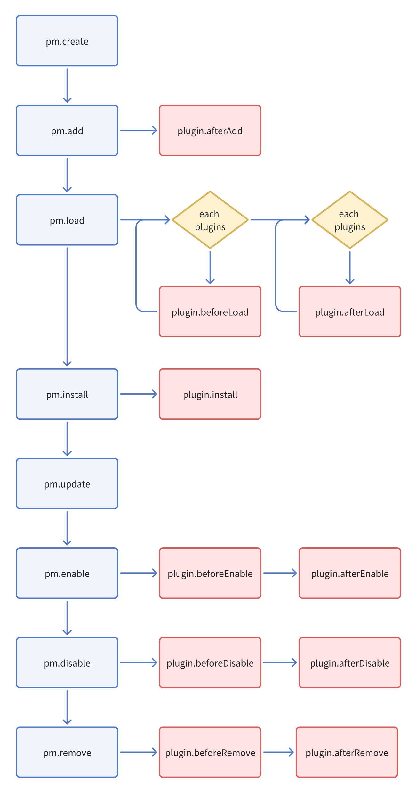

# 概述

初始化的空插件，服务端相关目录结构如下：

```bash
|- /plugin-sample-hello
  |- /src              # 插件源码
    |- /server
      |- collections   # 约定式目录，插件的数据表配置
      |- commands      # 约定式目录，自定义命令
      |- migrations    # 约定式目录，迁移文件
      |- plugin.ts     # 插件类
      |- index.ts      # 服务端入口
  |- package.json
  |- server.d.ts
  |- server.js
```

## Plugin

`plugin.ts` 提供了插件生命周期的各种方法的调用

```ts
import { Plugin } from '@nocobase/server';

export class PluginDemoServer extends Plugin {
  async afterAdd() {
    // 插件 pm.add 注册进来之后。主要用于放置 app beforeLoad 事件的监听
    this.app.on('beforeLoad');
  }
  async beforeLoad() {
    // 自定义类或方法
    this.db.registerFieldTypes();
    this.db.registerModels();
    this.db.registerRepositories();
    this.db.registerOperators();
    // 事件监听
    this.app.on();
    this.db.on();
  }
  async load() {
    // 定义 resource
    this.resourcer.define();
    // resource action
    this.resourcer.registerActions();
    // 注册 middleware
    this.resourcer.use();
    this.acl.use();
    this.app.use();

    this.app.i18n;
  }
  async install() {
    // 安装逻辑
  }
  async afterEnable() {
    // 激活之后
  }
  async afterDisable() {
    // 禁用之后
  }
  async remove() {
    // 删除逻辑
  }
}

export default MyPlugin;
```

## 插件的生命周期



- 在插件初始化之后，触发 `afterAdd`，在 `afterAdd` 里其他插件不一定都实例化
- 在 `beforeLoad` 里所有已激活的插件都实例化了，可以通过 `app.pluginManager.get()` 获取到实例
- 在 `load` 里，所有插件的 `beforeLoad` 方法都已执行

## 插件类里常用的属性及方法

| API                              | 教程               |
| -------------------------------- | ------------------ |
| this.name                        | 插件名             |
| this.enabled                     | 已激活             |
| this.installed                   | 已安装             |
| this.app                         | 应用实例           |
| this.pm                          | 插件管理器实例     |
| this.db                          | 数据库实例         |
| this.resourcer                   | 资源管理器         |
| this.acl                         | 权限控制           |
| this.log                         | 日志               |
| this.app.i18n                    | 国际化             |
| this.db.registerFieldTypes()     | 注册字段 type      |
| this.db.registerModels()         | 注册 Model         |
| this.db.registerRepositories()   | 注册 Repository    |
| this.db.registerOperators()      | 注册自定义的运算符 |
| this.app.on()                    | 应用事件           |
| this.db.on()                     | 数据库事件         |
| this.db.collection()             | 配置数据表         |
| this.db.import()                 | 导入数据表配置     |
| this.db.addMigrations()          | 迁移               |
| this.resourcer.registerActions() | 注册资源操作       |
| this.resourcer.use()             | 中间件             |
| this.acl.use()                   | 中间件             |
| this.app.use()                   | 中间件             |
| this.app.command()               | 命令行             |
