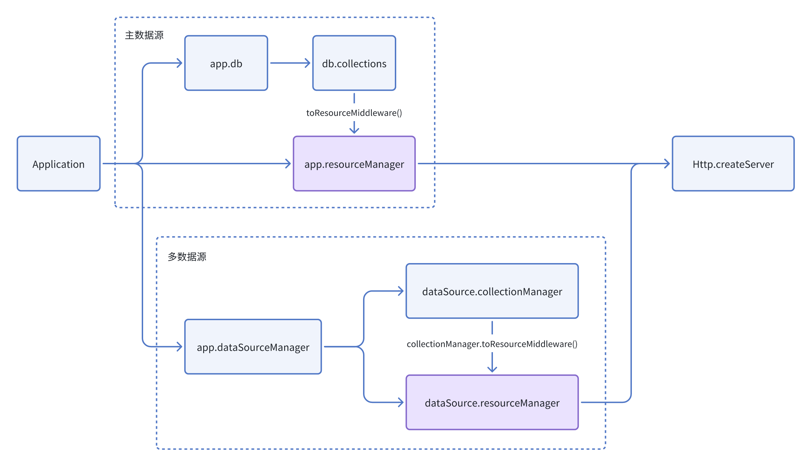

# 配置资源

在各个 NocoBase 的各个数据源里，已存在的 collection（包括 association）会自动转为相对应的 resource，如下图所示：



因此，通常只需要在全局为所有资源注册全局操作即可，如以下数据源代码片段：

```ts
const collectionManager = new CollectionManager();
const resourceManager = new ResourceManager();

collectionManager.defineCollection({
  name: 'products',
});

collectionManager.defineCollection({
  name: 'orders',
});

resourceManager.use(collectionManager.toResourceMiddleware());

resourceManager.registerActionHandlers({
  async create(ctx, next) {},
  async update(ctx, next) {},
  async list(ctx, next) {},
  async get(ctx, next) {},
  async destroy(ctx, next) {},
});
```

## ResourceManager

### resourceManager.registerActionHandlers()

因为 Collection & Association 会自动转为 Resource，所以大部分通用的场景并不需要再配置资源了，只需要在全局为所有资源注册全局操作即可。

```ts
resourceManager.registerActionHandlers({
  async create(ctx, next) {},
  async update(ctx, next) {},
  async list(ctx, next) {},
  async get(ctx, next) {},
  async destroy(ctx, next) {},
});
```

也可以为某资源注册特定的操作

```ts
resourceManager.registerActionHandlers({
  'users:updateProfile': async (ctx, next) => {},
});
```

### resourceManager.define()

特殊情况也可以单独为资源定义特殊的操作

```ts
resourceManager.define({
  name: 'pm',
  actions: {
    add: async (ctx, next) => {
    },
    enable: async (ctx, next) => {
    },
    disable: async (ctx, next) => {
    },
    remove: async (ctx, next) => {
    },
  }
});
```

```ts
resourceManager.define({
  name: 'auth',
  actions: {
    signIn: async (ctx, next) => {
    },
    signOut: async (ctx, next) => {
    },
    signUp: async (ctx, next) => {
    },
    check: async (ctx, next) => {
    },
  }
});
```

### resourceManager.use()

添加资源级中间件，只有请求已定义的 resource 时才执行，更多内容查看「[中间件](/development/server/middleware)」章节

## 示例

- 待补充