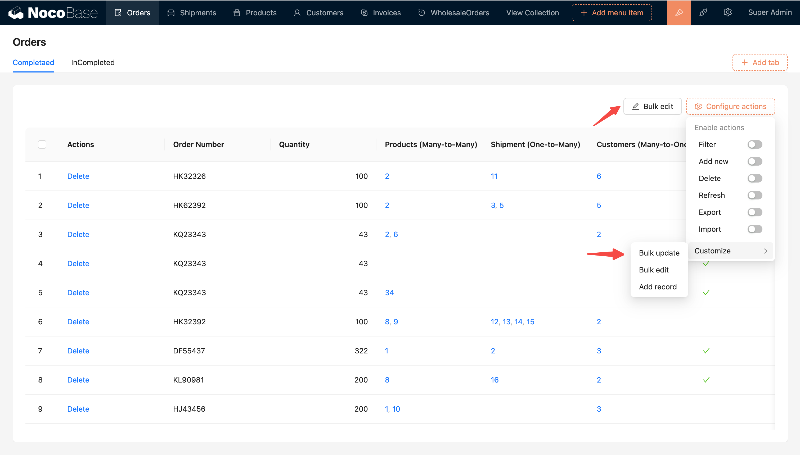
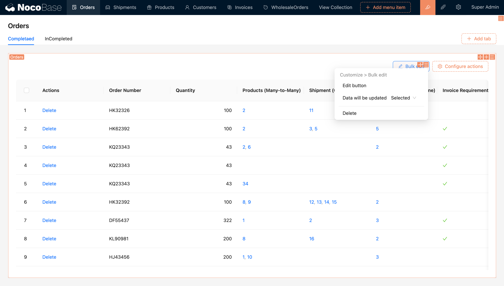
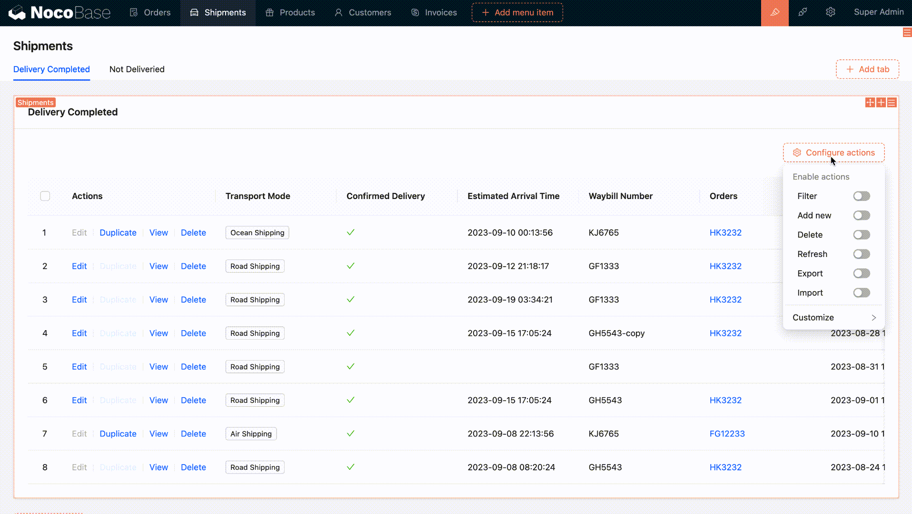

# 批量编辑

## 介绍

批量编辑操作用于需要为不同记录组配置不同更新逻辑的情况，适用于灵活性要求较高的数据处理场景。用户点击批量编辑按钮后，在弹窗中配置批量编辑表单，为字段指定不同的赋值逻辑。

## 安装

内置插件，无需单独安装
## 使用指南

1. 设置批量编辑的数据：选中/所有，默认为选中。

2. 为字段设置更新逻辑，支持为特定字段设置逻辑。

- 不更新
- 修改为指定值
- 清空

示例：在运单表格区块中配置批量编辑操作，选中的数据，将运输模式修改为空运，确认送达和实际到达时间清空。

更多批量编辑表单内容参考 [批量编辑表单](/handbook/ui/fields/generic/bulk-edit-form-item)

