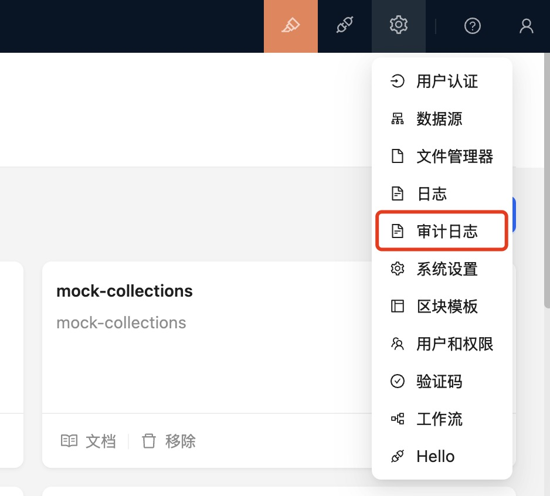
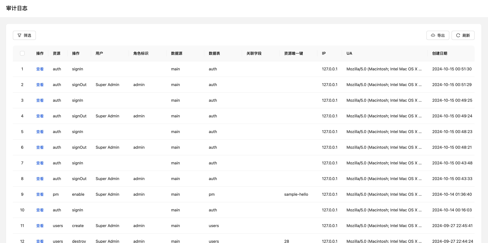

# 审计日志

<!-- :::warning
文档待补充
::: -->

## 介绍

根据产品安全性的要求，应用内的资源操作都需要记录审计日志，从而监控和规范用户在系统内的操作行为。

## 安装

你可以在「[插件管理器](/handbook/plugin-manager)」里增加审计日志插件。系统会默认添加`app:restart`、`app:clearCache`、`pm:add`、`pm:update`、`pm:delete`、`user:add`、`user:update`、`user:delete`等日志记录。

## 使用说明

`this.app.auditManager.registerAction` 单个注册
`this.app.auditManager.registerActions` 批量注册

注册需要参与审计的资源和操作，支持几种用法：
- 注册全局的操作，对所有资源生效：`registerActions(['create'])`
- 对某个资源的所有操作生效 resource:*:  `registerActions(['app:*'])`
- 对某个资源的某个操作生效 resource:action:  `registerActions(['pm:update'])`
- 支持传自定义的 `getMetaData` 方法

``` javascript
registerActions([
  'create',
   { name: 'auth:signIn', getMetaData }
])
```

- 当注册的接口有重叠时，颗粒度细的注册方法优先级更高，例如

``` javascript
registerAction('create');
registerAction('xxx:create', { getMetaData }); // 采用这个
```

- 如果不自定义`getMetaData`方法，会默认使用内置的方法
``` javascript
async getDefaultMetaData(ctx: Context) {
  return {
    request: {
      params: {},
      body: {}
    },
    response: {
      body: {}
    }
  }
}
```

## 界面
当启动审计日志后，可以从这个入口进入到审计页面



可以通过页面进行筛选、查看日志详情，还可以批量导出



## 日志格式


| 字段名      | 描述                                                         |
| ----------- | ------------------------------------------------------------ |
| uuid        | 日志记录标识，有问题也可以结合系统日志定位                   |
| dataSource  | 数据源                                                       |
| resouce     | 资源，数据表：a，a.b. 其他自定义资源，自定义资源不需要记录 collection 和 association |
| collection  | a 或<br />a.b 中 b是字段名，实际表名是的 b.target. <br />如果是继承的表，是按 tableoid 的情况处理 |
| association | 关联字段， a.b 的 b                                          |
| action      | 操作                                                         |
| resouceUk   | 涉及资源 unique key，有多个的时候用 `,` 分割，如创建操作。   |
| userId      | 操作用户 ID                                                  |
| roleName    | 操作角色标识                                                 |
| IP          | 来源 IP                                                      |
| UA          | UserAgent 信息                                               |
| status      | 操作状态 0 - 失败, 1 - 成功                                  |
| createdAt   | 操作时间                                                     |
| metadata    | 操作状态码，错误消息。操作相关的上下文信息，自定义的记录内容等 |


## 相关文档

- [API参考 - @nocobase/actions](../../api/actions)
<!--
## 介绍

## 安装

## 使用说明 -->
