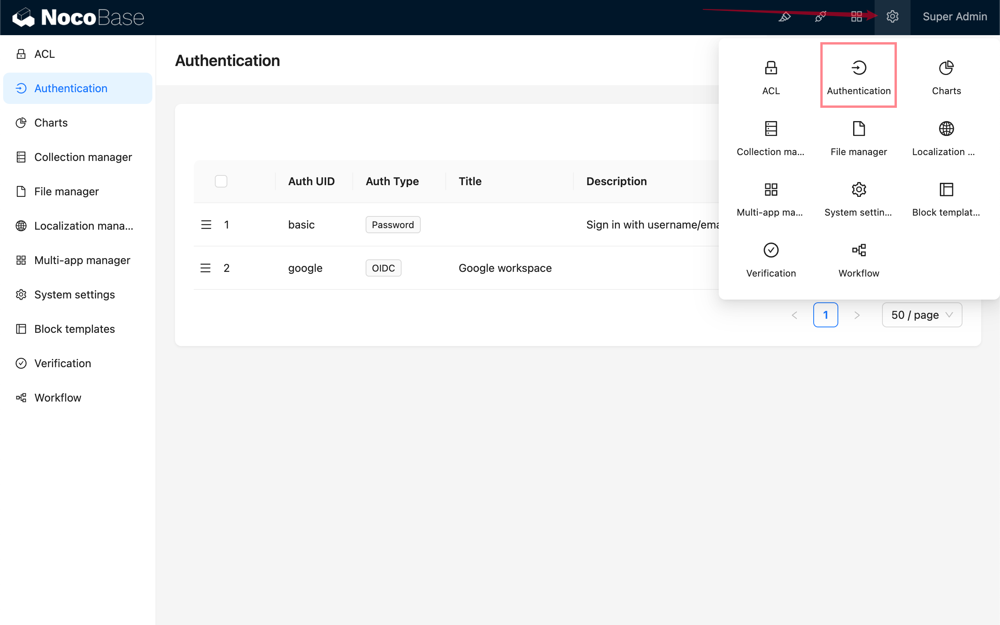

# 短信认证

## 介绍

短信认证插件支持用户通过短信注册用户，登录 NocoBase.

> 需要配合 [`@nocobase/plugin-verification` 插件](../verification/index.md)提供的短信验证码功能使用

## 添加短信认证

进入用户认证插件管理页面。

添加 - 短信 (SMS)

## 配置

短信验证码功能配置见[验证码插件 (@nocobase/plugin-verification) 文档](../verification/index.md)，短信登录认证功能将使用已配置并设置为默认的短信验证码 Provider 来发送短信。

用户不存在时自动注册 (Sign up automatically when the user does not exist): 该选项勾选后，当用户使用的手机号不存在时，将使用手机号作为昵称注册新用户。

## 登录

访问登录页面使用。

