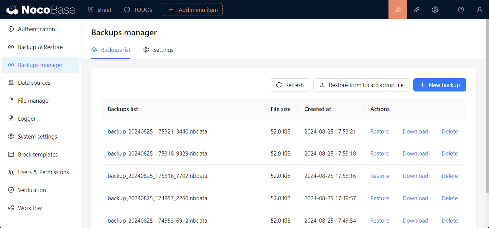
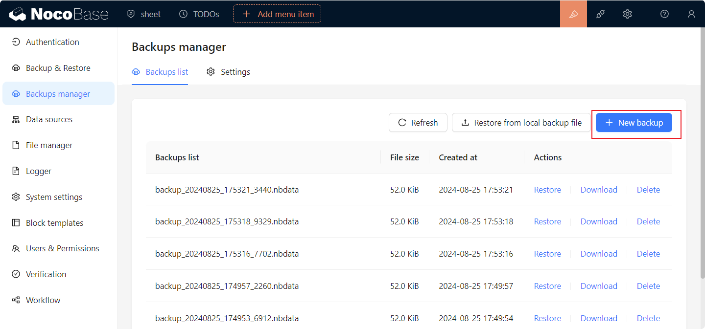
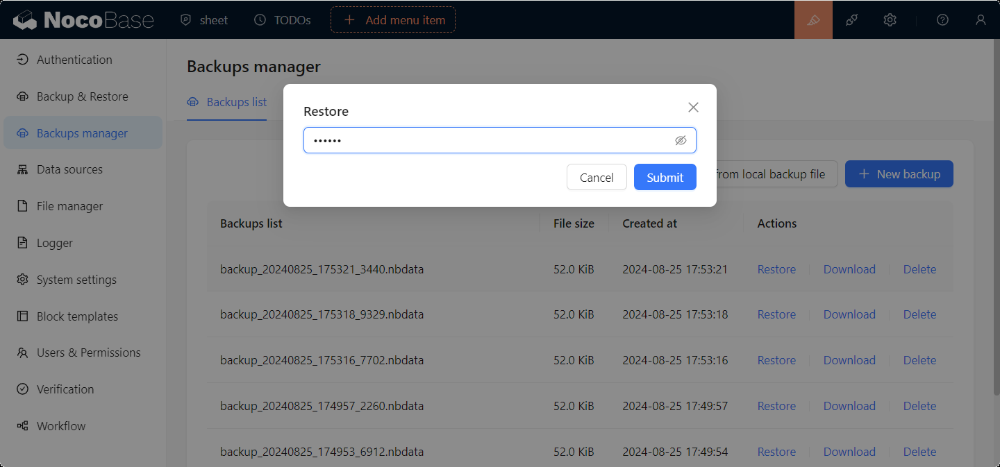
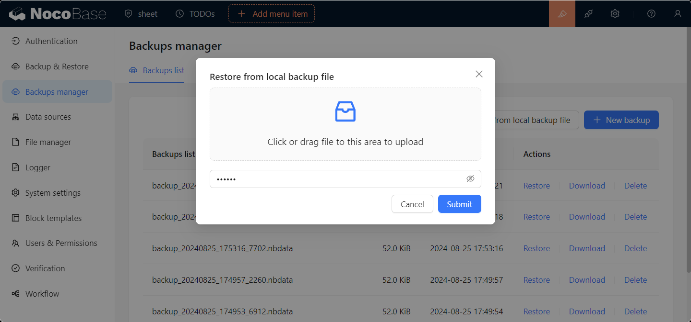
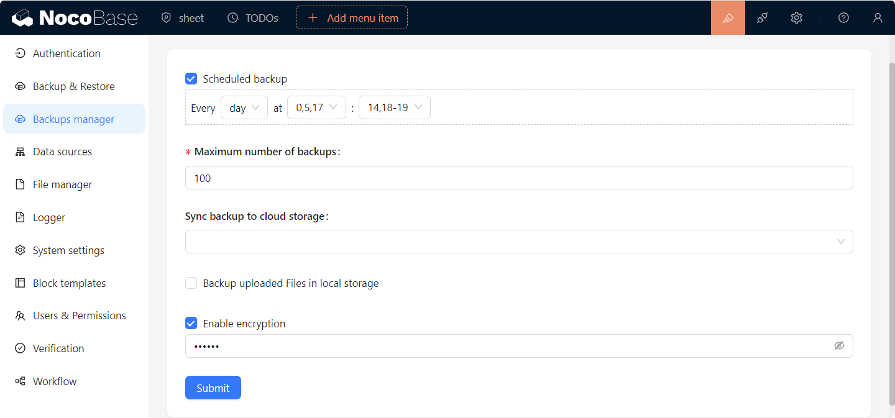

# 备份管理器

<PluginInfo name="backups"></PluginInfo>

## 介绍

NocoBase 备份管理器插件，提供了 NocoBase 数据库及用户上传文件的全量备份、定时备份、备份的下载、删除及还原等功能。

## 安装

该插件为 NocoBase 专业版内置插件，无需单独安装。请查看 <a target="_blank" href="https://www.nocobase.com/cn/commercial">商业版本</a> 了解详情。

:::warning{title=注意}
- 本插件是基于数据库原生客户端实现的，使用前需要在 NocoBase 服务器运行环境中安装对应数据库的客户端。
  - [Postgres 数据库客户端安装](./installation/postgres.md)
  - [MySQL 数据库客户端安装](./installation/mysql.md)
  - [MariaDB 数据库客户端安装](./installation/mariadb.md)
- 还原操作时，目标数据库版本应当不低于创建该备份的数据库版本。
:::

## 使用说明

### 新建备份

点击新建备份按钮，即可根据备份配置新建备份，并在备份列表中显示备份状态。

### 还原备份

支持从备份列表中还原备份、上传本地备份文件还原备份。
以下场景下不允许执行还原操作：
- 当前 NocoBase 版本低于备份文件中的 NocoBase 版本时。
- 当前 NocoBase 数据库与备份文件中的以下配置不一致时：
  - dialect 数据库类型
  - underscored 字段配置
  - table prefix 表前缀
  - schema 表结构

> **备份还原均为数据库全量操作，推荐在备份还原前先备份一份当前数据库**

#### 从备份列表中还原

点击备份列表中备份项的`还原`按钮，在弹出窗口中输入备份文件加密密码，点击确认还原备份。
> 未加密备份文件无需输入密码。

#### 上传本地备份文件还原

点击`从本地备份还原`按钮，在弹出窗口中选择本地备份文件，输入备份文件加密密码，点击确认还原备份。
> 未加密备份文件无需输入密码。

#### 下载备份文件

点击备份列表中备份项的`下载`按钮，即可下载备份文件。

#### 删除备份

点击备份列表中备份项的`删除`按钮，即可删除备份文件。

## 备份设置

切换至`设置`标签页，修改备份设置，点击保存即可生效。

### 备份设置说明

- `定时备份`: 开启后，可设置按指定时间自动备份。
- `最大备份数`: 设置备份文件本地最大保存数量，超出数量后将自动删除本地最早的备份文件。
- `同步备份文件至云存储`: 设置备份文件备份成功后自动上传的云存储。
- `备份上传到本地存储中的文件`: 是否把用户上传到服务器本地存储中的文件(storage/uploads)包含在备份中。
- `启用加密`: 是否启用备份文件加密，并设置加密密码。

> **备份文件加密密码请妥善保管，遗忘密码将无法还原备份文件。**
