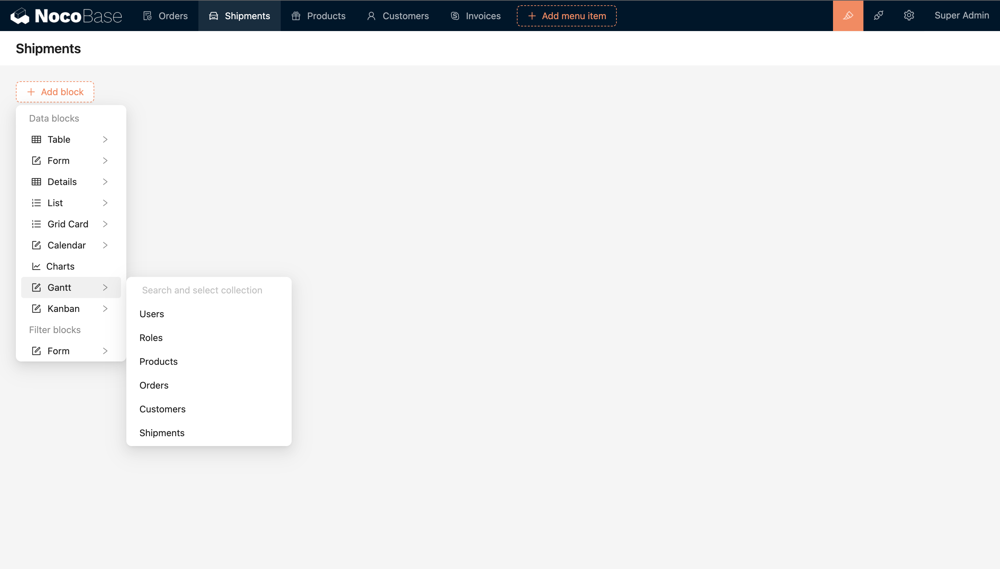
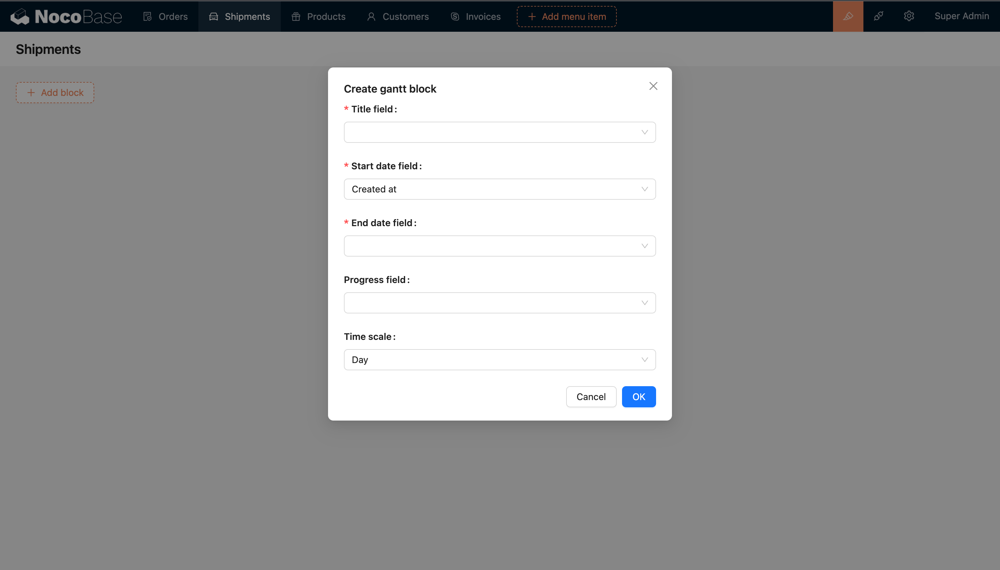
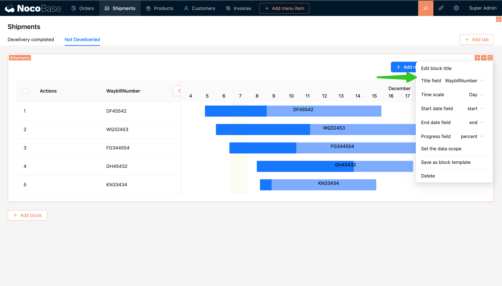
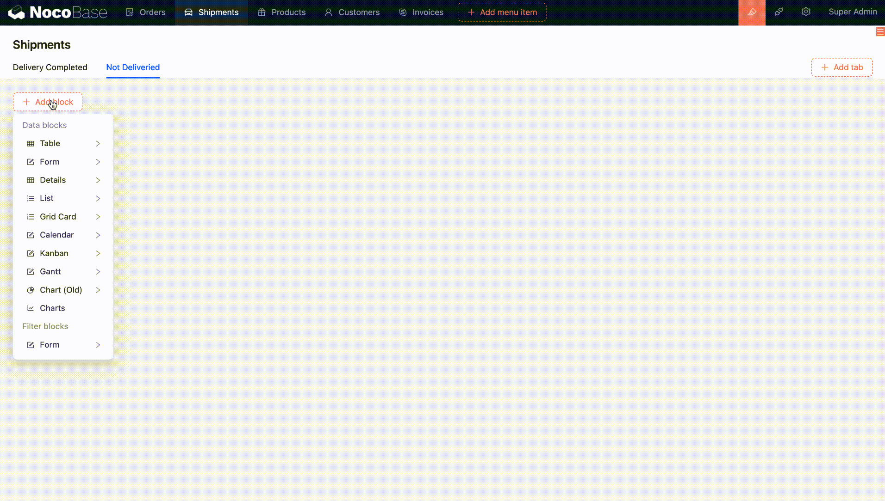

# 甘特图

## 介绍

## 安装

## 使用手册

甘特图区块以时间线的形式呈现数据，用于可视化任务、项目或事件的时间线和进度。适用于项目管理、事件计划、工程计划和任务调度等场景，支持拖拽甘特图条形调整任务的时间和进度

### 甘特图区块参数配置

- 标题字段：用于显示在甘特图条形上的信息
- 时间缩放等级：时间缩放等级，默认天
- 开始日期字段：每个任务的开始日期，必填
- 结束日期字段：每个任务的结束日期，必填
- 进度字段：设置表示进度（百分比字段）的字段，非必填

### 用甘特图管理数据

- 拖拽条形调整任务的开始日期和结束日期
- 拖拽进度条调整任务的进度

### 应用场景

- 处理流程可视化：如将整个运单流程划分为不同的任务阶段，例如订单确认、包装、发货、运输、到达目的地等。每个任务阶段都可以在甘特图上表示为一个条形，其长度代表该阶段的持续时间

