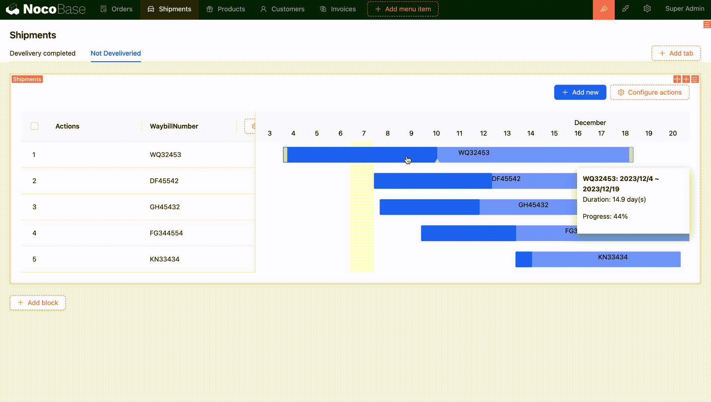

# 甘特图

<PluginInfo name="block-gantt"></PluginInfo>

## 介绍

甘特图区块以时间线的形式呈现数据，用于可视化任务、项目或事件的时间线和进度。适用于项目管理、事件计划、工程计划和任务调度等场景，支持拖拽甘特图条形调整任务的时间和进度。

## 安装

内置插件，无需安装。

## 添加区块

- 标题字段：用于显示在甘特图条形上的信息；
- 时间缩放等级：时间缩放等级，默认天；
- 开始日期字段：每个任务的开始日期，必填；
- 结束日期字段：每个任务的结束日期，必填；
- 进度字段：设置表示进度（百分比字段）的字段，非必填；

- 拖拽条形调整任务的开始日期和结束日期；
- 拖拽进度条调整任务的进度；

## 区块设置项

### 设置数据范围

更多内容参考 [设置数据范围](/handbook/ui/blocks/block-settings/data-scope)

- [保存为区块模板](/handbook/ui/blocks/block-settings/block-template)
- [设置数据加载方式](/handbook/ui/blocks/block-settings/loading-mode)

## 配置操作

### 全局操作

- [筛选](/handbook/ui/actions/types/filter)
- [添加](/handbook/ui/actions/types/add-new)
- [删除](/handbook/ui/actions/types/delete)
- [刷新](/handbook/ui/actions/types/refresh)
- [导入](/handbook/action-import)
- [导出](/handbook/action-export)
- [添加数据](/handbook/action-add-record)
- [批量更新](/handbook/action-bulk-update)
- [批量编辑](/handbook/action-bulk-edit)

### 行操作

- [查看](/handbook/ui/actions/types/view)
- [编辑](/handbook/ui/actions/types/edit)
- [复制](/handbook/action-duplicate)
- [删除](/handbook/ui/actions/types/delete)
- [弹窗](/handbook/ui/actions/types/pop-up)
- [更新记录](/handbook/ui/actions/types/update-record)
- [自定义请求](/handbook/action-custom-request)
- 提交至工作流
