# 数据字典

<YouChaoYunPluginInfo name="data-dictionary" commercial=true></YouChaoYunPluginInfo>

## 为什么要使用数据字典？

### 使用场景

- 需要在系统内维持特定数据的一致性，比如：对合同的管理，希望定义固定的几个合同状态供用户选择使用，以便后续统计分析时达到既定的管理目标。
- 当作枚举数据使用，实现特定的功能，比如：实现CRM系统时，按上下游公司的类别分为客户、供应商，则可以复用同一个数据定义、区块模板，只需要在客户、供应商、销售合同、采购合同列表做类型区分即可。
- 参照相关标准定义数据字典，可实现与其他异构系统的数据复用，比如：各省市的住建部门都有自己的劳务实名制系统，国家住建部则定义一套数据字典标准，以便各省市的数据可以互通。

### 与内置选择字段对比：

- 一处定义，多处使用
- 不需要管理员权限，终端用户也可维护数据
- 提供更丰富的特性
- 未来的可扩展性

### 方案特色：

- 支持树型字典
  比如：GB/T 2261.2-2003，个人基本信息分类与代码 - 婚姻状况
  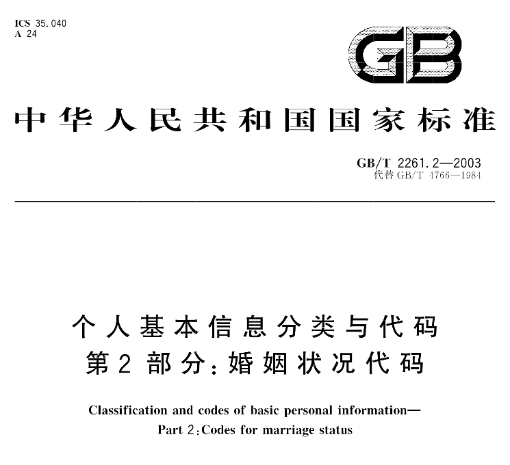
  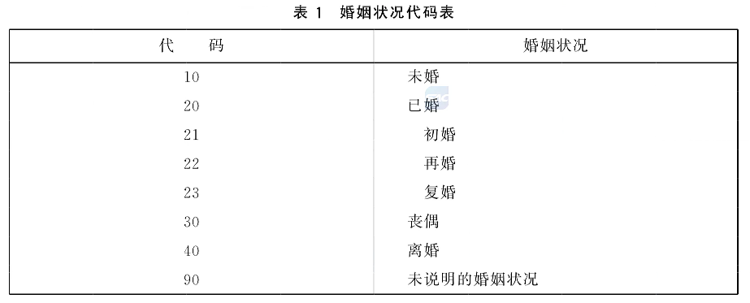

- 支持更多颜色选择
- 提供有效/无效控制，不影响历史数据

## 使用说明

数据字典维护：字典类型、字典数据
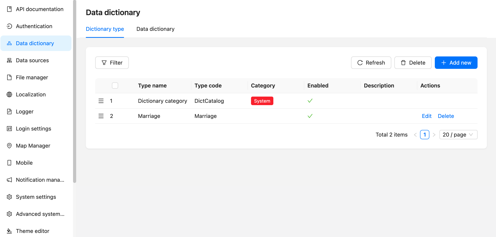

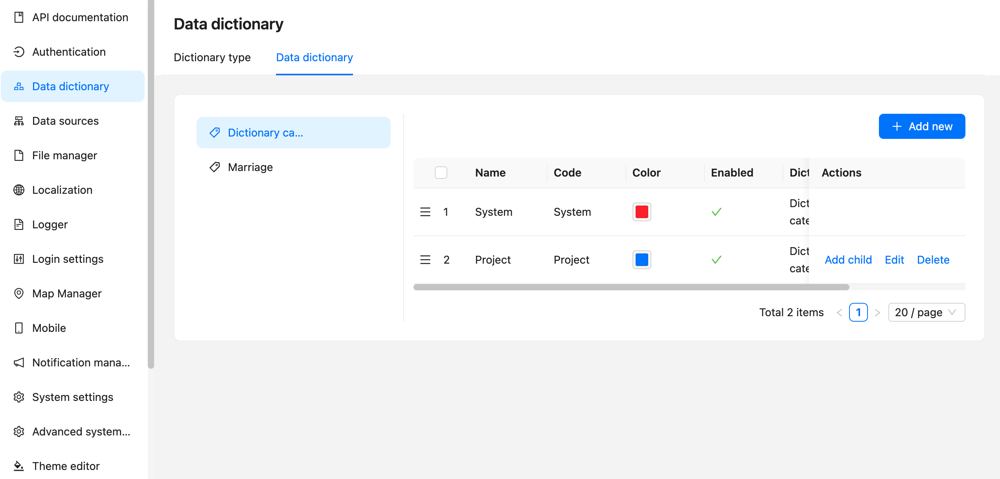

字段添加
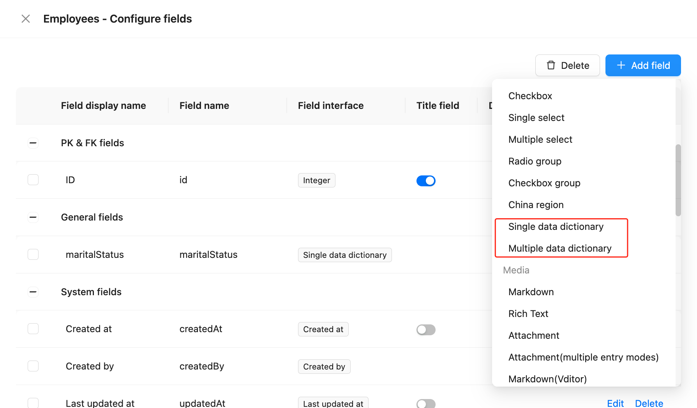

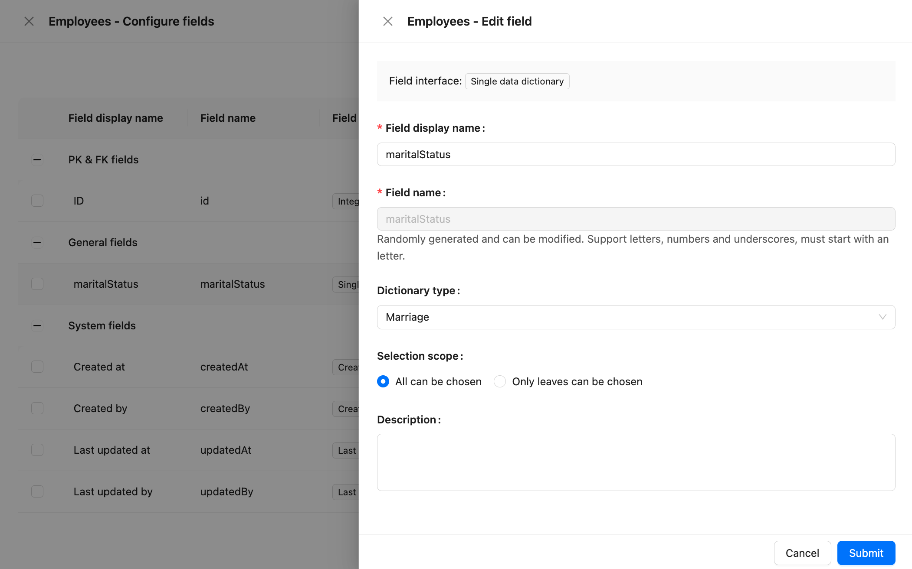

## 使用效果

表格区块
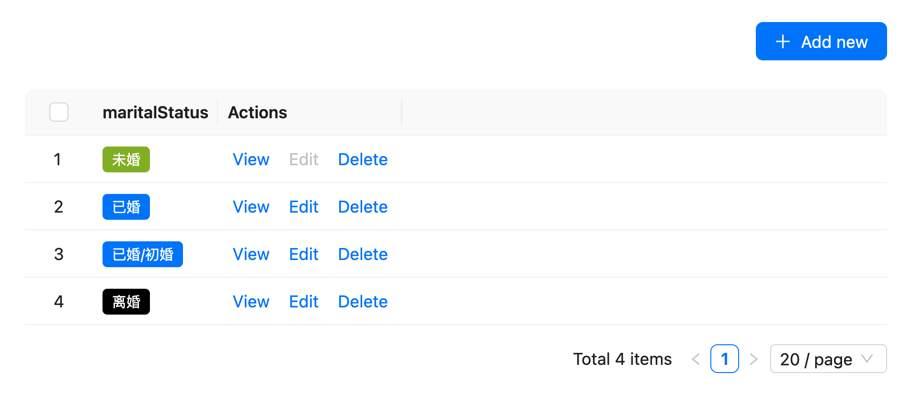

配置项：1. 字段组件（标签、带颜色文字、文字）；2. 是否显示父级
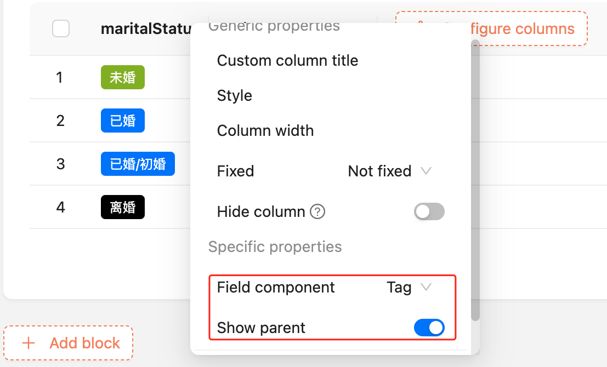

新增、编辑区块
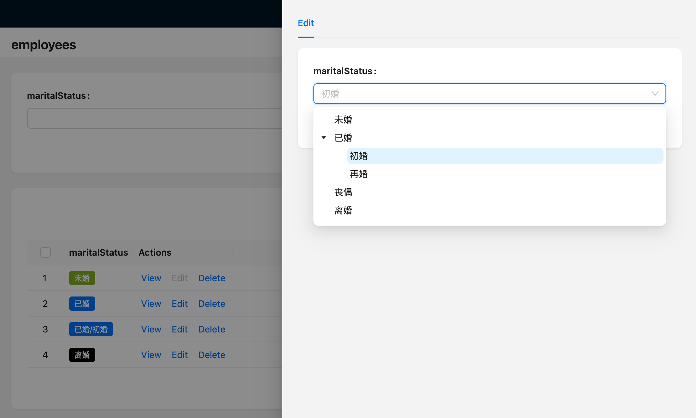

详情区块
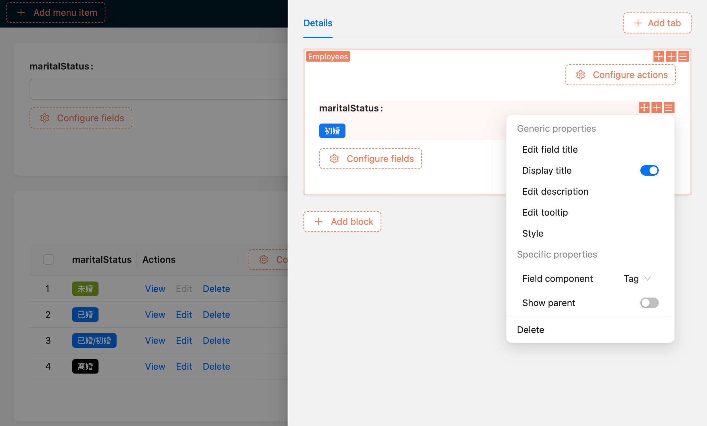

联动规则
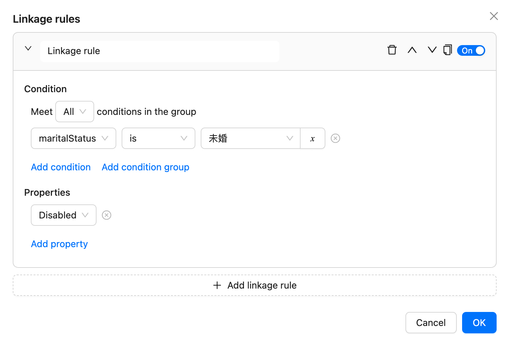

数据范围
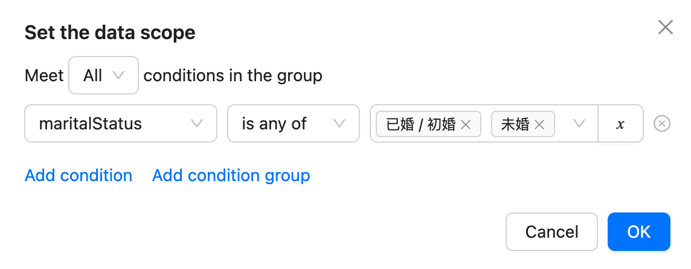

筛选区块
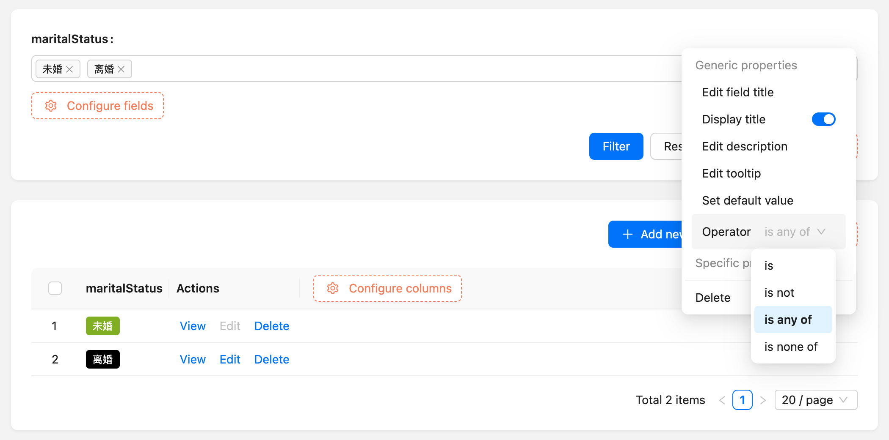

## 历史数据迁移

完善中...
