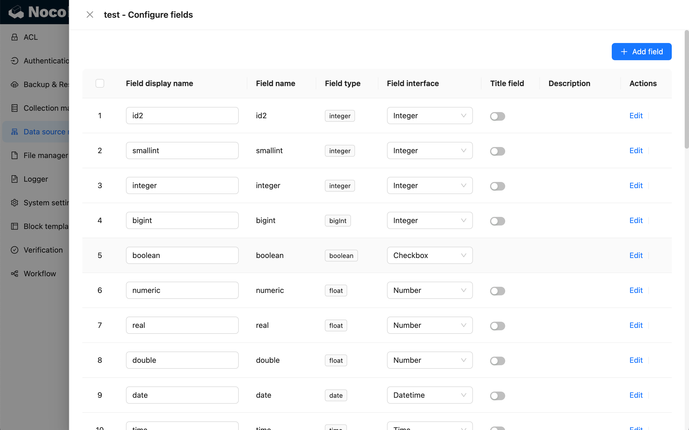
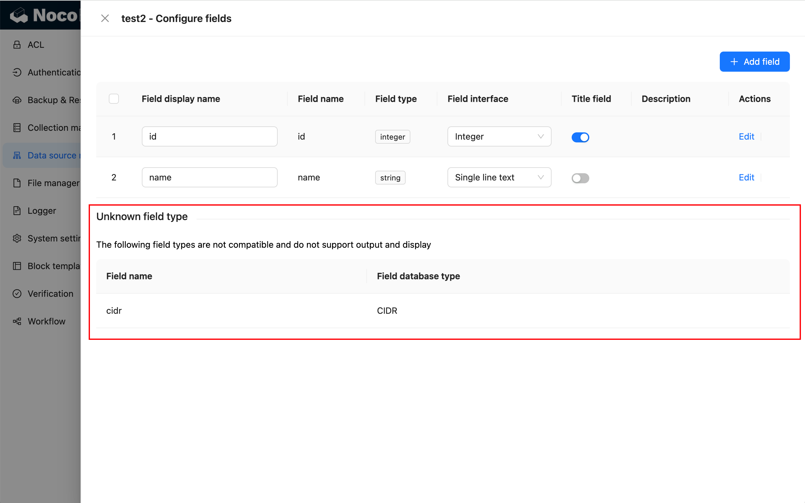
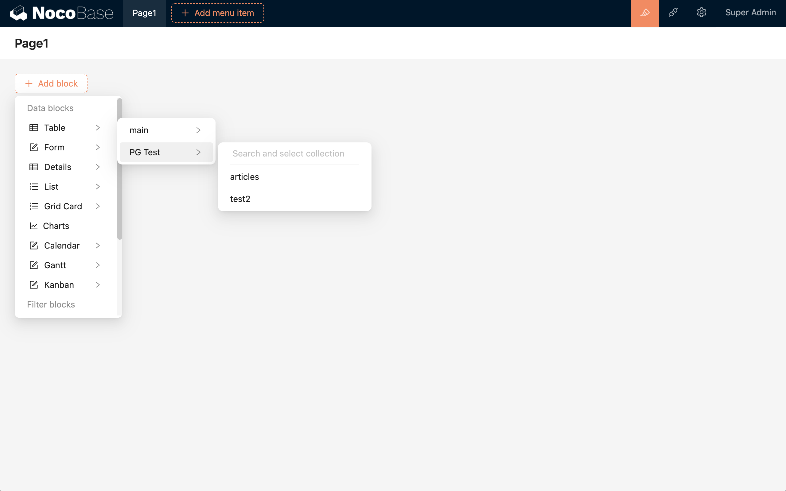
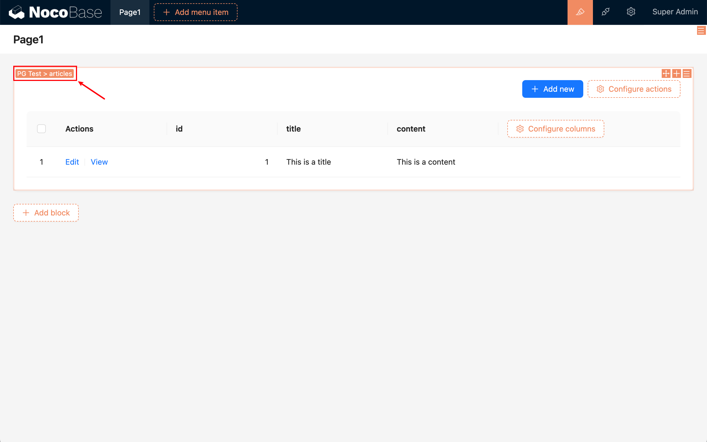

查看数据源里的数据表

数据库视图需要配置筛选目标键（Filter target key）才能在区块中展示，筛选目标键指的是根据特定字段筛选数据，字段值必须具备唯一性。

### 配置字段

#### 不支持的字段类型

不支持的字段类型会单独展示出来，这些字段需要开发适配之后才能使用

#### 系统字段的适配

#### ID 类字段的适配

#### Unix 时间戳

#### 选择类型字段的适配

#### 配置关系

### 作为数据区块的数据源

:::warning{title=警告}
目前暂不支持有重复数据的数据表或数据库视图的数据展示。作为区块展示的数据表必须配置了筛选目标键（Filter target key），筛选目标键指的是根据特定字段筛选数据，字段值必须具备唯一性。
:::

添加区块

表格区块

### 作为工作流的数据来源

