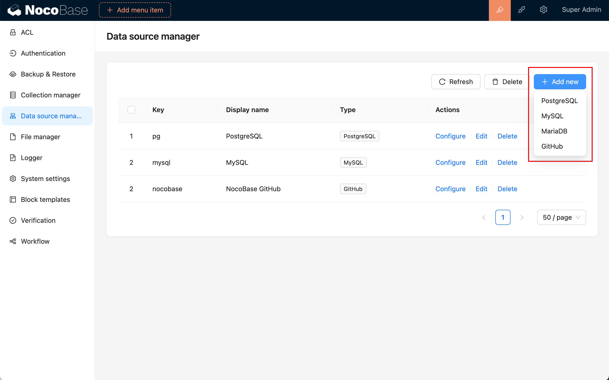

# 数据源管理

:::info
This feature is powered by ***plugin-data-source-manager***. 
:::

## 介绍

NocoBase 提供了数据源管理插件，用于管理数据源的数据表，数据源管理插件只是提供所有数据源的管理界面，并不提供接入数据源的能力，需要和适配的各种数据源插件搭配使用，目前支持接入的数据源包括：

- Main 数据库：NocoBase 主数据库，支持 MySQL、PostgreSQL、SQLite 等关系型数据库。
- External MySQL：使用外部的 MySQL 数据库作为数据源。
- External MariaDB：使用外部的 MariaDB 数据库作为数据源。
- External PostgreSQL：使用外部的 PostgreSQL 数据库作为数据源。

除此之外，也可以扩展，可以是常见的各类数据库，也可以是提供 API（SDK）的平台。

## 安装

内置插件无需安装。

## 使用手册

