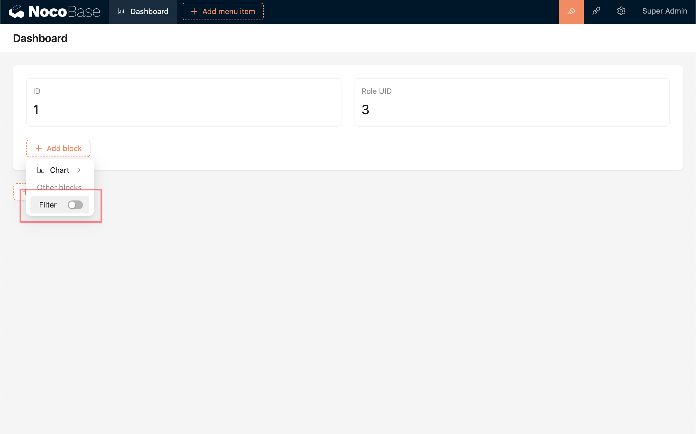
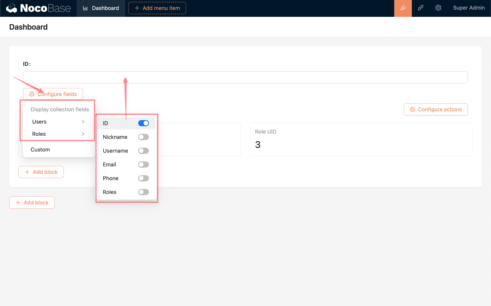
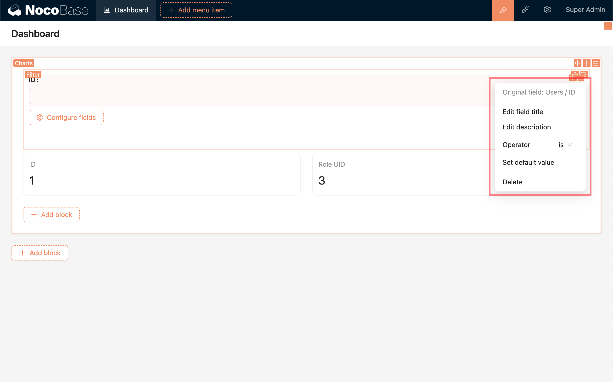
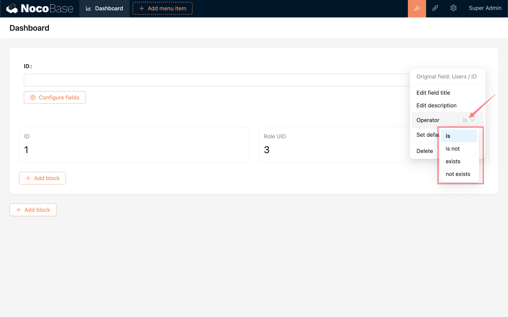
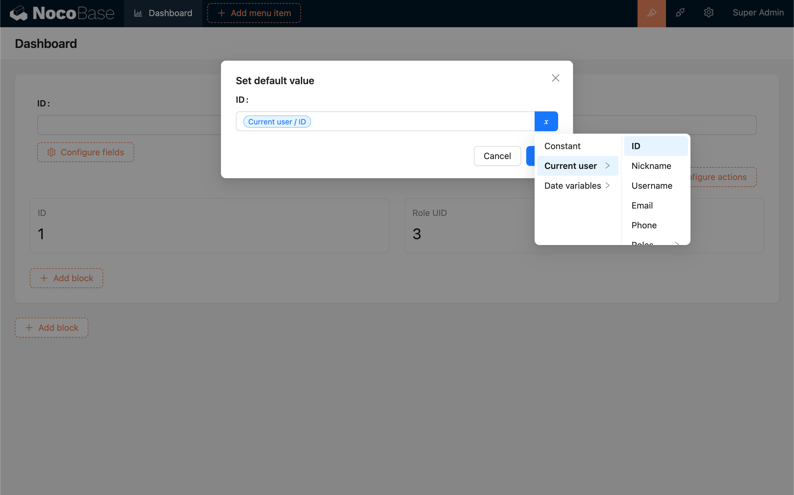
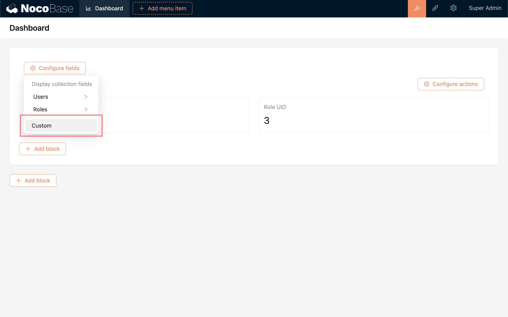
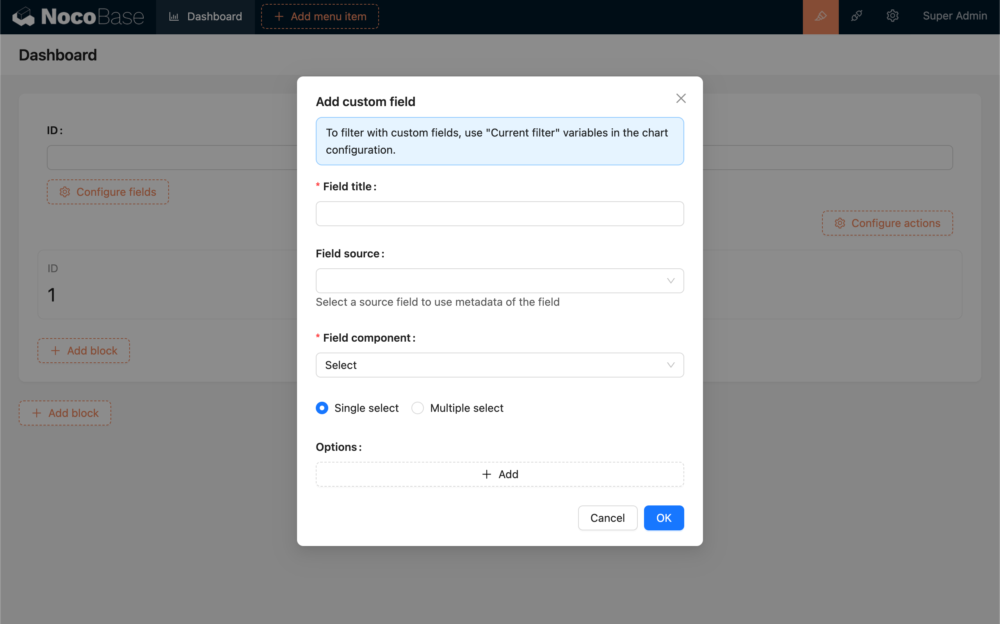
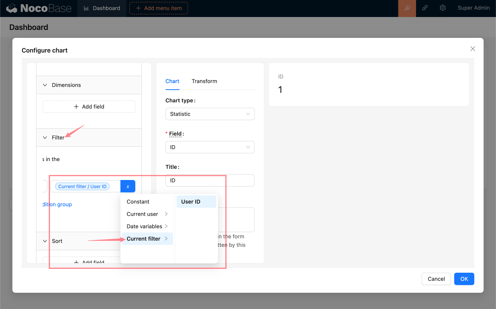
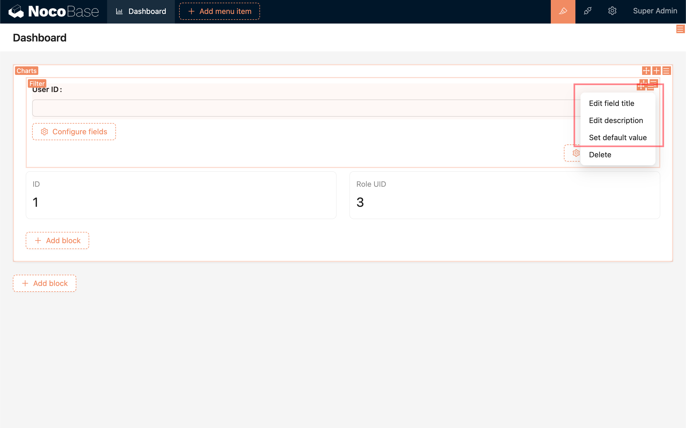
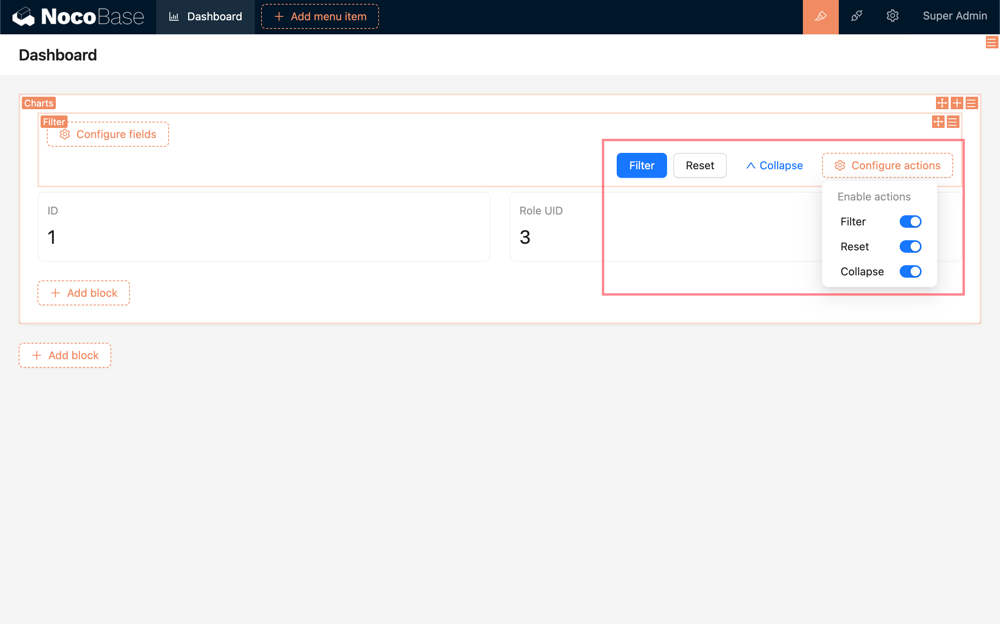

# 筛选区块

图表区块中的筛选区块，用于对当前图表区块內的多个图表进行动态筛选。

## 启用/禁用

在图表区块中点击“添加区块” (Add block) - “筛选” (Filter), 可以启用/禁用筛选区块。

## 配置筛选字段

### 数据表字段

对于当前图表区块中的图表所用到的数据表，直接选择数据表对应的字段，即可创建一个筛选表单字段。

可以对表单字段进行配置：

- 配置字段显示标题
- 配置字段描述
- 配置该字段在筛选时应用的操作符  
  

- 配置字段默认值，可以使用变量。变量的数据类型需与当前字段数据类型相符。
  

  例如：

  - 配置默认值为当前用户ID，页面加载后自动筛选出当前用户数据。
  - 配置默认值为当前日期，页面加载后自动筛选出当前日期数据。

### 自定义字段

某些情况下，可能需要用同一个筛选字段来筛选不同表的不同字段。例如：用一个日期字段来筛选不同表的不同日期字段。这时候可以选择创建自定义字段。

添加自定义字段的时候，需要设置字段标题，选择字段组件及进行相应配置，还可以从当前区块使用的数据表中选择一个字段，直接应用该字段的元数据配置，避免重复配置。

要使用自定义筛选字段，需要打开对应图表的配置，然后在数据查询的筛选配置中，添加筛选条件并使用“当前筛选” (Current filter) 中的变量。被筛选字段的类型需要和筛选表单自定义字段的类型相符。

对于自定义字段，同样可以配置标题、描述和默认值。

## 配置区块动作

- 筛选 (Filter) - 应用筛选条件
- 重置 (Reset) - 重置筛选表单
- 折叠/展开 (Collapse / Expand) - 将折叠为一行或展开多行

