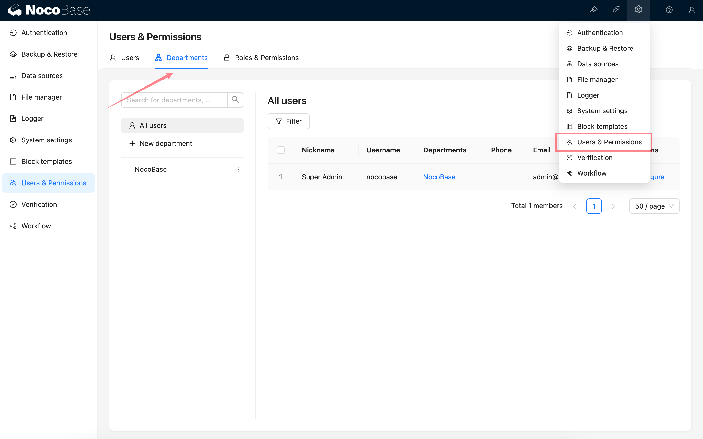
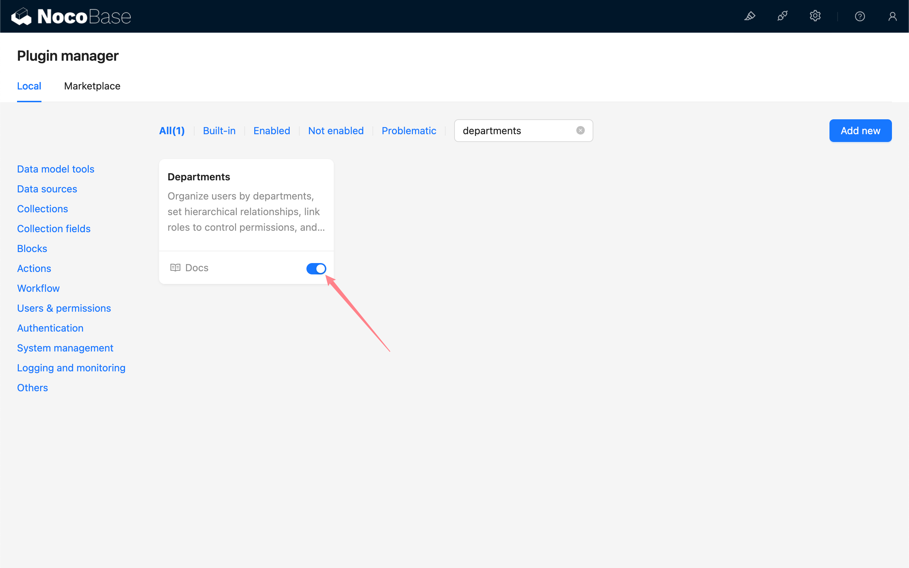

# 部门

:::info{title=提示}
该功能由商业插件 plugin-departments 提供，请查看 [NocoBase 商业版本](https://www.nocobase.com/commercial-cn)了解详情。
:::

## 介绍

部门插件支持在 NocoBase 中以部门的形式来组织用户，设定上下级关系。可以通过给部门绑定角色来控制一组用户的权限。支持将部门信息作为变量用于工作流和表达式等支持设置变量的地方。

## 安装

该插件为商业插件，需要通过插件管理器上传并激活。

