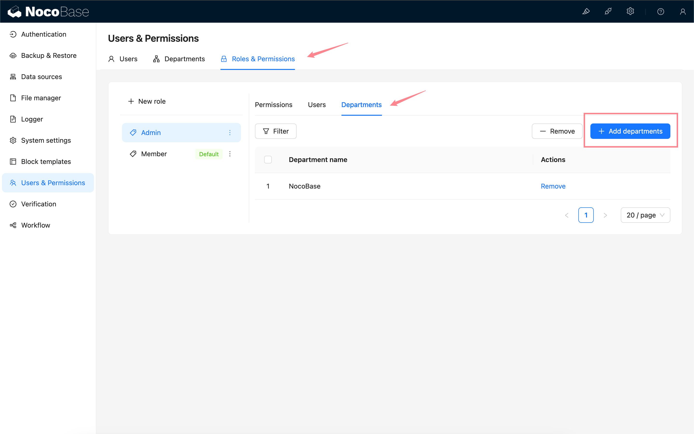
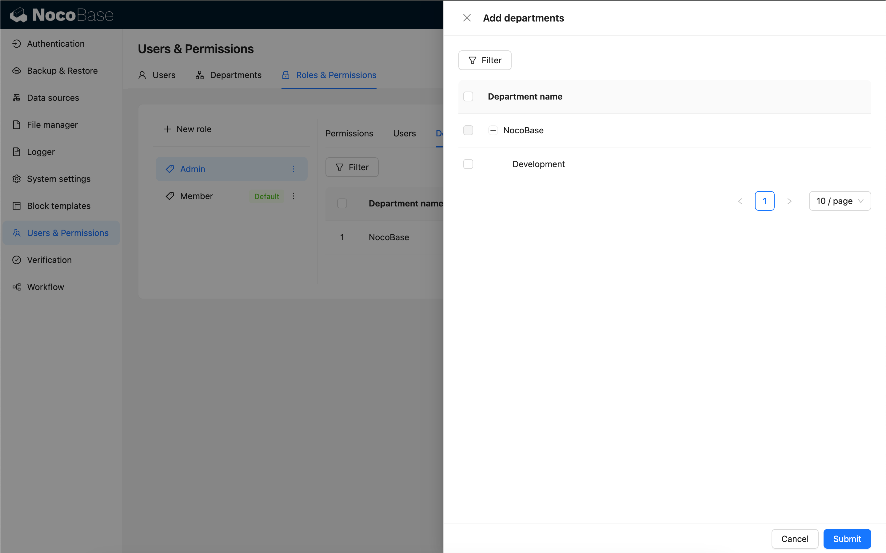

# 使用手册

## 部门管理

### 新建部门

### 新建子部门

### 编辑部门

### 修改上级部门

在编辑部门的表单中修改上级部门字段，当前部门和当前部门的下级部门不可选。

## 部门成员管理

### 查看部门成员列表

### 给部门添加成员

一个用户可以同时加入多个部门，加入的第一个部门默认为主属部门，一个用户只有一个主属部门。

已经是部门成员的用户不会出现在用户选择列表中。

### 设置部门负责人

在编辑部门的表单中点击负责人字段选择部门成员成为负责人，支持多选，已经是部门负责人的成员将不会出现在成员选择列表中。

### 给用户配置部门

除了给部门添加成员，还可以从用户视角，给用户配置部门。

已经加入的部门不可选。

### 修改主属部门

## 部门角色管理

通过给部门关联一个或多个角色，可以使当前部门下的成员拥有这些角色。

有两种方式可以给部门关联角色。

第一种是在部门编辑表单的角色字段选择角色。

第二种是在角色管理里面，给对应角色添加部门。

已经拥有该角色的部门不可选。

## 搜索用户和部门

按照用户昵称、用户名、手机、邮箱搜索用户，按照部门名称搜索部门。

