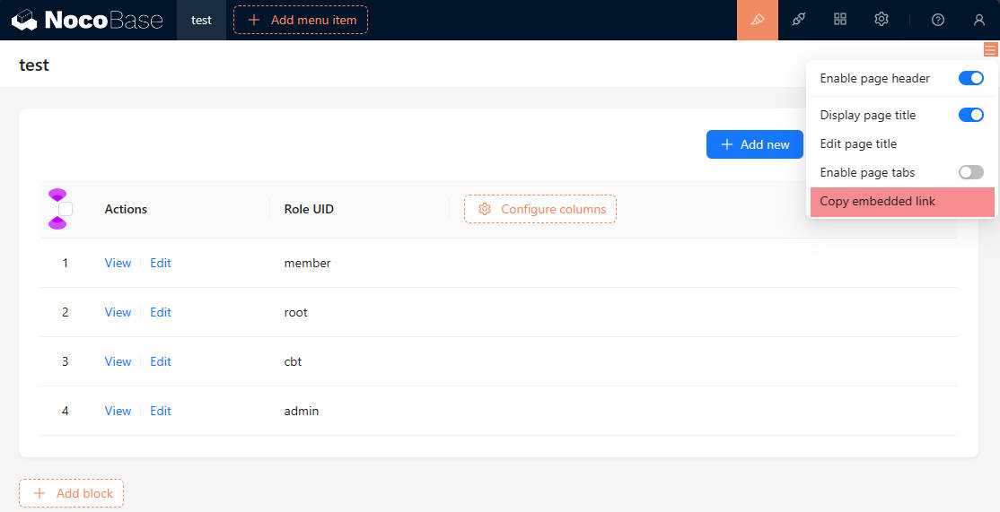

# 嵌入

## 介绍

本插件用于将 NocoBase 的区块嵌入到其他网站或应用程序中。

## 安装

:::info{title=提示}
该插件为商业插件，请查看 [NocoBase 商业版本](https://www.nocobase.com/commercial-cn)了解详情。
:::

## 使用说明

安装插件后，在设计模式下，区块的设置菜单中就会有 *复制嵌入链接* 的选项。

点击后获取到的链接可以单独打开，例如 `https://xxx.com/embed/qs087rz4o2b` 。

如果想要在其他网站或应用程序中嵌入 NocoBase 的区块，需要进行用户打通，并将 `token` 拼接到链接中，例如 `https://xxx.com/embed/qs087rz4o2b?token=xxx`，关于用户打通的详细说明请参考 [用户认证](/handbook/auth)。
