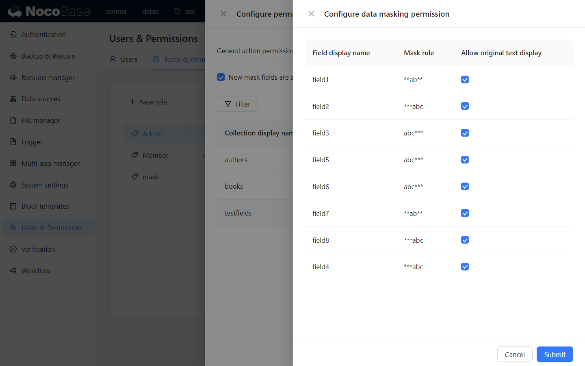
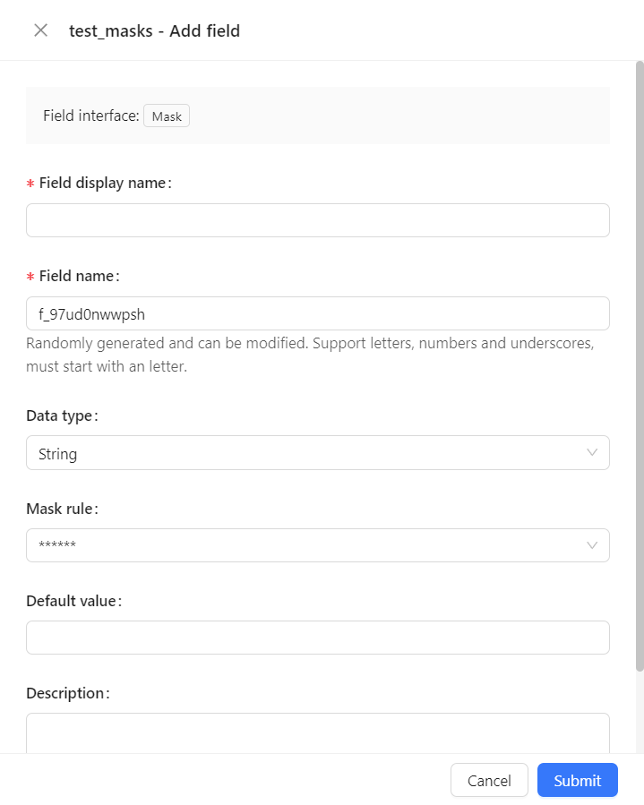

# 掩码

<PluginInfo name="field-mask"></PluginInfo>

## 介绍

系统中某些敏感数据（如个人身份信息、信用卡号、手机号、邮箱等）需要进行保护，以防止未经授权的访问或泄露。这些数据在传输或显示时需要以掩码形式存在，并且在需要时可以显示原始数据。

## 权限控制

可以通过 `用户和权限->角色和权限->数据源->掩码字段权限` 页面为用户角色分配 `显示掩码原文` 权限，拥有该权限的用户可以查看掩码字段的原始数据。

## 功能

在数据表格中，掩码字段默认以掩码形式显示，若当前用户有显示掩码原文权限，且鼠标在掩码字段上点击时，会显示原始数据。

在编辑表单中，掩码字段以掩码形式显示，若当前用户有显示掩码原文权限，掩码字段获取输入焦点时，会显示原始数据，以便用户编辑。失去焦点后，数据会再次以掩码形式显示。

导出数据时，若当前用户有显示掩码原文权限，导出的数据会显示原始数据，否则导出的数据会以掩码形式导出。

## 字段配置

### 数据类型

目前仅支持字符串和数字类型的字段。

### 掩码规则

#### 预定义的掩码规则有：

- `******`：数据被掩码为六个星号。
- `***abc`：数据被掩码为三个星号加上后三位原始数据。
- `**ab**`：数据被掩码为前后两个星号加上中间的两位原始数据。
- `abc***`：数据被掩码为前三位原始数据加上三个星号。

#### 自定义掩码规则

当预定义的掩码规则无法满足需求时，可以选择 `Custom` 自定义掩码规则。
自定义掩码规则写法如下：

- `*` 代表占位符，掩码后会输出指定位数的 `*`。
- 其它字符均为原始数据显示。

例如：

- `a*a*a*` 会将原始数据 `123456` 掩码为 `1*3*5*`。
- `a****a` 会将原始数据 `123456789` 掩码为 `1**9`。
- `33***333` 会将原始数据 `asdfghjkl` 掩码为 `as***kl`。

## 示例

待补充。
