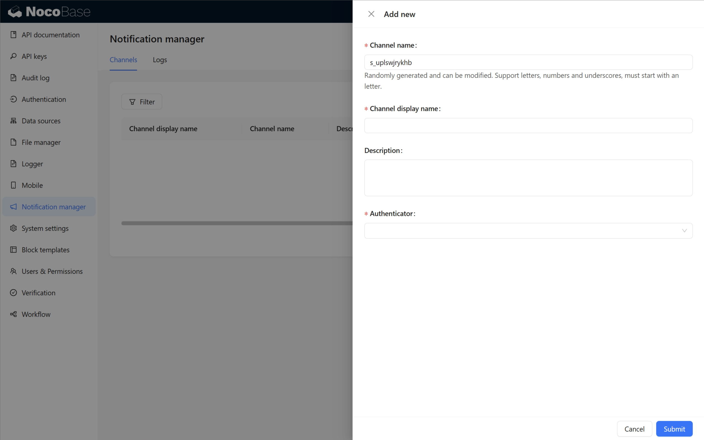
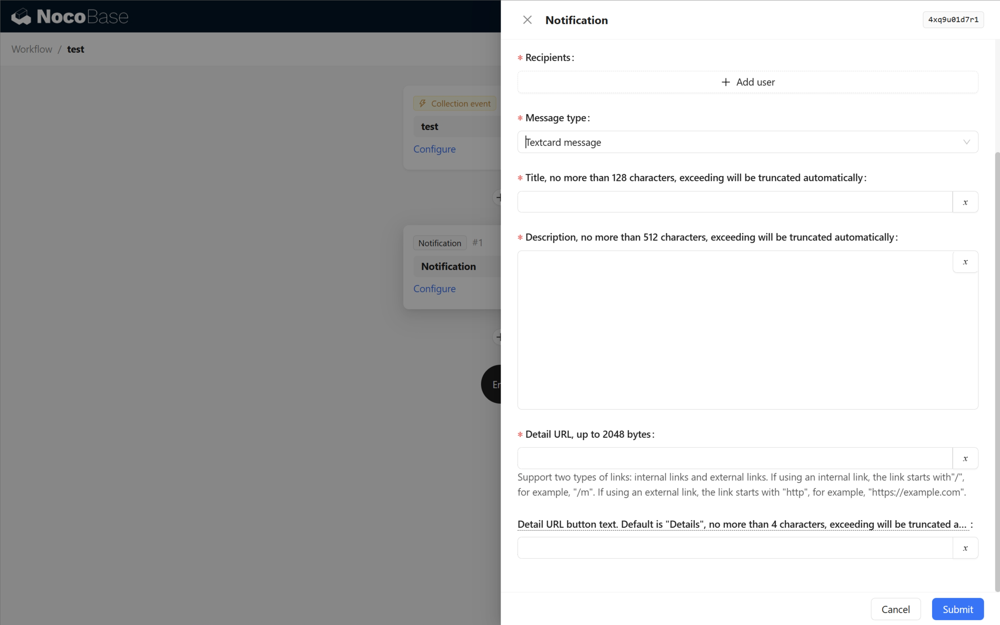
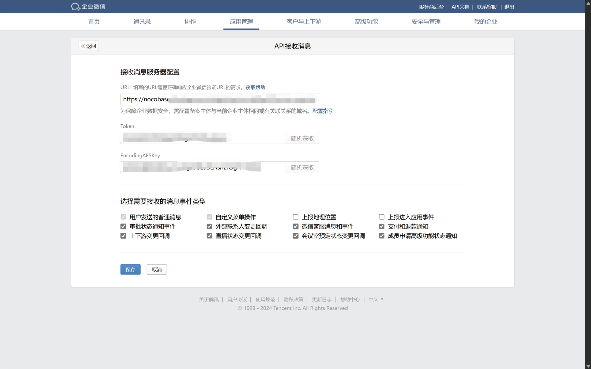
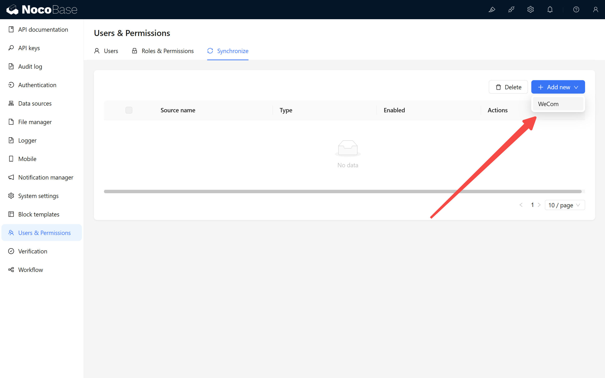
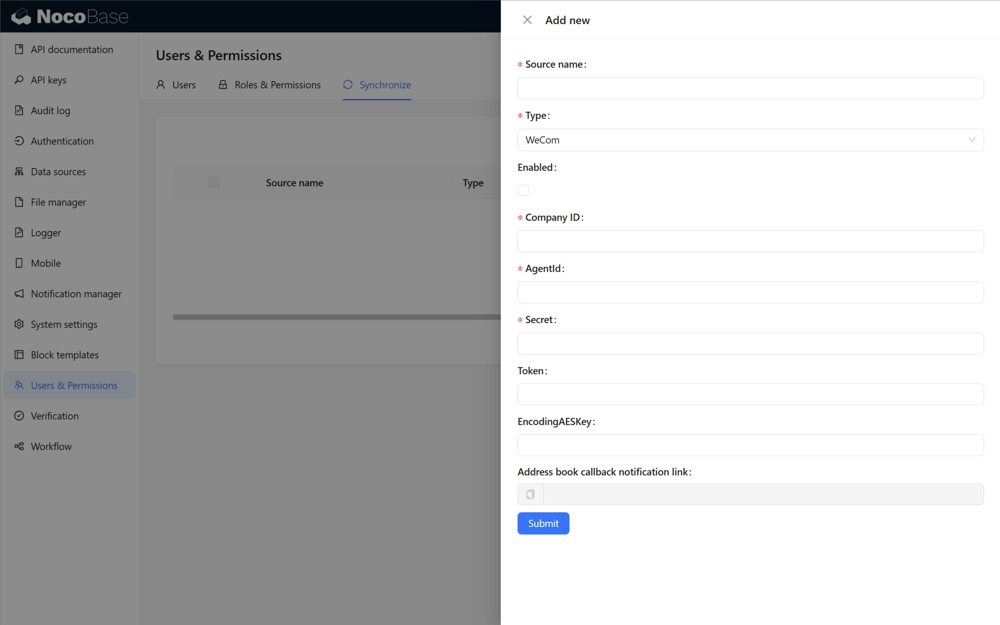
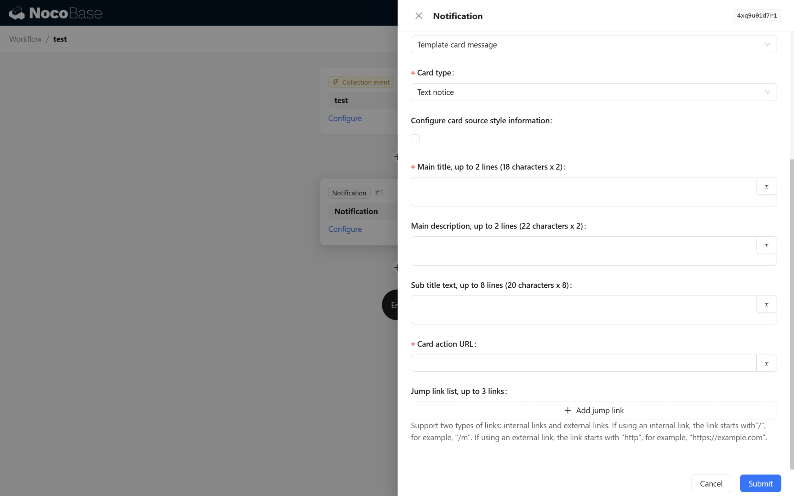

# 通知：企业微信

<PluginInfo commercial="true" name="auth-wecom"></PluginInfo>

## 介绍

通过企业微信渠道发送通知。

## 使用手册

### 安装并启用企微认证插件，并配置好企微认证

[用户认证-企业微信](https://docs-cn.nocobase.com/plugins/auth-wecom)

### 企业微信渠道配置

- Authenticator - 认证器，已配置的企业微信认证器

### 工作流通知配置

企业微信渠道在工作流通知中目前支持三种消息类型：文本卡片消息，Markdown消息，模板卡片消息-文本通知型，每种消息类型具体见[企业微信文档](https://developer.work.weixin.qq.com/document/path/90236)

#### 文本卡片消息

企业微信文档：[文本卡片消息](https://developer.work.weixin.qq.com/document/path/90236#%E6%96%87%E6%9C%AC%E5%8D%A1%E7%89%87%E6%B6%88%E6%81%AF)

#### Markdown消息

企业微信文档：[Markdown消息](https://developer.work.weixin.qq.com/document/path/90236#markdown%E6%B6%88%E6%81%AF)

#### 模板卡片消息-文本通知型

使用模板卡片消息前，需要先设置接受消息回调

进入企业微信应用管理后台，找到接收消息配置

进入配置页面后，生成Token和EncodingAESKey

打开系统，并设置企业微信用户数据同步

基础配置参数与所选企业微信认证配置一致，并填入在企业微信应用后台生成的Token和EncodingAESKey，设置启用并提交保存。保存后再打开配置信息，复制通讯录回调通知链接，填入到企业微信应用配置的接受消息配置的URL字段中，保存接受消息配置

以上步骤完成后，即可配置通知

企业微信文档：[模板卡片消息-文本通知型](https://developer.work.weixin.qq.com/document/path/90236#%E6%96%87%E6%9C%AC%E9%80%9A%E7%9F%A5%E5%9E%8B)
