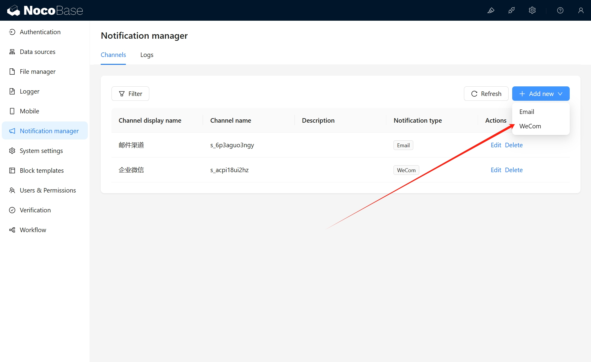
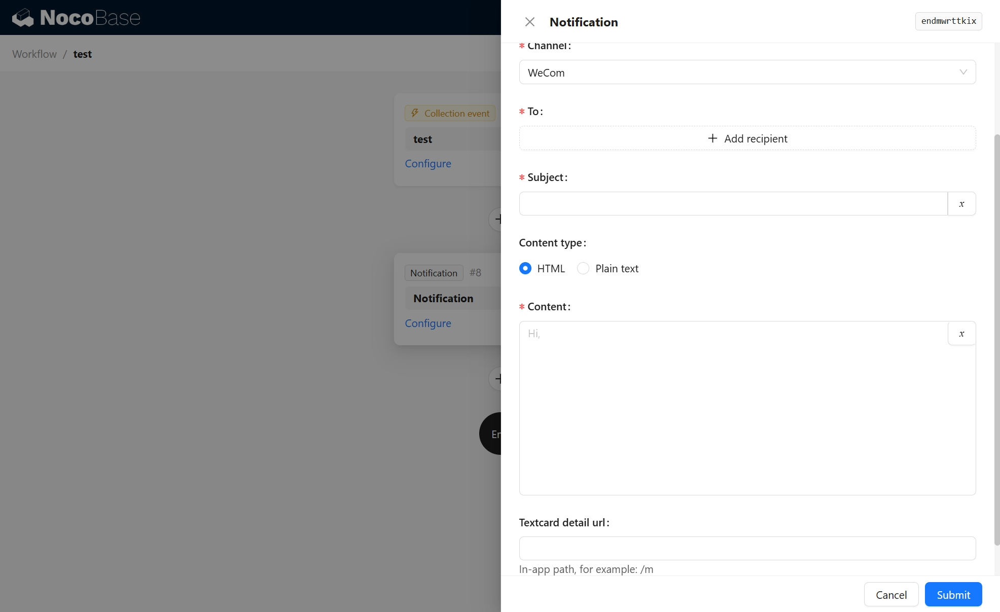
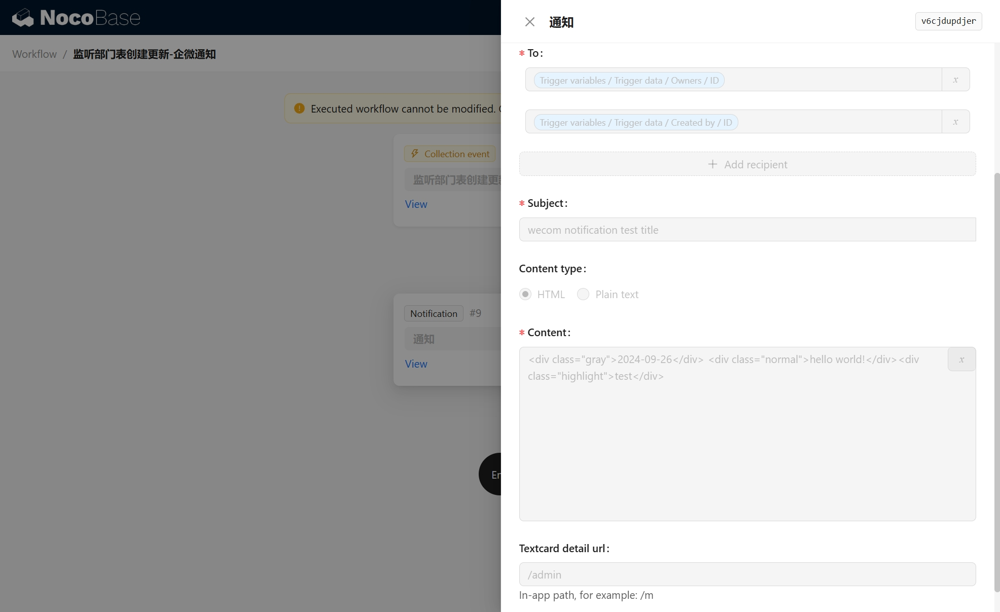

# 通知：企业微信

<PluginInfo name="notification-wecom"></PluginInfo>

## 介绍

通过企业微信渠道发送通知。

## 安装

## 使用手册

### 安装并启用企微认证插件，并配置好企微认证

[用户认证-企业微信](https://docs-cn.nocobase.com/plugins/auth-wecom)

### 企业微信渠道配置

### 工作流通知配置

### 示例

#### 通知配置

#### 通知效果

