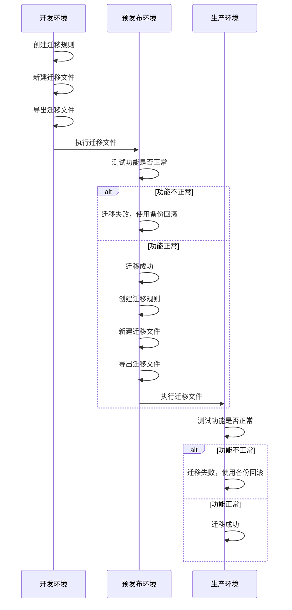

# 发布管理

## 介绍

本篇文档将结合环境变量插件、迁移管理插件和备份管理器插件，详细介绍如何在 NocoBase 应用中进行数据发布管理。

## 1. 创建三个应用，分别对应开发、预发布和生产环境

- 开发环境：用于开发和配置新功能；
- 预发布环境：用于最终验证，确保在生产环境发布时没有问题；
- 生产环境：实际提供服务的环境，必须保证其稳定性和安全性。

### 配置应用

为便于演示，本文将直接使用 Docker 安装 NocoBase。首先，我们将创建三个文件夹，用于配置各环境的应用。

```bash
|- /home/nocobase
  |- development
    |- docker-compose.yml
  |- staging
    |- docker-compose.yml
  |- production
    |- docker-compose.yml
```

每个 docker-compose.yml 里都配置了三个容器

- `app`：NocoBase 应用
- `database`：数据库服务
- `minio`：文件存储服务

<Tabs>

<div label="Development" name="development">

```yaml
networks:
  nocobase:
    driver: bridge

services:
  app:
    image: registry.cn-shanghai.aliyuncs.com/nocobase/nocobase:develop
    restart: always
    networks:
      - nocobase
    depends_on:
      - postgres
    environment:
      # 应用的密钥，用于生成用户 token 等
      # 如果 APP_KEY 修改了，旧的 token 也会随之失效
      # 可以是任意随机字符串，并确保不对外泄露
      - APP_KEY=development-secret-key
      # 数据库类型，支持 postgres, mysql, mariadb, sqlite
      - DB_DIALECT=postgres
      # 数据库主机，可以替换为已有的数据库服务器 IP
      - DB_HOST=database
      # 数据库名
      - DB_DATABASE=nocobase-dev
      # 数据库用户
      - DB_USER=nocobase
      # 数据库密码
      - DB_PASSWORD=nocobase
      # 时区
      - TZ=Asia/Shanghai
      # 商业插件，使用 service platform 的账号信息
      - NOCOBASE_PKG_USERNAME=
      - NOCOBASE_PKG_PASSWORD=
    volumes:
      - ./storage:/app/nocobase/storage
    ports:
      - '14000:80'
  database:
    image: postgres:16
    restart: always
    command: postgres -c wal_level=logical
    environment:
      POSTGRES_USER: nocobase
      POSTGRES_DB: nocobase-dev
      POSTGRES_PASSWORD: nocobase
    volumes:
      - ./storage/db/postgres:/var/lib/postgresql/data
    networks:
      - nocobase
  minio:
    image: minio/minio:latest
    networks:
      - nocobase
    ports:
      - "9000:9000"      # MinIO 控制台端口
      - "9001:9001"      # MinIO 管理端口
    volumes:
      - ./storage/minio:/data     # 将宿主机的 ./data 目录挂载到容器的 /data
    environment:
      MINIO_ROOT_USER: "minioadmin"       # 设置 MinIO 管理用户名
      MINIO_ROOT_PASSWORD: "minioadmin"  # 设置 MinIO 管理密码
    command: server /data --console-address ":9001"
    restart: unless-stopped
```

</div>

<div label="Staging" name="staging">

```yaml
networks:
  nocobase:
    driver: bridge

services:
  app:
    image: registry.cn-shanghai.aliyuncs.com/nocobase/nocobase:develop
    restart: always
    networks:
      - nocobase
    depends_on:
      - postgres
    environment:
      # 应用的密钥，用于生成用户 token 等
      # 如果 APP_KEY 修改了，旧的 token 也会随之失效
      # 可以是任意随机字符串，并确保不对外泄露
      - APP_KEY=staging-secret-key
      # 数据库类型，支持 postgres, mysql, mariadb, sqlite
      - DB_DIALECT=postgres
      # 数据库主机，可以替换为已有的数据库服务器 IP
      - DB_HOST=postgres
      # 数据库名
      - DB_DATABASE=nocobase-staging
      # 数据库用户
      - DB_USER=nocobase
      # 数据库密码
      - DB_PASSWORD=nocobase
      # 时区
      - TZ=Asia/Shanghai
      # 商业插件，使用 service platform 的账号信息
      - NOCOBASE_PKG_USERNAME=
      - NOCOBASE_PKG_PASSWORD=

    volumes:
      - ./storage:/app/nocobase/storage
    ports:
      - '14000:80'

  postgres:
    image: registry.cn-shanghai.aliyuncs.com/nocobase/postgres:16
    restart: always
    command: postgres -c wal_level=logical
    environment:
      POSTGRES_USER: nocobase
      POSTGRES_DB: nocobase-staging
      POSTGRES_PASSWORD: nocobase
    volumes:
      - ./storage/db/postgres:/var/lib/postgresql/data
    networks:
      - nocobase
```

</div>

<div label="Production" name="production">

```yaml
networks:
  nocobase:
    driver: bridge

services:
  app:
    image: registry.cn-shanghai.aliyuncs.com/nocobase/nocobase:develop
    restart: always
    networks:
      - nocobase
    depends_on:
      - postgres
    environment:
      # 应用的密钥，用于生成用户 token 等
      # 如果 APP_KEY 修改了，旧的 token 也会随之失效
      # 可以是任意随机字符串，并确保不对外泄露
      - APP_KEY=production-secret-key
      # 数据库类型，支持 postgres, mysql, mariadb, sqlite
      - DB_DIALECT=postgres
      # 数据库主机，可以替换为已有的数据库服务器 IP
      - DB_HOST=postgres
      # 数据库名
      - DB_DATABASE=nocobase-prod
      # 数据库用户
      - DB_USER=nocobase
      # 数据库密码
      - DB_PASSWORD=nocobase
      # 时区
      - TZ=Asia/Shanghai
      # 商业插件，使用 service platform 的账号信息
      - NOCOBASE_PKG_USERNAME=
      - NOCOBASE_PKG_PASSWORD=

    volumes:
      - ./storage:/app/nocobase/storage
    ports:
      - '14000:80'

  postgres:
    image: registry.cn-shanghai.aliyuncs.com/nocobase/postgres:16
    restart: always
    command: postgres -c wal_level=logical
    environment:
      POSTGRES_USER: nocobase
      POSTGRES_DB: nocobase-prod
      POSTGRES_PASSWORD: nocobase
    volumes:
      - ./storage/db/postgres:/var/lib/postgresql/data
    networks:
      - nocobase
```

</div>

</Tabs>

然后，拉取最新镜像并重建容器

```bash
docker compose pull app
docker compose up -d
```

### 安装数据库客户端

备份还原和迁移管理插件需要安装数据库客户端，Docker 版本，可以直接在 `./storage/scripts` 目录下，编写一段脚本

```bash
mkdir ./storage/scripts
cd ./storage/scripts
vim install-database-client.sh
```

`install-database-client.sh` 的内容如下：

<Tabs>

<div label="PostgreSQL" name="PostgreSQL">

```bash
#!/bin/bash

# Check if pg_dump is installed
if [ ! -f /usr/bin/pg_dump ]; then
    echo "pg_dump is not installed, starting PostgreSQL client installation..."

    # Configure Aliyun mirrors
    tee /etc/apt/sources.list > /dev/null <<EOF
deb http://mirrors.aliyun.com/debian/ bookworm main contrib non-free
deb-src http://mirrors.aliyun.com/debian/ bookworm main contrib non-free
deb http://mirrors.aliyun.com/debian-security/ bookworm-security main contrib non-free
deb-src http://mirrors.aliyun.com/debian-security/ bookworm-security main contrib non-free
deb http://mirrors.aliyun.com/debian/ bookworm-updates main contrib non-free
deb-src http://mirrors.aliyun.com/debian/ bookworm-updates main contrib non-free
deb http://mirrors.aliyun.com/debian/ bookworm-backports main contrib non-free
deb-src http://mirrors.aliyun.com/debian/ bookworm-backports main contrib non-free
EOF

    # Install necessary tools and clean cache
    apt-get update && apt-get install -y --no-install-recommends wget gnupg \
      && rm -rf /var/lib/apt/lists/*

    # Configure PostgreSQL source
    echo "deb [signed-by=/usr/share/keyrings/pgdg.asc] http://mirrors.aliyun.com/postgresql/repos/apt bookworm-pgdg main" > /etc/apt/sources.list.d/pgdg.list
    wget --quiet -O /usr/share/keyrings/pgdg.asc http://mirrors.aliyun.com/postgresql/repos/apt/ACCC4CF8.asc

    # Install PostgreSQL client
    apt-get update && apt-get install -y --no-install-recommends postgresql-client-16 \
      && rm -rf /var/lib/apt/lists/*

    echo "PostgreSQL client installation completed."
else
    echo "pg_dump is already installed, skipping PostgreSQL client installation."
fi
```

</div>
<div label="MySQL/MariaDB" name="MySQL/MariaDB">

```bash
#!/bin/bash

# 检查 mysql 客户端是否已安装
if [ ! -f /usr/bin/mysql ]; then
    echo "MySQL client is not installed, starting MySQL client installation..."

    # 配置 Aliyun 镜像源
    tee /etc/apt/sources.list > /dev/null <<EOF
deb http://mirrors.aliyun.com/debian/ bookworm main contrib non-free
deb-src http://mirrors.aliyun.com/debian/ bookworm main contrib non-free
deb http://mirrors.aliyun.com/debian-security/ bookworm-security main contrib non-free
deb-src http://mirrors.aliyun.com/debian-security/ bookworm-security main contrib non-free
deb http://mirrors.aliyun.com/debian/ bookworm-updates main contrib non-free
deb-src http://mirrors.aliyun.com/debian/ bookworm-updates main contrib non-free
deb http://mirrors.aliyun.com/debian/ bookworm-backports main contrib non-free
deb-src http://mirrors.aliyun.com/debian/ bookworm-backports main contrib non-free
EOF

    # 更新包列表并安装必要的工具
    echo "Updating package list and installing necessary tools..."
    apt-get update && apt-get install -y --no-install-recommends wget gnupg \
        && rm -rf /var/lib/apt/lists/*

    wget --no-check-certificate https://downloads.mysql.com/archives/get/p/23/file/mysql-community-client-core_8.0.39-1debian12_amd64.deb && \
        dpkg -x mysql-community-client-core_8.0.39-1debian12_amd64.deb /tmp/mysql-client && \
        cp /tmp/mysql-client/usr/bin/mysqldump /usr/bin/ && \
        cp /tmp/mysql-client/usr/bin/mysql /usr/bin/

    echo "MySQL client installation completed."
else
    echo "MySQL client is already installed, skipping installation."
fi
```

</div>

</Tabs>

然后重启 app 容器

```bash
docker compose restart app
# 查看日志
docker compose logs app
```

查看数据库客户端版本号，必须与数据库服务端的版本号一致

<Tabs>
<div label="PostgreSQL" name="PostgreSQL">

```bash
docker compose exec app bash -c "pg_dump -V"
```

</div>
<div label="MySQL/MariaDB" name="MySQL/MariaDB">

```bash
docker compose exec app bash -c "mysql -V"
```
</div>
</Tabs>

### 激活备份管理和迁移管理插件


尝试备份和还原功能是否正常


:::info
到此，应用的前期准备就差不多了，接下来我们进入下一个重点。
:::

## 2. 配置中心化，借助环境变量插件轻松配置第三方信息

这一章，我们将创建一个文件表用于存储文件，并且使用 minio 作为文件存储服务。

### 配置环境变量

因为不同环境的文件存储服务并不相同，所以我们需要将 minio 配置存放到环境变量里待用，其中 MINIO_ACCESS_KEY_SECRET
加密存储。

```bash
MINIO_BASE_URL=http://localhost:9000/dev-bucket
MINIO_REGION=auto
MINIO_ACCESS_KEY_ID=2BNszTAUdzmuEMH8mqSJ
MINIO_ACCESS_KEY_SECRET=JH8H2whk1Ut4ThoPm3ozTgVxWMw0kUJzHKdkFIWx
MINIO_BUCKET=dev-bucket
# 注：示例 docker-compose.yml 的 app 和 minio 在同一 network 下，对应的 endpoint 是 http://<container-name>:9000 的格式
MINIO_ENDPOINT=http://minio:9000
```


### 新建文件存储

新增 Minio 存储，因为 Minio 兼容 S3 协议，所以直接选 S3 就可以。


新建 files 文件表，文件存储选择刚才创建的 minio。


### 添加区块

在界面里添加 files 表格区块


:::info
这一步，我们配置了一个简单的文件表，并使用了 minio 存储服务，接下来我们开始尝试将开发环境的应用迁移到预发布环境进行测试。
:::

## 3. 通过迁移管理插件，确保应用配置在多个环境间顺利迁移

建议只能在开发环境配置应用，通过迁移将应用配置导入到预发布环境，然后再从预发布环境导入生产环境，预发布环境和生产环境不允许配置应用。

### 流程图




### 创建迁移规则


### 新建迁移文件

新建迁移，并把迁移文件下载下来备用。


### 执行迁移

打开预发布环境的迁移管理，上传迁移文件并执行


### 设置环境变量

这一步会提醒用户填写缺失的环境变量，我们将预发布环境的 minio 配置填写上来，并继续

```bash
MINIO_BASE_URL=http://localhost:9100/dev-bucket
MINIO_REGION=auto
MINIO_ACCESS_KEY_ID=VjvOMmNRSgB1WYOIQFch
MINIO_ACCESS_KEY_SECRET=iq0o82vfUZkO3b108NEQhyAG76IGk3xqCrp4VoRA
MINIO_BUCKET=staging-bucket
# 注：示例 docker-compose.yml 的 app 和 minio 在同一 network 下，对应的 endpoint 是 http://<container-name>:9000 的格式
MINIO_ENDPOINT=http://minio:9000
```


### 测试功能是否正常

// 缺失

### 迁移失败回滚


