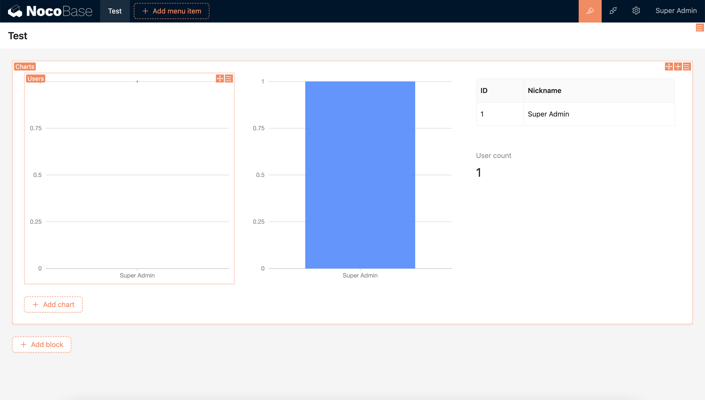

# 区块

区块是内容的载体，可以放置于页面（Page）、对话框（Modal）或抽屉（Drawer）里，多个区块可以自由拖拽排列。

## 添加区块

区块可以放置于页面（Page）、对话框（Modal）或抽屉（Drawer）里

### 页面里的区块

目前页面里的区块类型包括：数据区块、筛选区块、其他区块

### 弹窗（对话框或抽屉）里的区块

弹窗有对话框和抽屉两种，和页面一样也可以添加区块，区别在于弹窗里的区块通常为单条记录的添加、编辑或查看等，区块类型包括数据区块、其他区块。

## 区块的设计器

每个区块右上角都有三个小图标，从左到右分别为：

1. 拖拽布局
2. 快捷添加区块
3. 区块参数配置

简单的区块所有的配置项都集中在「区块参数配置」里，如 Markdown

复杂的数据类型区块还会提供独立的内嵌的「配置字段」和「配置操作」

除此之外，也可以自由发挥，提供更多嵌套的可能，如图表区块

## 区块布局

多个区块可以通过拖拽调整布局

## 区块类型

