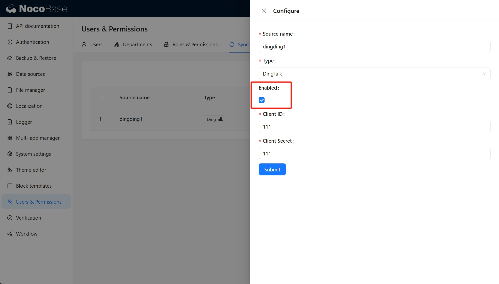
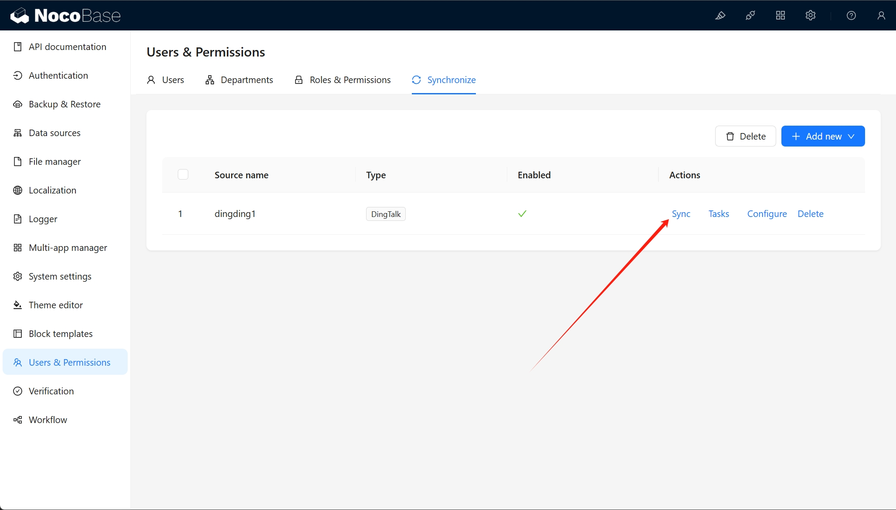
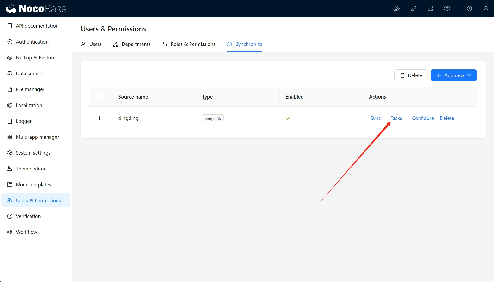
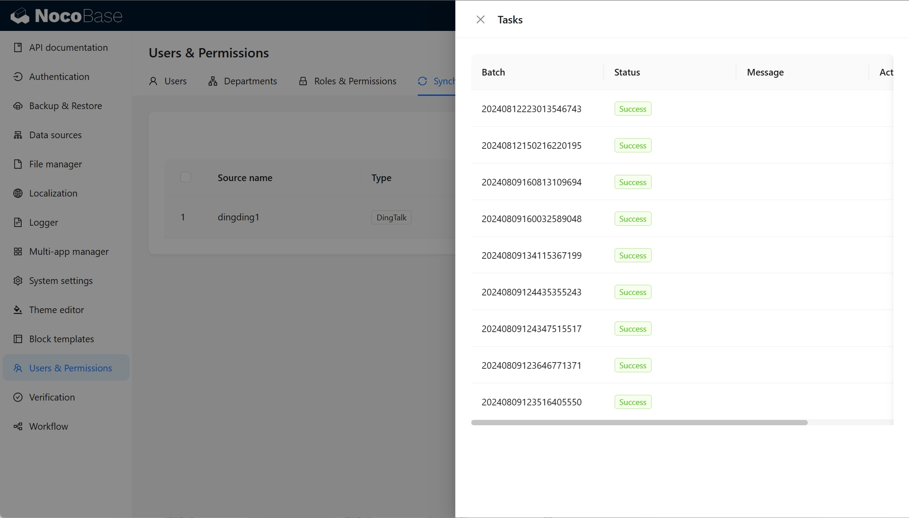
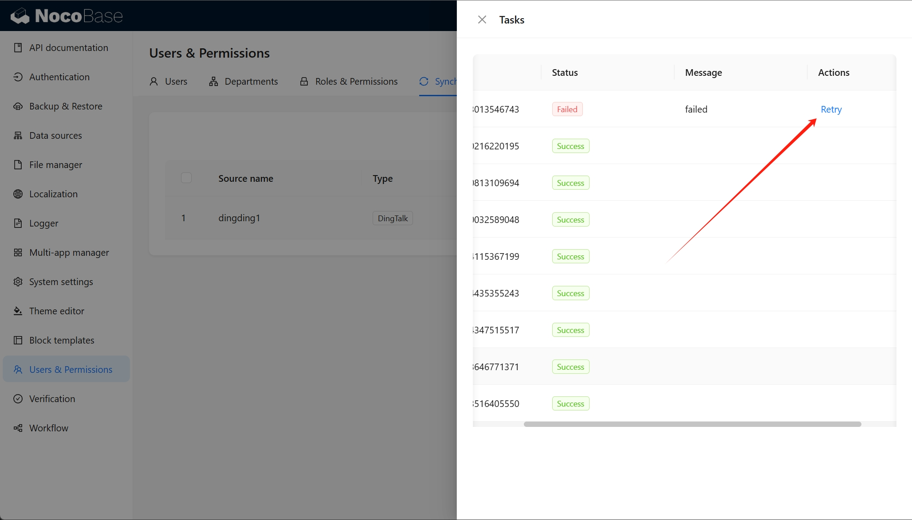
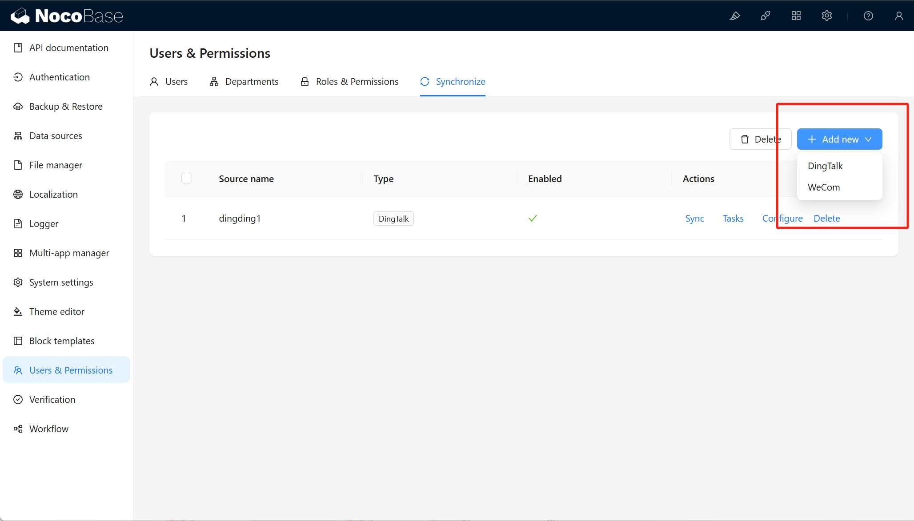

# 使用手册

## 数据源管理

用户数据同步插件在配置中心提供了一个管理界面。

## 激活数据源

只有激活的数据源才会显示同步和任务按钮。

## 同步数据

点击同步按钮后即开始同步。

点击任务按钮后可以查看同步任务列表。

任务列表中可对失败的任务进行重试，点击后重新开始同步。

## 数据源类型

目前支持的数据源类型有：

- 钉钉, [dingtalk-auth 插件](../auth-dingtalk/index.md) 扩展
- 企业微信, [wecom-auth 插件](../auth-wecom/index.md) 扩展

除此之外，也可以自己扩展数据源，参考[开发指南](./dev/guide.md)。