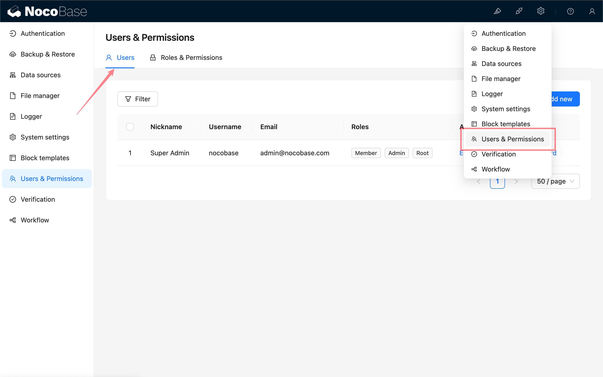
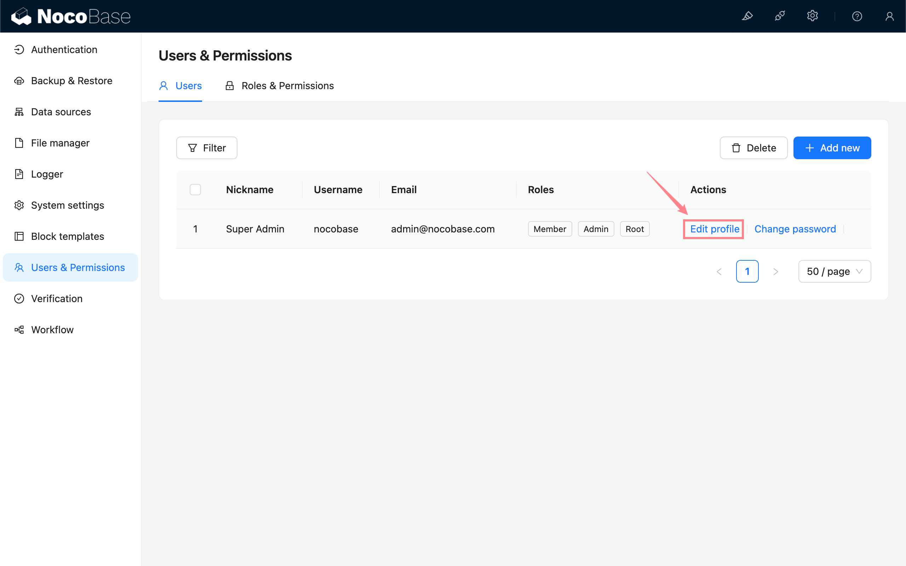
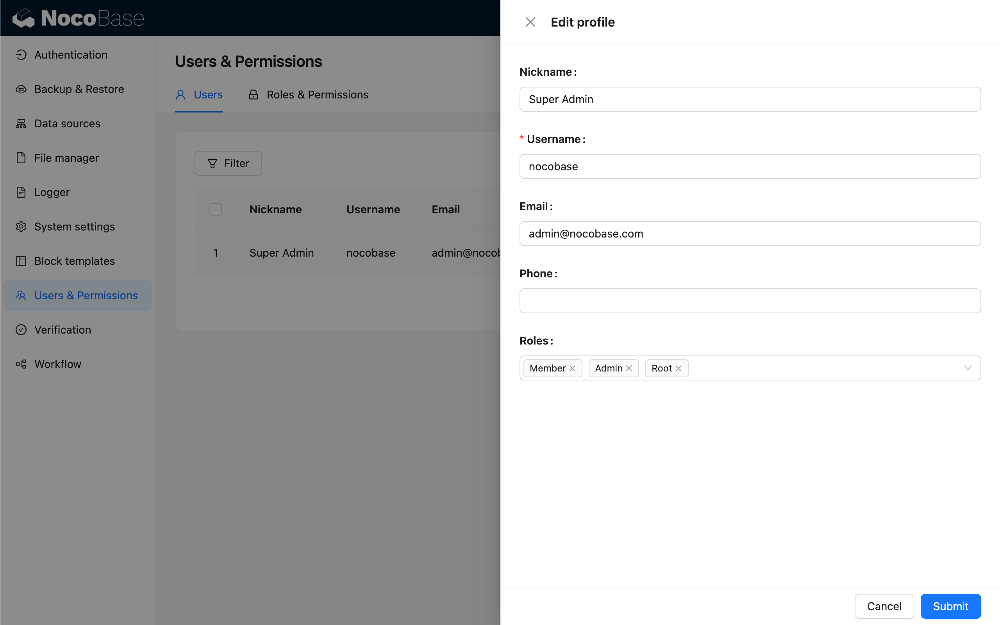
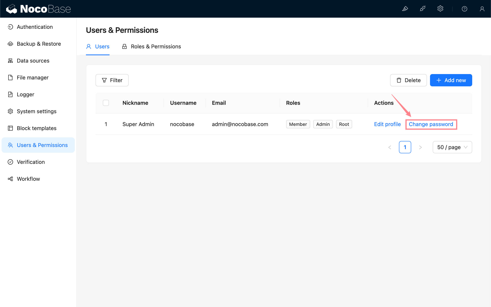
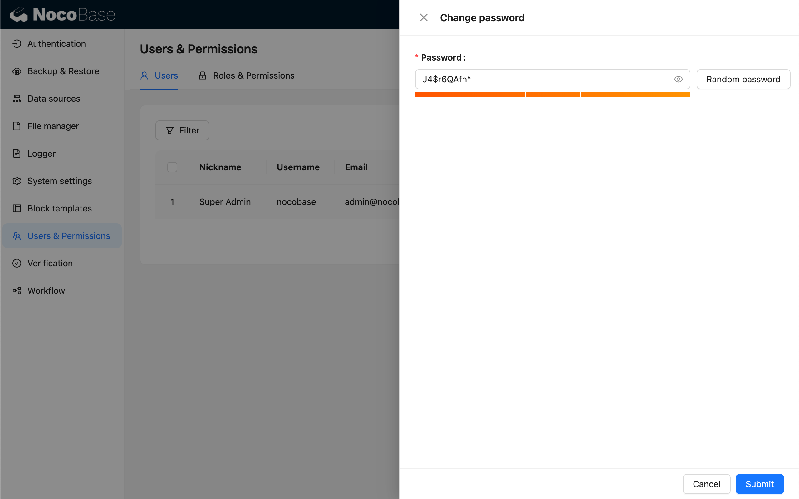

# 用户

<PluginInfo name="users"></PluginInfo>

## 介绍

用户插件提供了基础的用户模型，同时为其他数据模型提供创建人和最后更新人字段。

## 安装

内置插件，无需单独安装。

## 使用说明

### 用户管理

NocoBase 在插件配置中心里内置了一个用户管理界面。应用初始化以后会添加一个不可删除的管理员账号, 管理员拥有 Root 权限，可以访问所有资源。

除此之外，也可以在页面中使用用户表添加各种不同的区块来管理用户，比如表格区块：

### 添加用户

### 修改用户资料

### 修改用户密码

