# 操作后事件

系统中的所有用户产生的数据变动，通常都通过某项操作来完成，具体形式通常是点击某个按钮，按钮可能是表单中的提交按钮，也可能是数据区块中的操作按钮。操作后事件用于对这些按钮的操作绑定相关的工作流，以达成用户操作成功后触发特定流程的效果。

例如，在新增或更新数据时，用户可以通过配置按钮的“绑定工作流”选项，或者直接使用“提交至工作流”按钮，将数据提交至绑定的工作流。一旦绑定了工作流，点击按钮将触发相应的工作流程。

除“提交至工作流”直接提交到工作流处理以外，操作后事件都是在数据提交成功后触发的，如果按钮原有的操作逻辑处理失败，则不会触发该事件。

在实现层面，由于操作后事件的处理处于中间件层（Koa 的中间件），因此，对 NocoBase 的 HTTP API 调用也可以触发已定义的操作后事件。

:::info{title="提示"}
操作后事件原名为“操作后事件”，在早前的版本中，该功能只针对表单按钮。`v0.20` 版本开始支持更多数据区块中的操作按钮，所以更名为“操作后事件”。
:::

## FAQ

### 与操作前事件的区别

操作后事件与操作前事件的区别在于，在整个操作请求发出并获得响应的过程中，一个在操作处理前触发，一个在操作处理后触发，如下图所示：

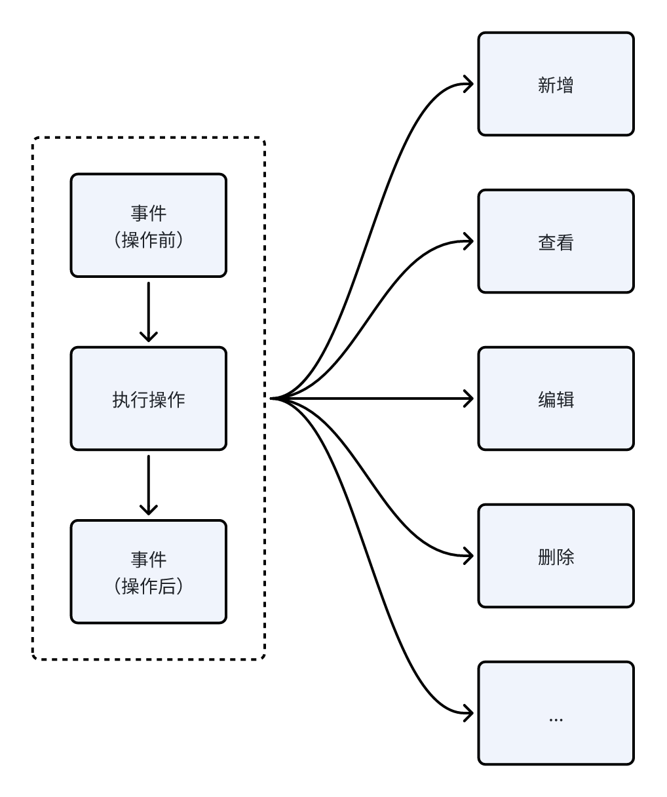

操作前事件是在操作执行前触发，操作前事件是在请求执行前，可以对请求的数据进行校验或处理，如果请求被拦截，该操作将不会被执行。

而操作后事件是在用户操作成功后触发，此时数据已经提交成功，可以根据成功的结果继续处理相关的流程。

### 与数据表事件的区别

操作后事件与数据表事件有类似之处，从效果上看都是在数据变动后触发的流程，但实现的层面各有不同，操作后事件是针对 API 层面的，而数据表事件是针对数据表的数据变动的。

数据表事件更靠近系统底层，在一些情况下可能由一个事件导致的数据变动触发另一个事件，能产生连锁反应。尤其是部分关联数据表的数据在当前表的操作中也发生了变动，则关联表相关的事件也会被触发。

事件的触发也不包含用户相关的信息。而操作后事件更贴近用户端，是用户操作的结果，流程的上下文也会包含用户的相关信息，适合处理用户操作的流程。在 NocoBase 对未来的设计中，可能会扩展更多可用于触发的操作后事件，所以**更推荐使用操作后事件**来处理用户操作导致数据变动的流程。

另一点区别是，操作后事件可以局部绑定在特定的表单上，如果有多个表单，可以一部分表单的提交触发该事件，而另一部分不触发，而数据表事件是针对整个数据表的数据变动，无法局部绑定。

## 安装

内置插件，无需安装。

## 使用手册

### 基本使用

#### 创建工作流

创建工作流时，类型选择“操作后事件”：

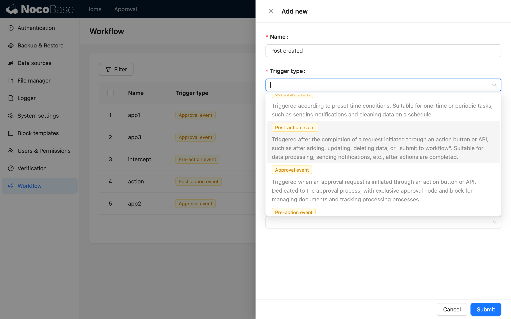

#### 执行模式

对于操作后事件，创建时还可以选择执行模式为“同步”或“异步”：

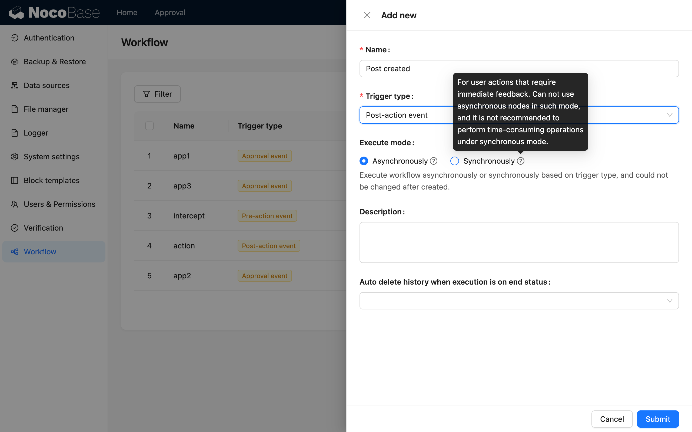

如果是需要在用户操作后立即执行并返回的流程，可以使用同步模式，否则默认为异步模式。异步模式下触发工作流后该操作即完成，工作流会在应用后台以队列的方式陆续执行。

#### 配置数据表

进入工作流画布，点击触发器打开配置弹窗，首先需要选择要绑定的数据表：

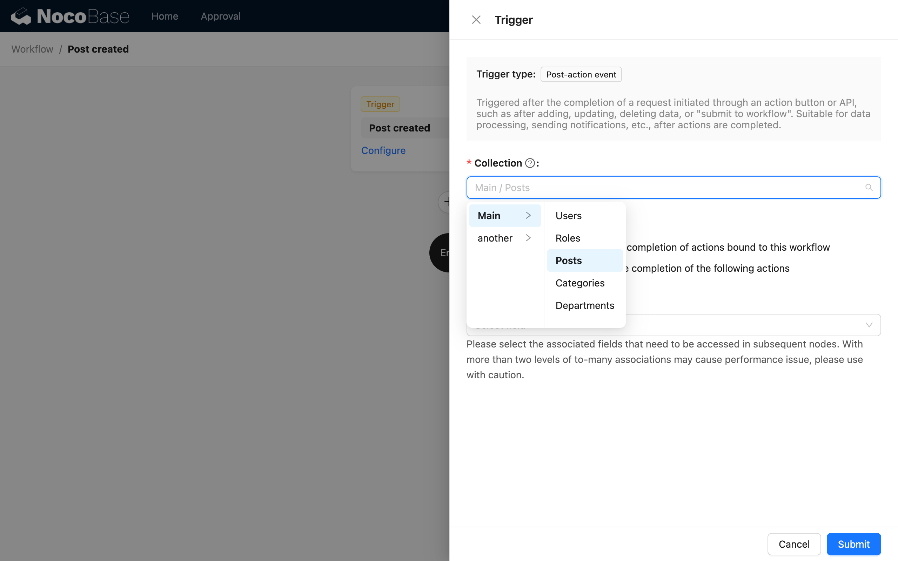

#### 选择触发模式

然后选择触发模式，有局部模式和全局模式两种：

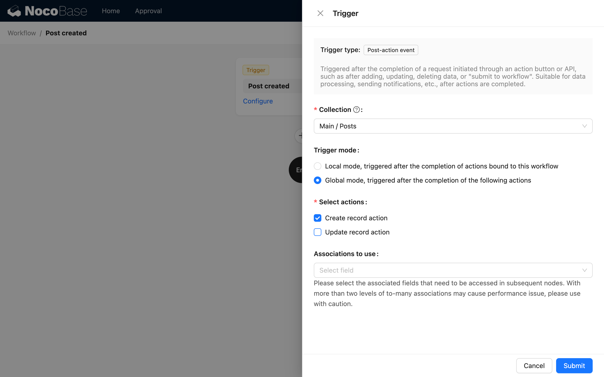

其中：

* 局部模式只在绑定了该工作流的操作按钮上触发，未绑定该工作流的按钮点击后不会触发。可基于用途不同的表单，是否触发同一个流程的考虑，以决定是否绑定该工作流。
* 全局模式则是在数据表的所配置操作按钮上都会触发，不区分来自哪个表单，也无需绑定对应工作流。

局部模式下，目前支持绑定的操作按钮如下：

* 新增表单的“提交”、“保存”和“提交至工作流”按钮。
* 更新表单的“提交”、“保存”和“提交至工作流”按钮。
* 数据行（表格、列表、看板等）中的“更新数据”和“提交至工作流”按钮。

#### 选择操作类型

如选择了全局模式，还需要选择操作类型，目前支持“创建数据操作”和“更新数据操作”。两种操作均在操作成功后触发工作流。

:::info{title="提示"}
“提交至工作流”按钮是一种特殊的操作按钮，会将表单中或当前数据记录中的数据直接提交至绑定的工作流，不需要选择操作类型。全局模式对“提交至工作流”不产生影响，都必须在绑定的按钮上点击才触发。
:::

#### 选择预加载关系数据

如需在后续流程中使用触发数据的关联数据，可以选择需要预加载的关系字段：

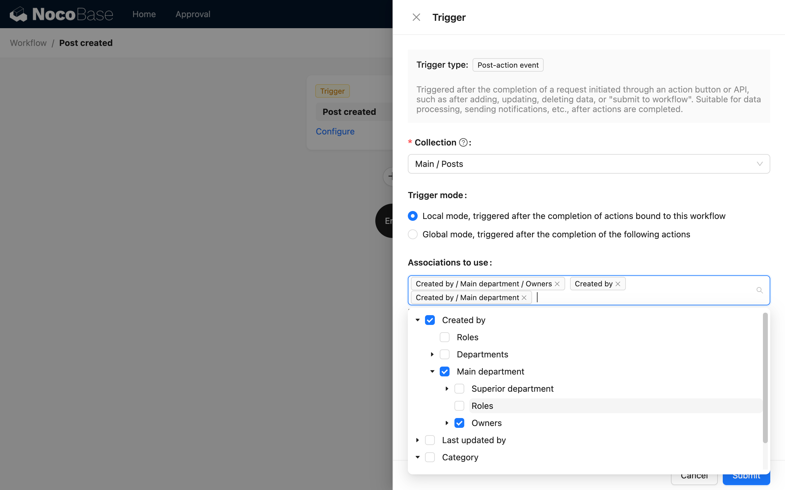

在触发后则可以在流程中直接使用这些关联数据。

#### 表单按钮绑定

对于局部触发模式或“提交至工作流”的操作，工作流配置完成后，需要回到用户界面，在对应数据区块的表单操作按钮上绑定该工作流。

针对“提交”按钮（含“保存数据”按钮）配置的工作流，将在用户提交对应表单且数据操作完成后被触发。

针对自定义的“提交至工作流”按钮配置的工作流，将在用户点击对应按钮时，直接将已配置的表单数据提交到对应工作流进行处理。

从按钮配置的菜单中选择“绑定工作流”，即可打开绑定配置弹窗。弹窗中可以配置任意多个要触发的工作流，如果一个都不配置，则代表无需触发。针对每一个工作流，需要先限定触发的数据是整个表单的数据还是表单中的某个关系字段的数据，之后再根据所选的数据模型对应的数据表，选择已配置了匹配该表模型的表单工作流。

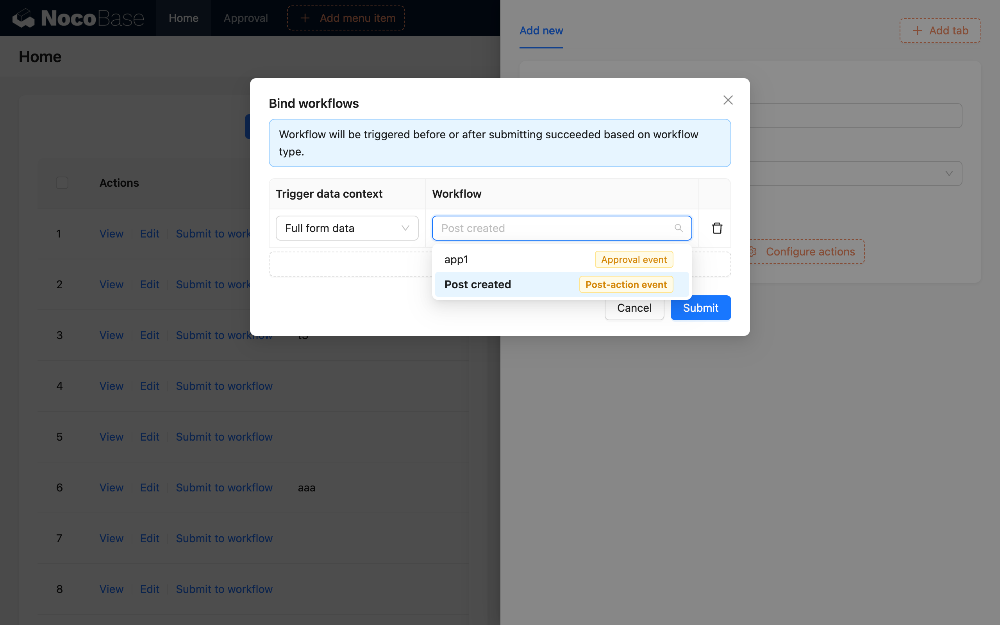

:::info{title="提示"}
工作流需要启用后，才可以在以上界面被选择。
:::

### 示例

普通的“提交”触发与数据表事件类似，这里主要针对“提交至工作流”的方式进行演示。

假设一个“报销申请”的场景，我们需要在员工提交费用报销后，进行额度的自动审核和超出额度的人工审核，审核成功的才通过申请，并在之后交由财务处理。

首先，我们可以先创建一张“费用报销”数据表，有以下字段：

- 项目名称：单行文本
- 申请人：多对一（用户）
- 金额：数字
- 状态：单选（“审核通过”、“处理完成”）

之后先创建一个“操作后事件”类型的工作流，并且把触发器中的数据表模型配置为“费用报销”表：

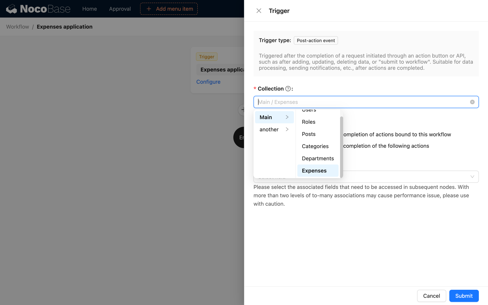

将工作流设置为启用状态后，流程的具体处理节点稍后再回来配置。

然后我们在界面上创建“费用报销”数据表的表格区块，并且在工具栏增加一个“添加”按钮，配置对应的表单字段。这里我们不使用默认的“提交”按钮，而是移除后重新添加一个“提交至工作流”的按钮：

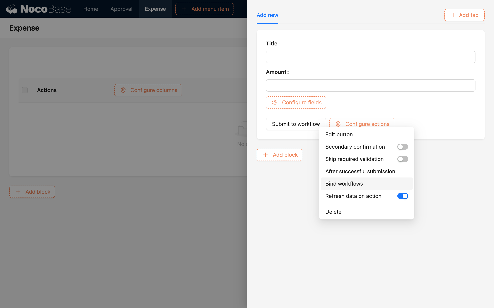

并打开按钮的“绑定工作流”配置对话框，选择整个表单数据作为上下文，以及工作流为我们之前创建的工作流：

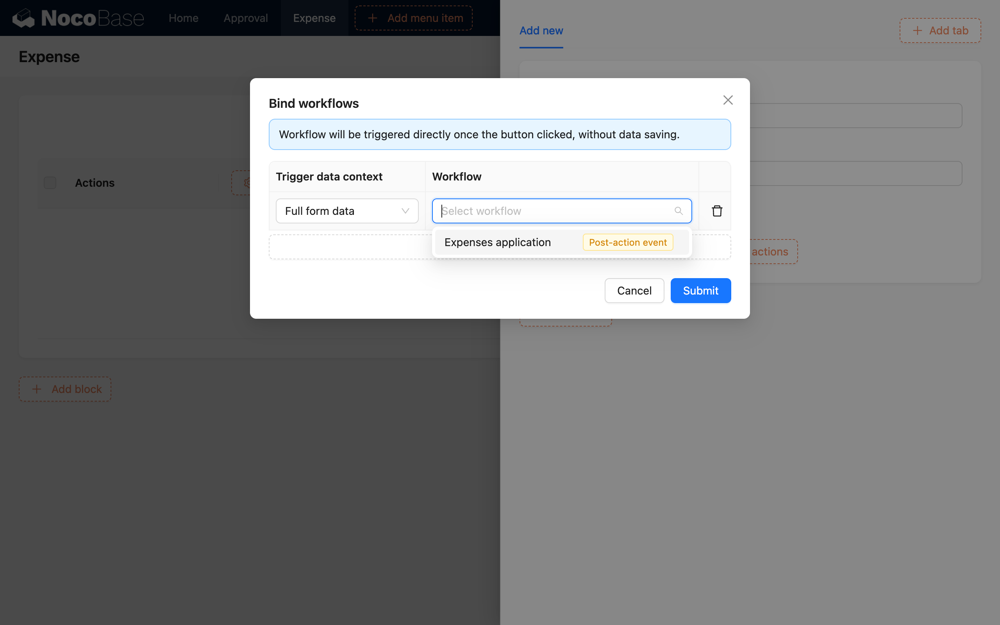

表单配置完成后，再回到工作流的逻辑编排。比如我们需要金额大于 500 元时要求管理员进行人工审核，否则直接通过，审核通过后才创建报销记录，并由财务进一步处理（略）。

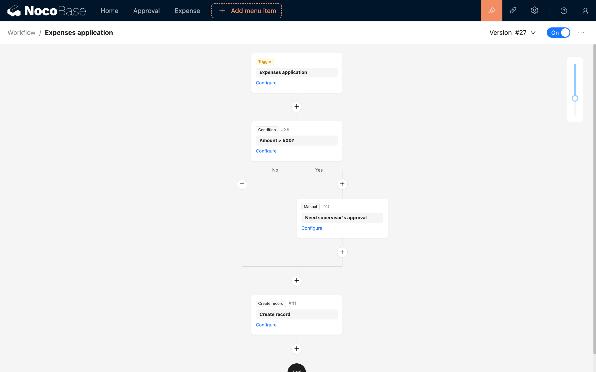

忽略后续财务的处理的话，这样就完成了申请报销流程的配置，当员工填写报销申请并提交后，会触发对应的工作流，如果费用金额小于 500，会自动创建记录并等待财务进一步处理，否则会由主管审核，审核通过后也是一样创建记录并交给财务处理。

该示例的流程也可以配置在普通“提交”按钮上，可以根据具体的业务场景决定是否需要先创建记录再执行后续的流程。

:::info{title="提示"}
对于绑定在新增表单中“提交至工作流”按钮触发的工作流，在点击按钮触发后，不会自动新增数据。由于数据本身不存在，所以也无法使用预加载该数据的关联数据。
:::
