# 操作前事件

操作前事件插件提供了一种可以对表单的操作请求进行拦截的机制，拦截事件会在对应的表单操作提交后且被处理之前触发。如果在触发后的流程中有“结束流程”节点被执行，或者其他节点执行失败（出错或其他未能执行完成的情况），则该表单操作将被拦截，否则预定操作将被正常执行。搭配使用“响应消息”节点可以为该流程配置返回客户端的响应消息，以对客户端给出相应的提示信息。操作前事件可用于进行业务验证或逻辑检查，以通过或拦截客户端提交的创建、更新和删除等操作请求。

## 安装

:::info{title=提示}
该插件为商业插件，请咨询开发团队获取。
:::

## 使用手册

### 基本使用

创建工作流时，类型选择“操作前事件”：

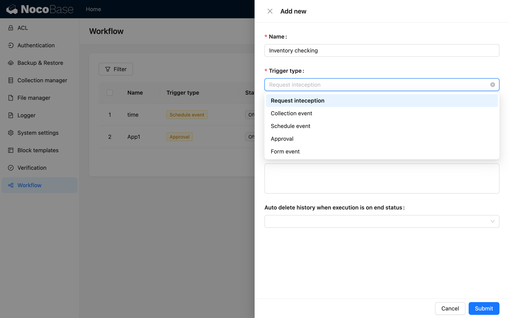

拦截工作流的触发器中首先要配置的是操作对应的数据表：

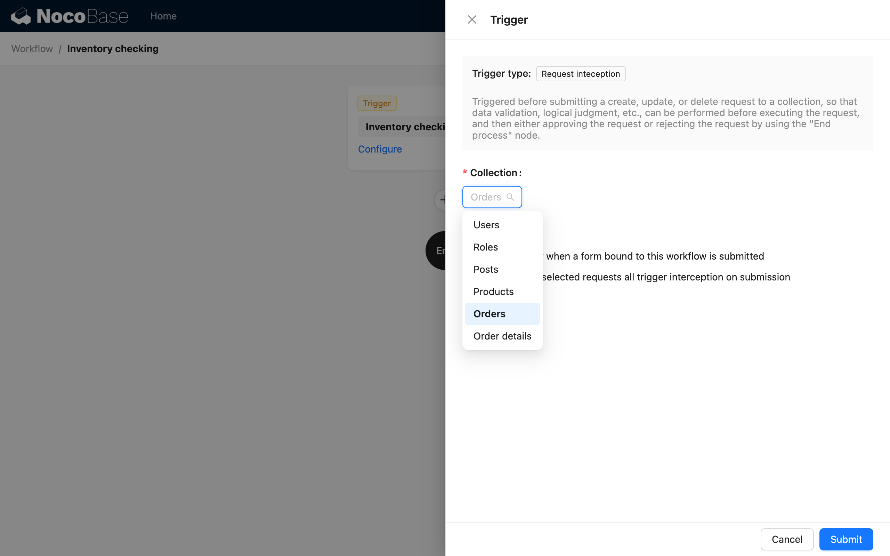

然后选择拦截模式，可以选择仅对绑定了该工作流的操作按钮拦截，也可以选择针对该数据表的所选操作都拦截（不区分来自哪个表单，也无需绑定对应工作流）：

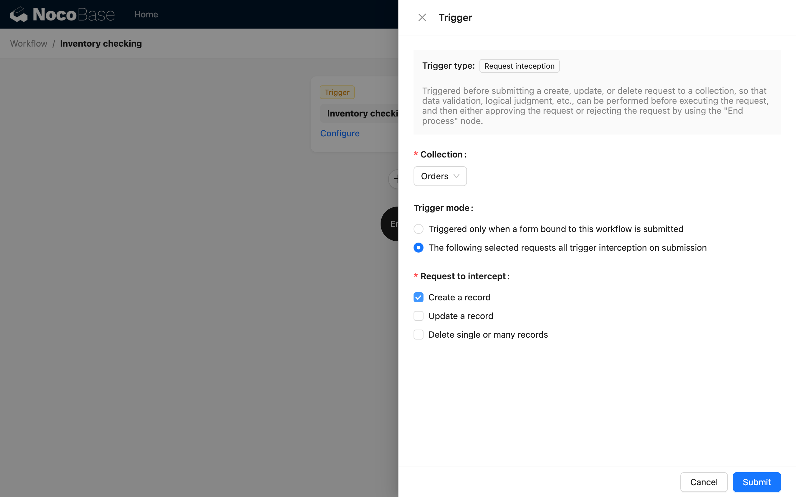

目前支持的操作类型有“创建”、“更新”和“删除”，可以同时选择多个操作类型。

配置好触发器之后，可以在工作流中自定义相关的判断逻辑，通常会使用“条件判断”节点的分支模式，根据具体业务条件判断结果，选择是否“结束流程”，并返回预设的“响应消息”：

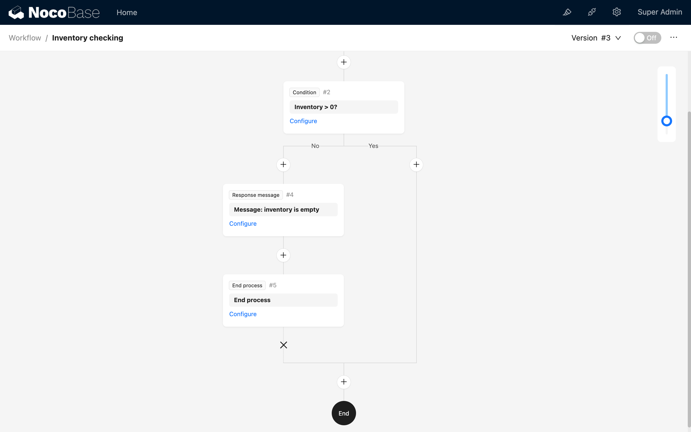

如果触发器配置中选择了“绑定该工作流的表单提交时才触发拦截”的模式，还需要回到表单界面，在对应操作按钮上绑定该工作流：

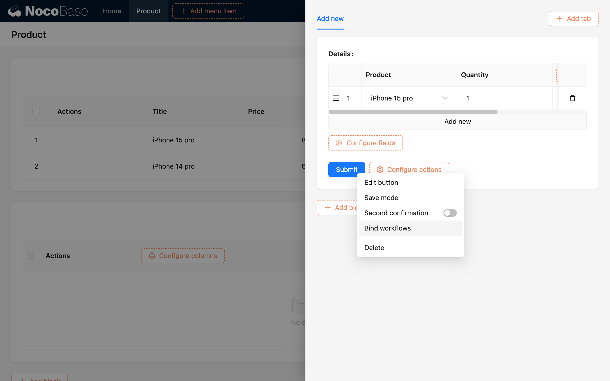

在绑定工作流的配置中选择对应的工作流，通常触发数据的上下文选择默认为“整个表单数据”即可：

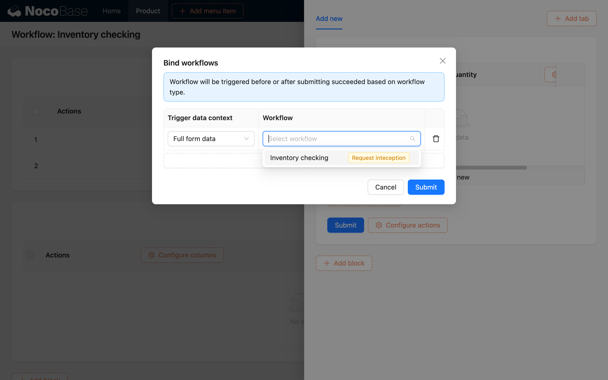

至此即完成了对应工作流的配置，并可以尝试提交一个不满足流程中条件判断配置的数据，触发拦截器的拦截逻辑，这时可以看到返回的响应消息：

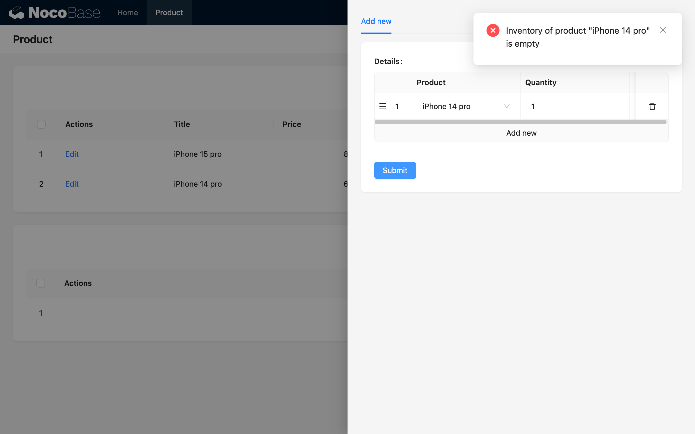

:::info{title=提示}
操作前事件要绑定的按钮目前仅支持使用新增或更新表单中的“提交”（或“保存”）、“更新数据”和“删除”按钮，不支持使用“提交至工作流”按钮（该按钮仅可绑定“操作后事件”）。
:::

### 相关提示

#### 达成拦截的条件

在“操作前事件”中有两种条件会导致对应操作被拦截：

1. 流程执行到任意的“结束流程”节点，类似前面的使用说明中，当触发流程的数据不满足“条件判断”节点中预设的条件时，会进入“否”的分支并执行“结束流程”节点，此时流程会结束，并且请求的操作将被拦截。
2. 流程中的任意节点执行失败，包括节点执行出错，或其他异常情况，此时流程会以对应状态结束，并且请求的操作也将被拦截。例如流程中有通过“HTTP 请求”调用外部数据时，如果请求失败，该流程以失败的状态结束的同时，也会拦截对应的操作请求。

达成拦截条件后，对应的操作不再会被执行，例如提交订单被拦截后，不会生成对应的订单数据。

#### 对应操作的相关参数

“操作前事件”类型的工作流中，针对不同的操作，触发器中有不同的数据可作为变量在流程中使用：

| 操作类型 \\ 变量   | “操作者” | “操作者角色标识” | 操作参数：“ID” | 操作参数：“提交的数据对象” |
| ------------------ | -------- | ---------------- | -------------- | -------------------------- |
| 创建一条记录       | ✓        | ✓                | -              | ✓                          |
| 更新一条记录       | ✓        | ✓                | ✓              | ✓                          |
| 删除单条或多条记录 | ✓        | ✓                | ✓              | -                          |

:::info{title=提示}
对于删除操作，在针对单条记录时，操作参数中的“ID”是一个简单的值，而在针对多条记录时，操作参数中的“ID”是一个数组。
:::

#### 响应消息的状态

如果在“结束流程”节点中配置的是以“成功”状态退出，且执行到该“结束流程”节点时，该操作的请求仍会被拦截，但返回的响应消息会以“成功”（而不是“错误”）的状态显示：

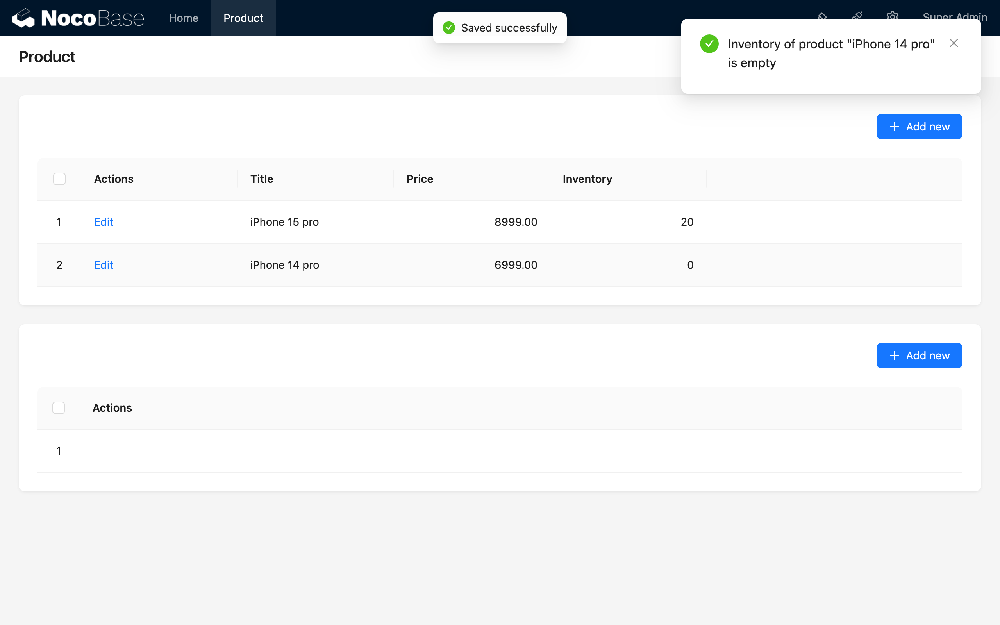

### 示例

结合上面基本的使用说明，我们以一个“订单提交”场景为例，假设我们需要在用户提交订单时，对用户选择的所有产品库存进行校验，如果任意一个所选产品库存不足，则拦截该订单的提交，并返回相应的提示信息；循环检测每个产品直到所有产品的库存都充足，则通过，为用户生成订单数据。

其他步骤与说明中的相同，但由于一个订单要针对多个商品，除了在数据建模时增加“订单” <-- m:1 -- “订单详情” -- 1:m --> “产品” 的多对多关系外，还需要在“操作前事件”工作流中增加一个“循环”节点，用于循环检测每个产品的库存是否充足：

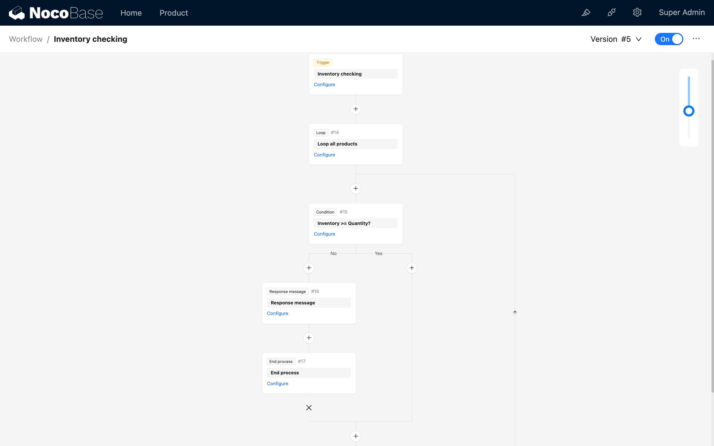

循环的对象选择为提交的订单数据中的“订单详情”数组：

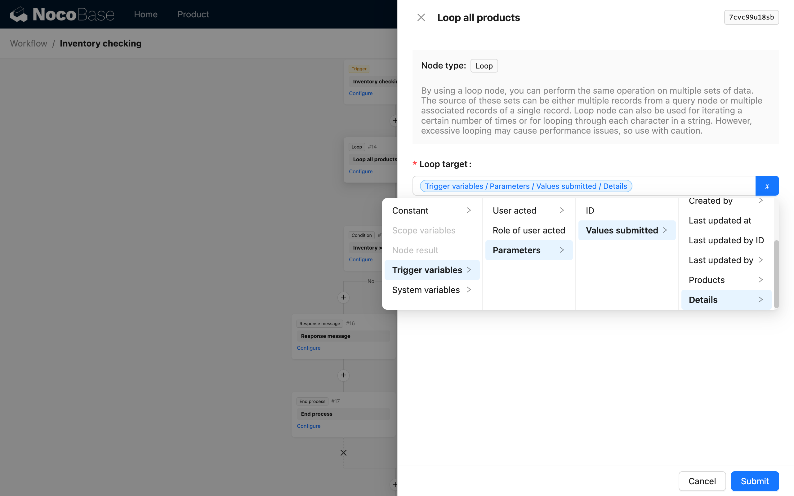

循环流程中的条件判断节点用于判断当前循环产品对象的库存是否充足：

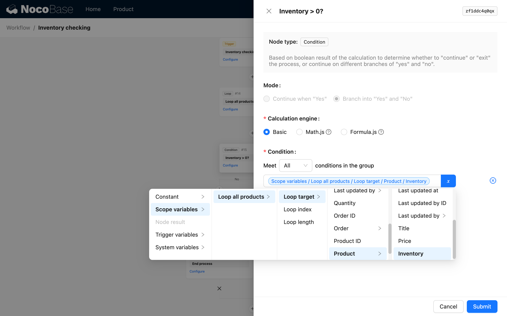

其他配置与基本使用中的配置相同，最终提交订单时，如果任意一个产品库存不足，则会拦截订单提交，并返回相应的提示信息。测试时也尝试在一个订单内提交多个产品，其中一个产品库存不足，另一个产品库存充足，可以看到返回的响应消息：

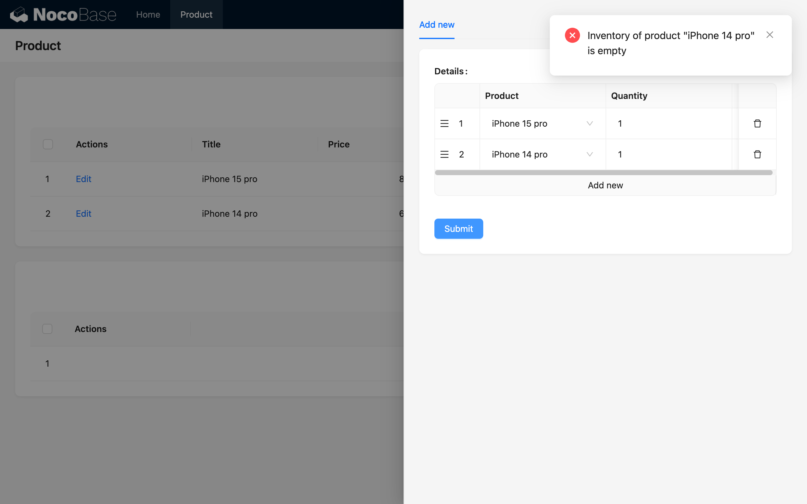

可以看到，响应消息中并未提示第一个产品“iPhone 15 pro”的库存不足，而只提示了第二个产品“iPhone 14 pro”的库存不足，这是因为在循环中，第一个产品库存充足，所以不会拦截，而第二个产品库存不足，所以拦截了订单提交。
