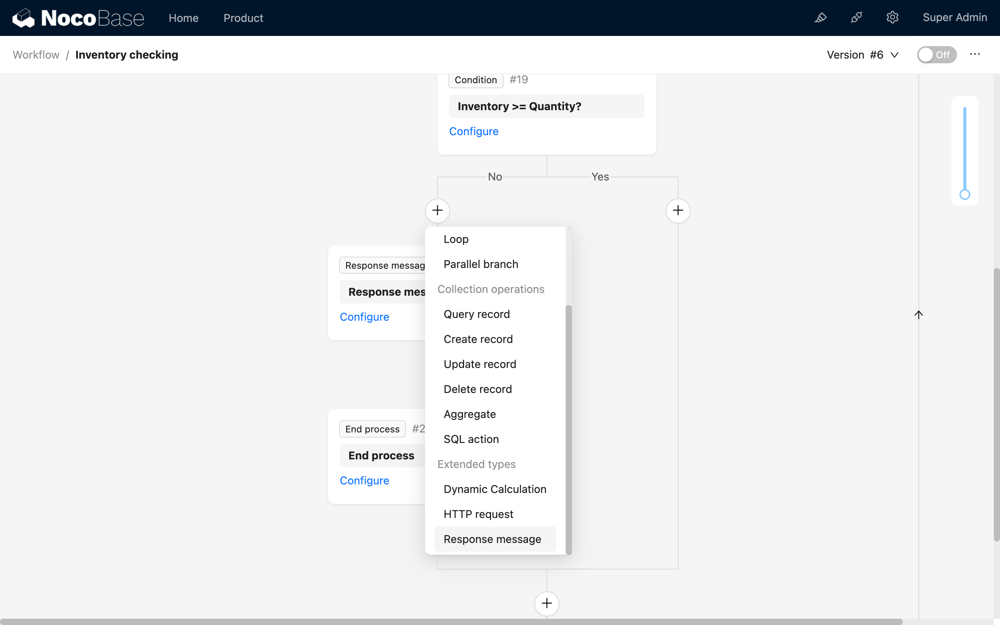
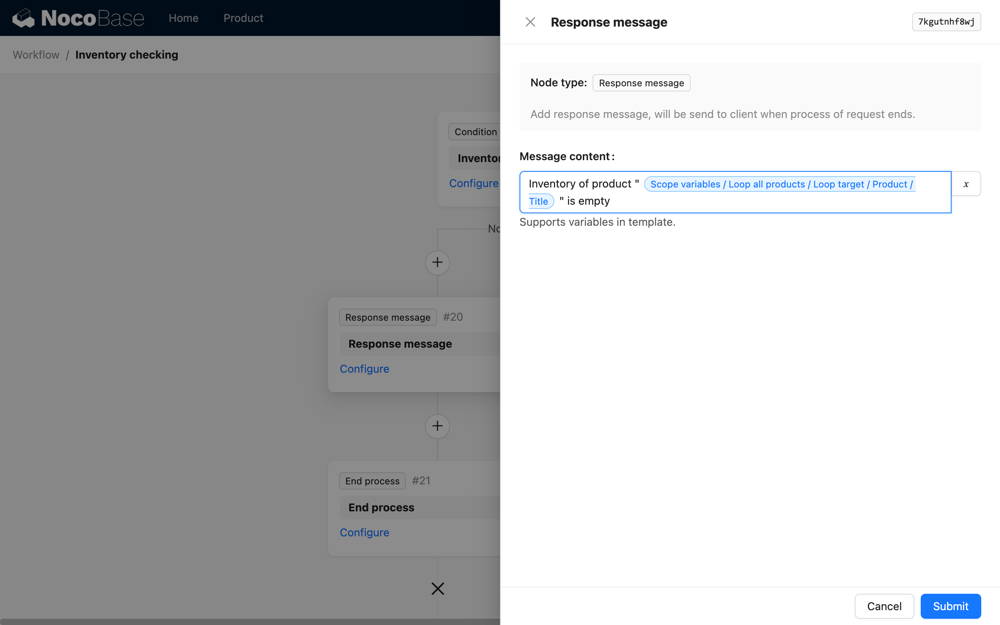
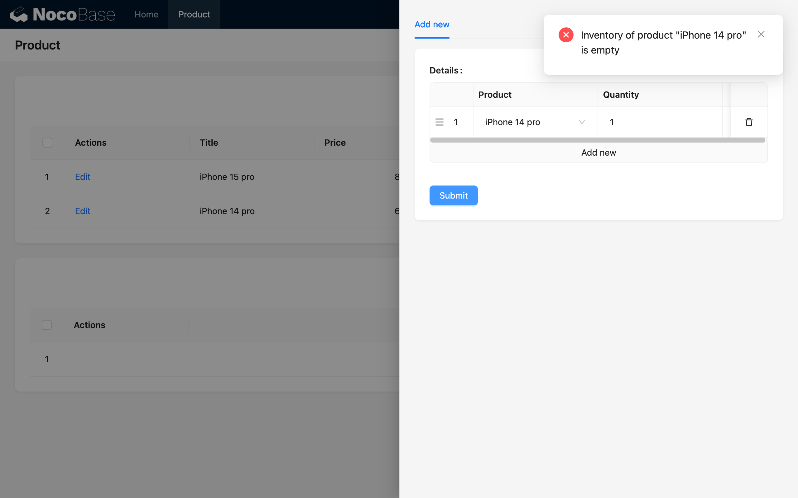

# 响应消息

响应消息节点用于在特定类型的流程中向提交操作的客户端反馈流程中自定义的消息。

:::info{title=提示}
目前支持在“表单事件”的同步模式和“请求拦截”类型的工作流中使用。
:::

## 安装

:::info{title=提示}
该插件为商业插件，请咨询开发团队获取。
:::

## 使用手册

### 创建节点

在支持的工作流类型中，可以在流程中的任意位置中添加“响应消息”节点，点击流程中的加号（“+”）按钮，添加“响应消息”节点：



响应消息会在整个请求过程中以数组的形式存在，在流程中执行到任意响应消息节点时均会将新的消息内容追加至数组中，在服务端发送响应内容时，会将所有消息一并发送至客户端。

### 节点配置

消息内容整体是一个模板字符串，其中可以插入变量，在节点配置中可以任意组织该模板内容：



在流程执行到该节点时，会对模板进行解析，并生成出消息内容的结果，上面的配置中，变量“局域变量 / 循环所有产品 / 循环对象 / 产品 / 标题”会在实际流程中被替换为特定的值，例如：

```
产品 “iPhone 14 pro” 的库存不足
```



### 使用场景

#### “请求拦截”流程

“请求拦截”流程中使用响应消息可以在流程结束后向客户端发送对应的消息反馈，具体参考[请求拦截](../../workflow-request-interceptor/index/index.md)

#### “表单事件”流程

在同步模式的“表单事件”中，响应消息会在流程执行完毕后向客户端提示，与“请求拦截”流程不同的是，不管表单事件的工作流以何种状态退出（成功、失败等），展示的提示信息均为“成功”状态的提示，这是因为发起流程的操作已正常完成，而绑定的工作流是否执行成功，并不影响之前的表单操作的结果。
