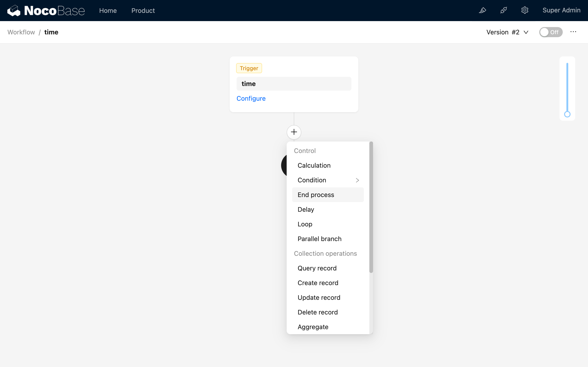
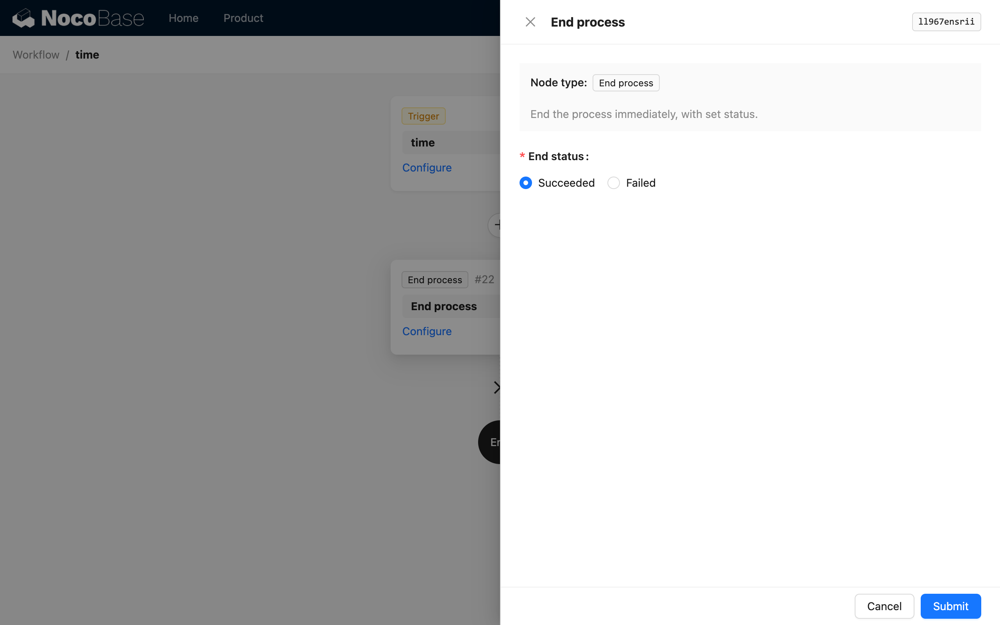

# 结束流程

该节点执行时将立即结束当前执行的工作流，并以节点配置的状态结束。通常用于特定逻辑的流程控制，在满足某些逻辑条件后，跳出当前工作流，不再继续执行后续流程的处理。可类比编程语言中的 `return` 指令，用于退出当前执行的函数。

:::info{title=提示}
在“请求拦截”类型的流程中使用时，会导致对发起的请求进行拦截。详情请参考[“请求拦截”的使用说明](../../../../workflow-request-interceptor/index/index.md)。
:::

## 创建节点

在工作流配置界面中，点击流程中的加号（“+”）按钮，添加“结束流程”节点：

## 节点配置

### 结束状态

结束状态将影响该工作流执行计划的最终状态，可配置为“成功”或“失败”。当流程执行到该节点时，会以配置的状态立即退出。

:::info{title=提示}
在“请求拦截”类型的流程中使用时，除了会导致对发起的请求进行拦截，结束状态的配置还会影响“响应消息”在该类型流程中反馈信息的状态。
:::
