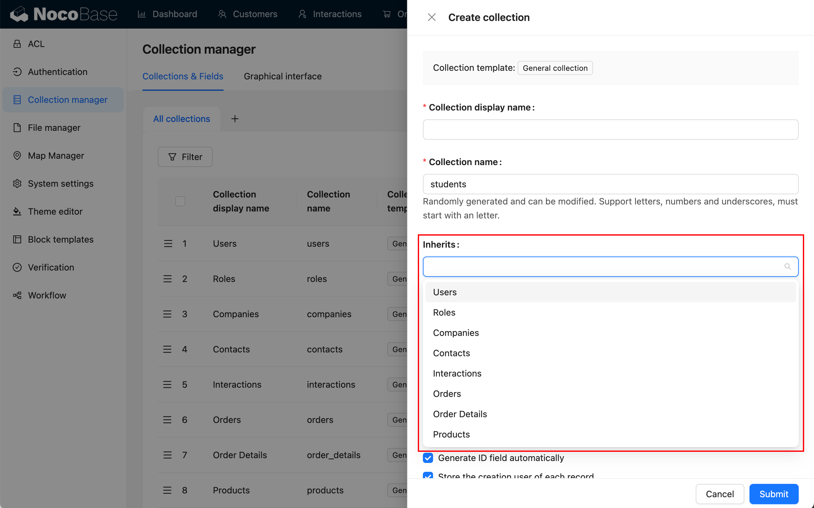

# 概述

数据建模是一种系统的方法，通过它可以对数据进行抽象和描述，以便更好地理解和组织数据。这涉及创建一个模型，该模型用于呈现数据之间的关系、结构和规则，从而有助于系统设计、分析和决策。数据建模包括使用不同的技术和图形表示，如实体关系图、数据流程图或数据库表设计，以便更清晰地定义和沟通数据的特征和用途。这有助于团队更有效地管理、利用和理解系统中的数据。

NocoBase 的数据建模具有以下特色：

## 提供了简易的数据表管理界面

用于创建各种模型（数据表）或连接已有模型（数据表）

## 提供了类似于 ER 图的可视化界面

ER 图用于从用户和业务需求中提取实体和它们之间的关系，它提供了一种直观且易于理解的方式来描述数据模型，通过 ER 图可以更清晰地理解系统中的主要数据实体和它们之间的联系。

## 提供了丰富的字段类型

## 提供了富有想象空间的数据表模板

用于预定义特定结构下的数据模型，目前已支持的数据表模板包括：

- 普通表：内置了常用的系统字段；
- 树表：树结构表，目前只支持邻接表设计；
- 日历表：用于创建日历相关的事件表；
- 文件表：用于文件存储的管理；
- 表达式表：用于工作流的动态表达式场景；
- SQL 表：并不是实际的数据库表，而是快速的将 SQL 查询，结构化的展示出来。

## 支持连接数据表视图

提供了更灵活、更高层次的数据访问方式，使得分析和报告更为简便，提高了数据的可用性和可维护性。

## 支持 FDW 技术

"FDW" 是 "Foreign Data Wrapper" 的缩写，中文是 "外部数据包装器"。FDW 是一种数据库技术，允许数据库系统直接访问和查询外部数据源中的数据（当做本地表使用），而无需将数据复制到本地数据库。这种技术使得在数据库中可以轻松地集成和查询来自不同来源的数据。

## 支持表继承

可以创建一个父表，然后从该父表派生出子表。子表会继承父表的结构，同时还可以定义自己的列。这种设计模式有助于组织和管理具有相似结构但可能有一些差异的数据。

以下是关于支持继承表的一些常见特点：

- 父表： 父表包含了通用的列和数据，定义了整个继承层次结构的基本结构。
- 子表： 子表继承了父表的结构，但还可以额外定义自己的列。这允许每个子表具有父表的通用属性，同时又可以包含特定于子类的属性。
- 查询： 在查询时，可以选择查询整个继承层次结构，也可以只查询父表或特定的子表。这使得能够根据需要检索和处理不同层次的数据。
- 继承关系： 父表和子表之间建立了继承关系，这意味着可以使用父表的结构来定义一致的属性，同时允许子表扩展或覆盖这些属性。

这种设计模式有助于减少数据冗余，简化数据库模型，同时使数据更容易维护。然而，需要谨慎使用，因为继承表可能会增加查询的复杂性，特别是在处理整个继承层次结构时。支持继承表的数据库系统通常提供了特定的语法和工具来管理和查询这种表结构。

## 多数据源的支持

可以连接各种数据源，目前已支持的数据源有 MySQL 和 PostgreSQL。除此之外，也可以自由扩展，可以是常见的各类数据库，也可以是提供 API 的平台。

