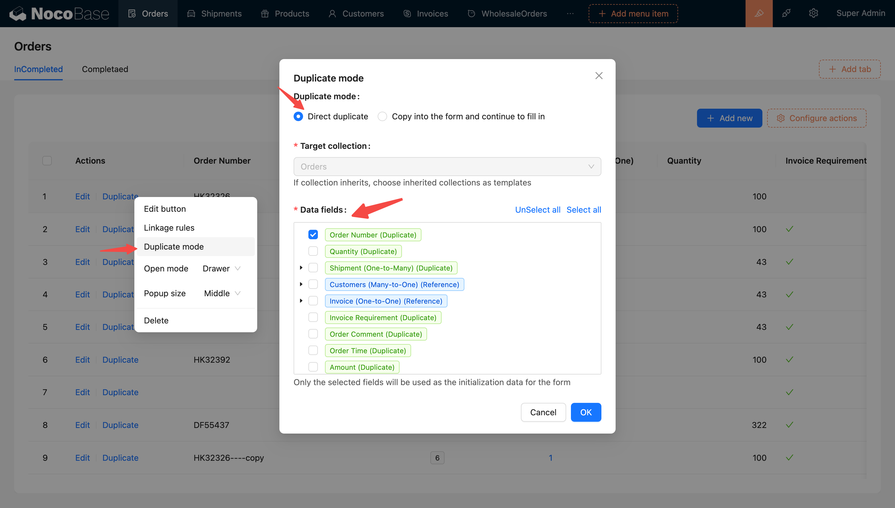
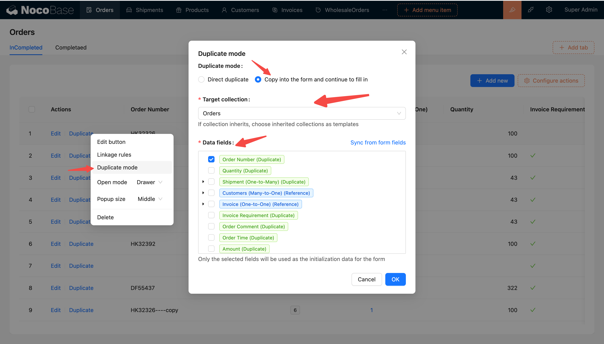
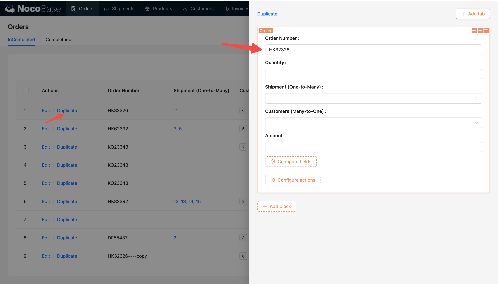
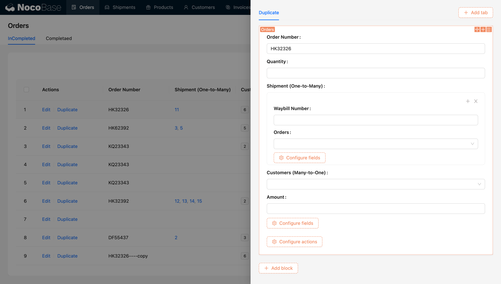
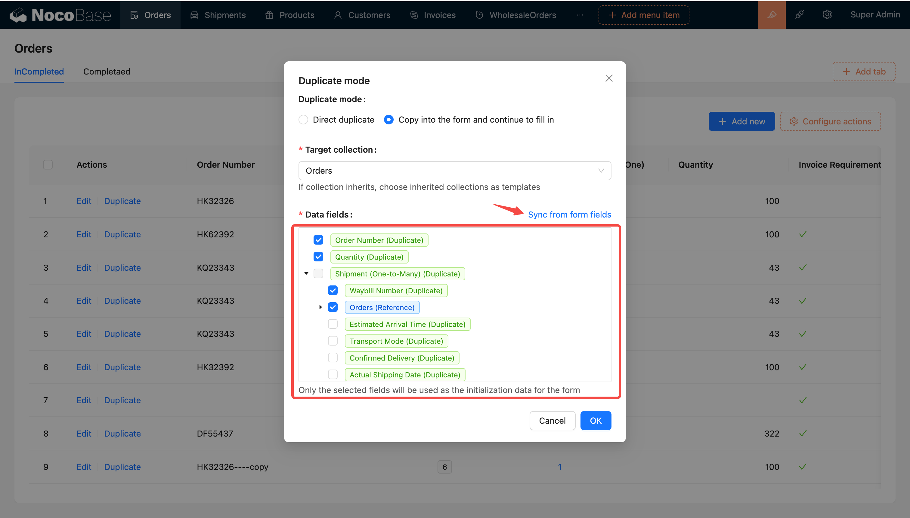
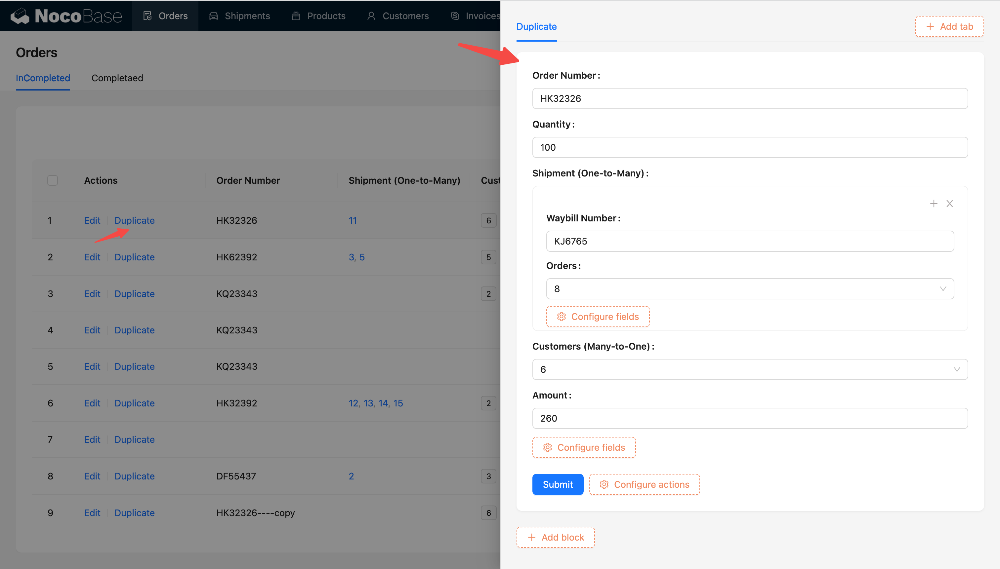

# 使用手册

复制操作允许用户复制一行数据以便于创建新的数据记录，支持直接复制/复制到表单并继续填写两种方式，按钮权限与新建一致

#### 直接复制

- 默认以直接复制的方式复制数据
- 目标数据表：是指复制添加的目标数据表（在继承的场景下，可以复制给子表，直接复制只能复制添加到本表）
- 模版字段：用于指定要复制的字段，可全选，必填

完成配置后点击按钮即复制数据

#### 复制到表单并继续填写

配置的模板字段作为将默认值填充到表单中，可修改后提交

可以设置本表或子表为复制添加的目标表

配置模板字段：模板字段将作为默认值填充到表单中，只会带出有勾选的字段值

「运单」（o2m）是复制的关系，调整其字段组件为子表单，可配置子表单中的字段

同步表单字段：完成表单配置后可点击同步表单字段按钮，会自动解析将表单中已配置的字段均勾选上（每次表单字段配置修改之后需要手动再同步一次），同步表单字段后可自定义调整模板字段

点击复制操作会打开弹窗，并按照模板字段带出模板数据作为表单默认值填充，可修改数据后提交完成数据复制

如下图完整示例为订单列表配置复制操作

#### 复制、引用、预加载的说明

对于不同字段（不同关系类型）有不同的处理逻辑（复制、引用、预加载），其中调整关系字段的字段组件中也会影响处理逻辑（Select 和 Record pikcer 用于处理引用关系，Sub-form 和 Sub-table 用于处理复制关系）

- 复制

  - 普通字段是复制
  - hasOne 和 hasMany 的关系字段只能是复制（即该类型的关系字段不能用 Select、Record picker 作为字段组件，应使用 Sub-form、Sub-table 等）
    - hasOne 和 hasMany 字段组件的变更不会改变处理逻辑（复制）
    - 复制的关系字段，所有的子字段都可以被选择

- 引用

  - belongsTo 和 belongsToMany 是引用
  - **引用是可能变成复制的，比如字段组件从 select 调整为 sub-form 后，关系就从引用变成了复制（变成复制之后，所有的子字段都是可选的）**

- 预加载：引用字段里的关系字段

  - 引用的关系字段下的关系字段为预加载
  - 预加载的关系字段在字段组件变更后可能变成引用或者复制

#### 关于全选

- 所有的复制字段都勾选上
- 所有的引用字段都勾选上

#### 模板数据的处理逻辑

- 所有的关系的 fk 都会过滤掉
- 如果是复制的关系数据 pk 也会过滤掉
- 引用和预加载有 pk 字段

#### 如何理解同步表单字段

在大多数场景下，表单配置涉及的字段非常繁多。在处理这种复杂表单场景时，手动配置模板字段通常会变得非常繁琐。为了解决这个问题，引入了同步表单字段按钮。这个按钮的作用是自动解析表单字段的配置，根据字段类型和关系字段组件的配置来处理字段复制逻辑，包括复制、引用和预加载。在这个过程中，已经配置出来的字段会默认被勾选上

每当用户修改表单字段配置之后，系统不会自动同步这些变化。因此，用户需要手动点击同步表单字段按钮，以便将最新的配置信息应用到模板配置中。
