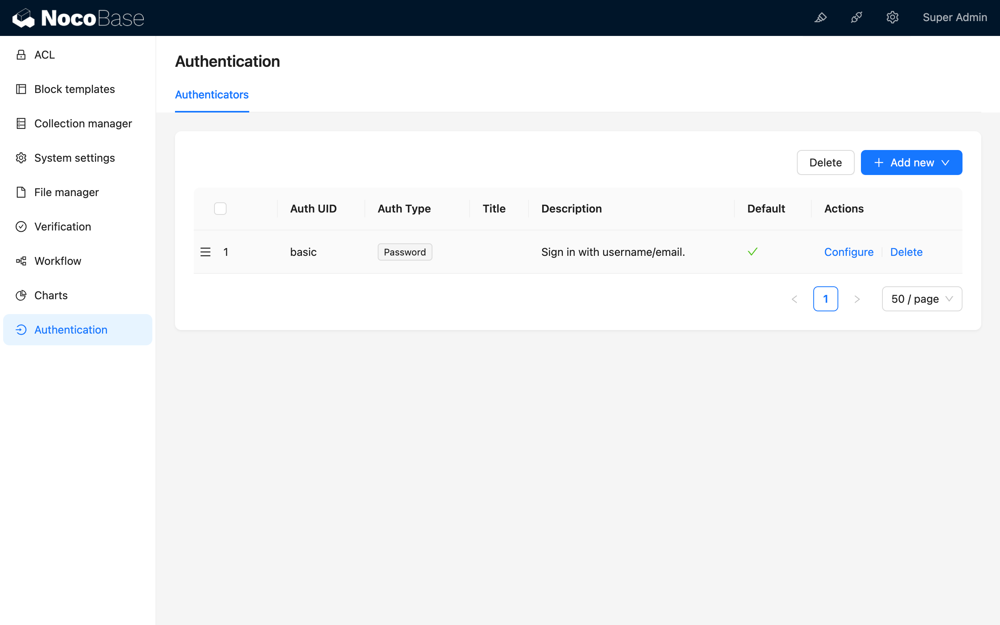
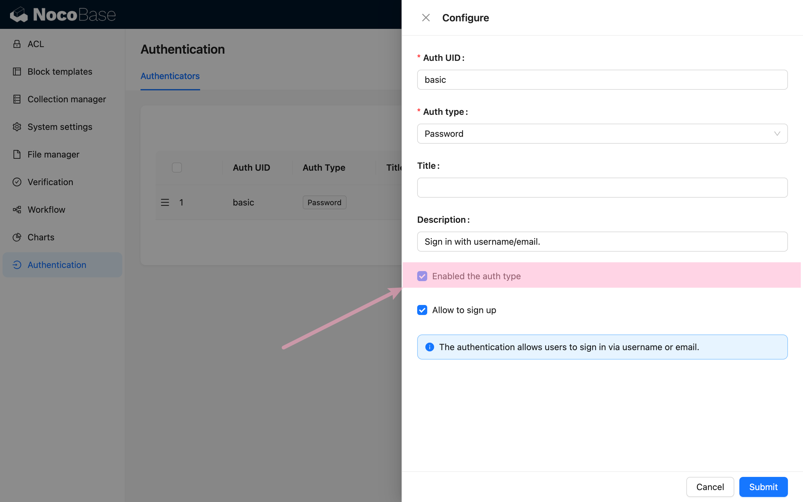
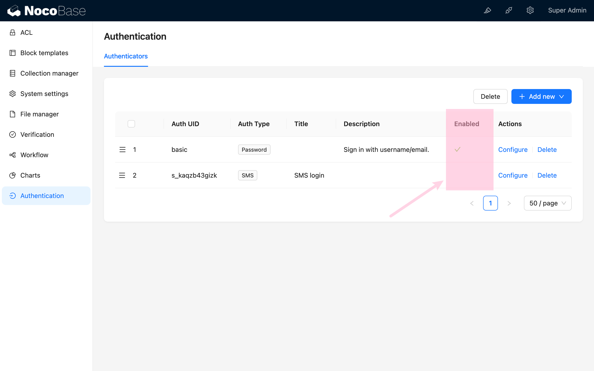
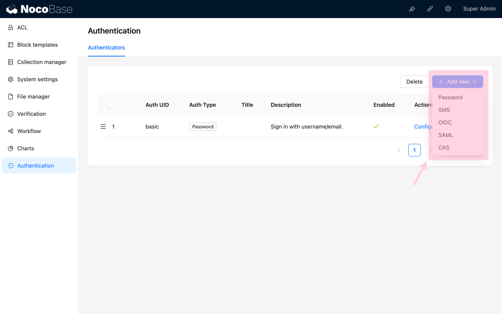
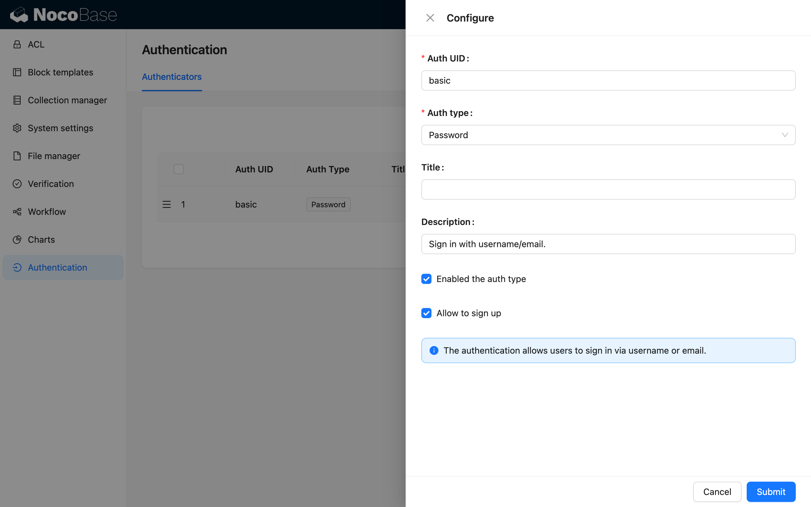
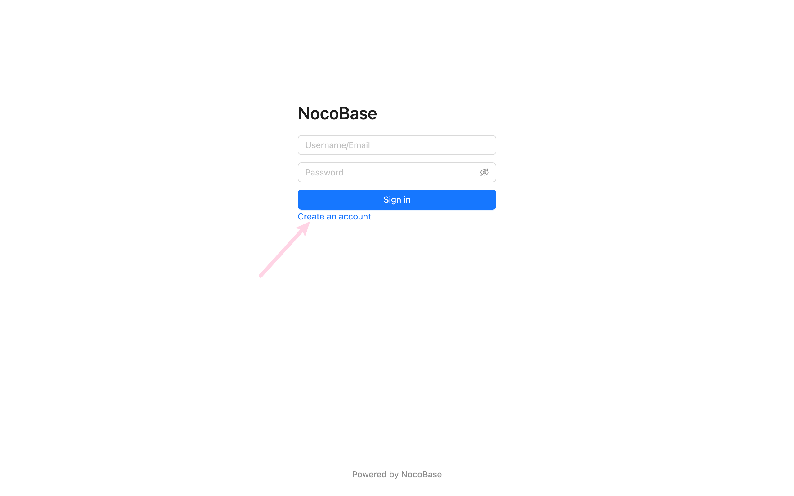
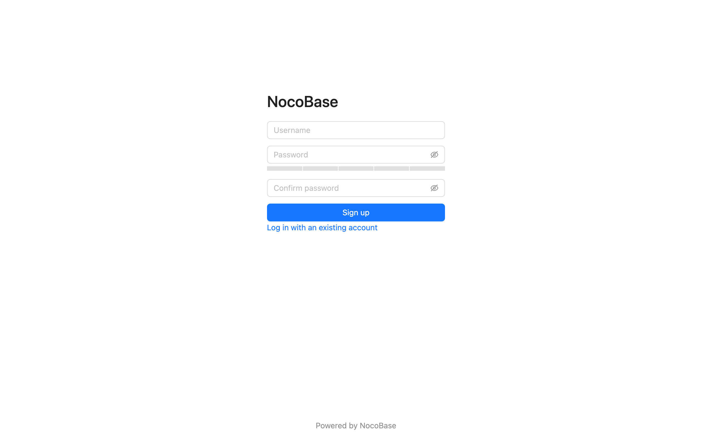
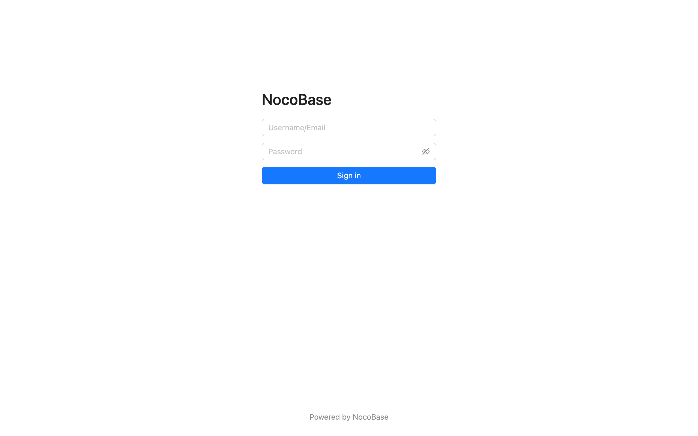
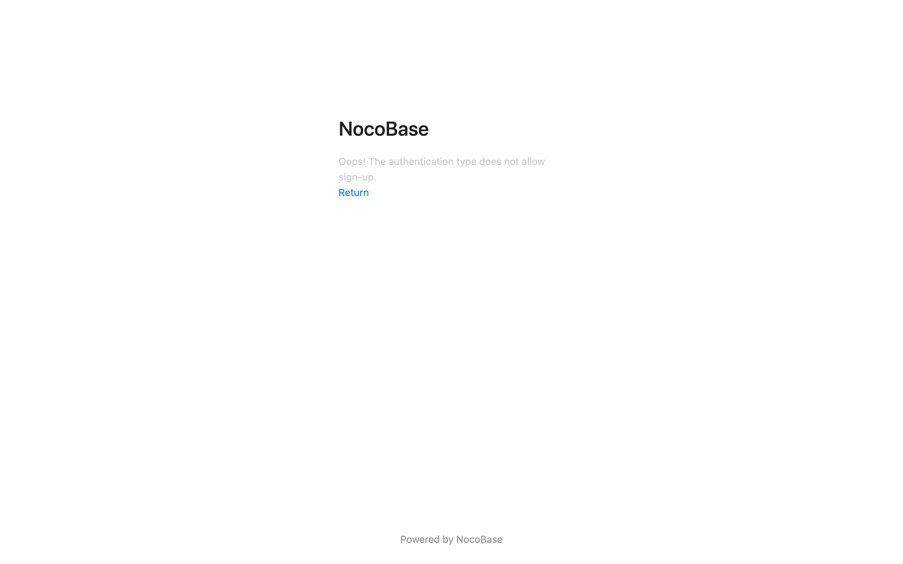

# 使用手册

## 用户认证管理

用户认证插件安装时，会初始化一个 `密码` 的认证方式，基于用户的用户名和邮箱。

## 激活认证类型

只有激活的认证类型才会显示在登录页面

## 用户认证类型

NocoBase 目前支持的用户认证类型有：

- 密码 (Password)，用户认证插件内置
- 短信 (SMS)，[sms-auth 插件](../../sms-auth/index.md) 扩展
- CAS，[cas-auth 插件](../../cas/index.md) 扩展
- SAML，[saml-auth 插件](../../saml/index.md) 扩展
- OIDC，[oidc-auth 插件](../../oidc/index.md) 扩展

除此之外，也可以自己扩展用户认证，参考[开发指南](../dev/index.md)。

## 密码认证

### 配置界面

### 允许注册

允许注册时，登录页会显示创建账号的连接，并可以跳转至注册页

注册页

不允许注册时，登录页不会显示创建账号的连接

不允许注册时，无法访问注册页面

