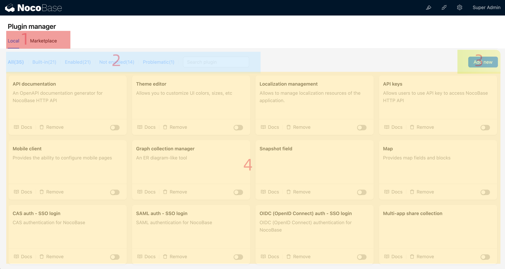
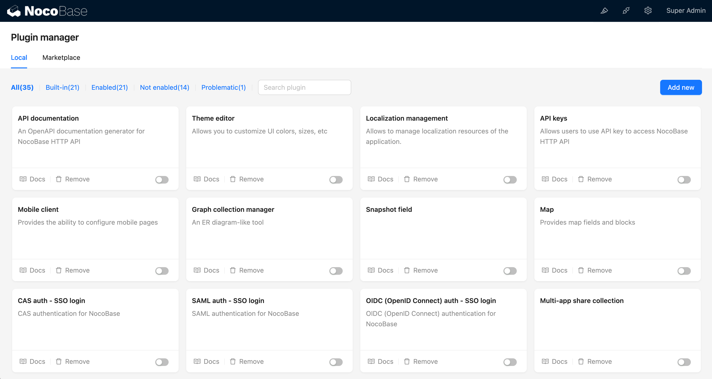
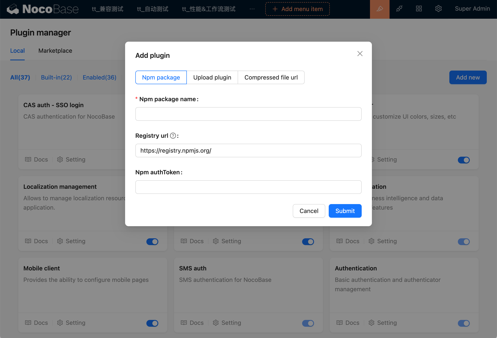
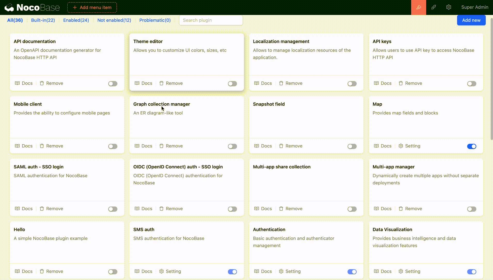
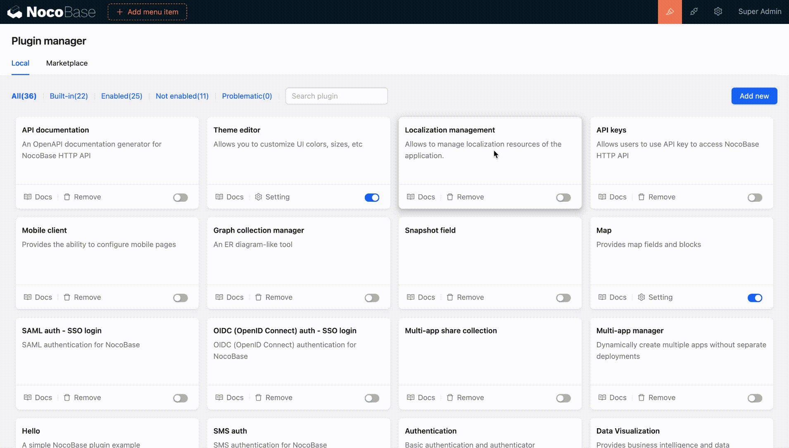
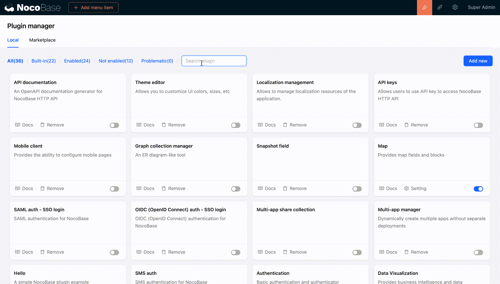
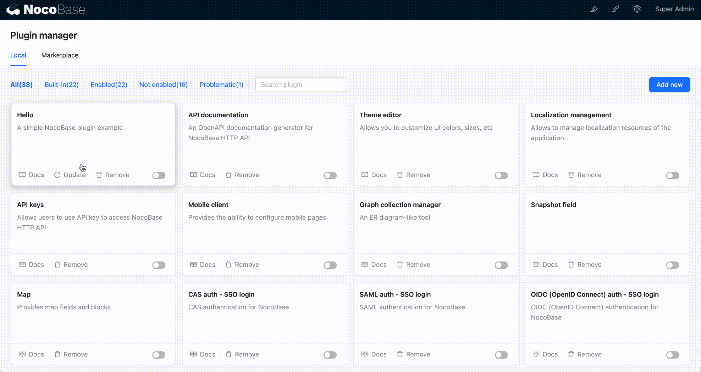

# 插件管理器

插件管理器支持通过界面添加插件，以简单、直观，轻量级的使用体验来扩展 NocoBase 的功能。轻松扩展和定制应用功能，包括安装、升级、和卸载插件

插件管理器的组成部分

1. 本地插件/插件市场
2. 插件分类（内置、启用、未启用、有问题,支持按插件名称模糊搜索）
3. 添加新插件
4. 插件配置主体

#### 查看插件文档

点击插件可以快速阅览插件的介绍文档（包括说明文档、依赖兼容性检查、更新日志）

#### 添加插件

即插即用，可以直接通过界面添加插件，支持从 npm registry（可以是私有的）下载、本地上传、URL 下载

#### 激活插件

#### 禁用插件

#### 删除插件

#### 更新插件

目前仅 storage/plugins 下的插件才有更新操作，如图

