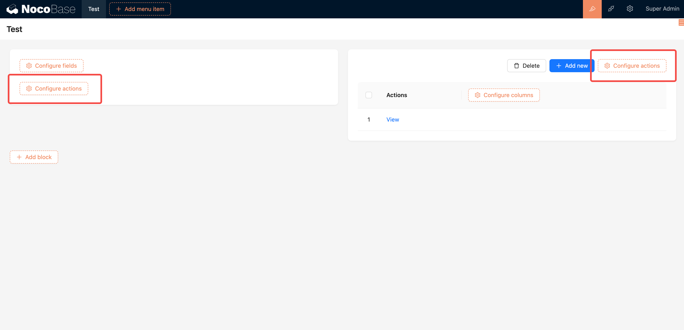
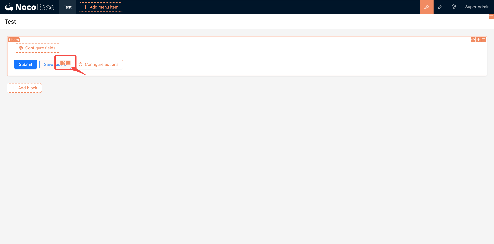
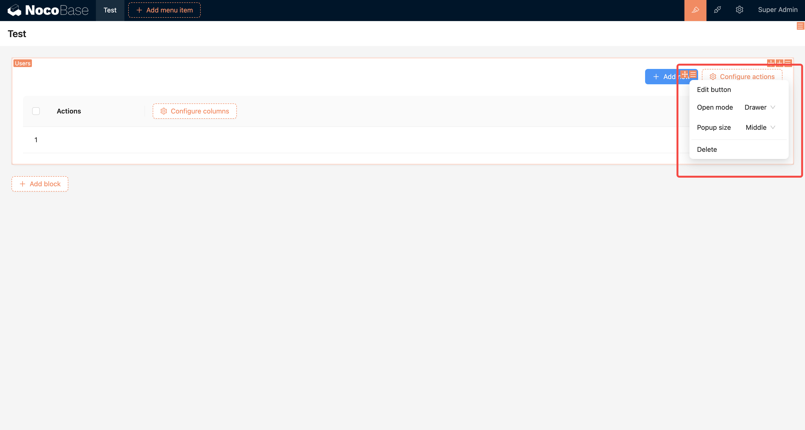
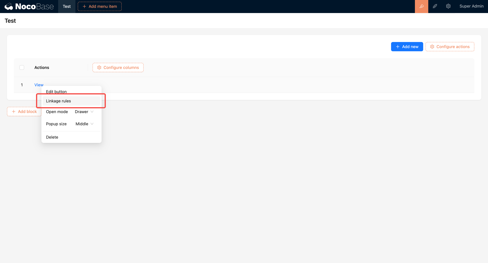
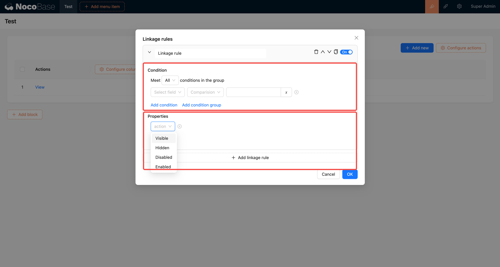

# 操作

在 UI 里，操作是用来触发一段指令的按钮。可以直接放在页面、对话框、抽屉里，也可以和区块组合使用。目前可动态配置的操作，主要是和区块组合使用

## 区块里的操作



## 操作的设计器（工具栏）

和区块、字段不太一样，操作的设计器里只有两个图标，分别为：

- 拖拽
- 参数配置



## 操作的拖拽排序

按住按钮设计器里的「拖拽」图标，可以对按钮进行排序

```bash
缺少一个动图
```

## 通用的参数配置

- 编辑按钮
- 打开方式：抽屉、对话框
- 弹窗尺寸：大、中、小
- 删除



## 操作的联动规则

有上下文数据的操作，还可以配置「联动规则」



联动规则配置



可以添加多条，条件与筛选用法一致，可以控制按钮的显示、隐藏、启用、禁用
