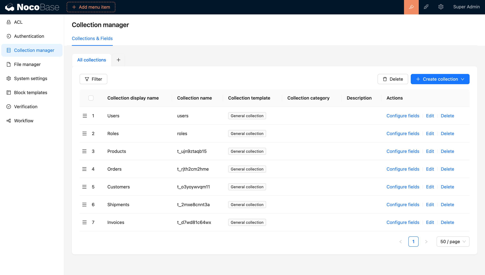
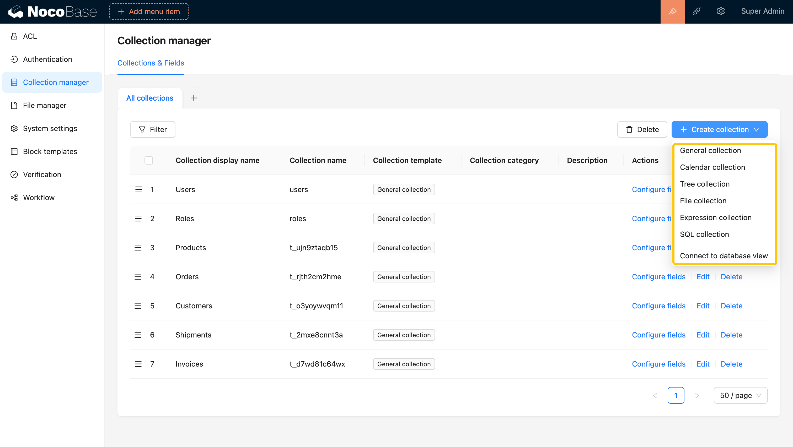

# 概述

## 介绍

在系统开发前，业务需求分析通常包括业务建模，将业务过程、实体、关系抽象为数据模型。plugin-collection-manager 插件提供 NocoBase 中的数据模型管理，类似关系型数据库的表概念。该插件支持数据建模，为用户提供了现成的数据表和字段资源，便于高效的数据模型设计与管理。

## 数据表模板

NocoBase 的数据表模板为用户提供了一种专注于业务需求和场景的数据表结构模板，其目标在于简化数据表的创建和维护过程，提高数据管理效率。

1. 简化创建： 利用这些模板，用户无需从零开始设计表结构，能够快速创建满足业务要求的数据表。
2. 字段预定义： 每个模板都支持预定义一组字段，这些字段通常与特定业务需求密切相关。例如，日历数据表模板预定义了 Cron 字段，并允许限制模板类型的数据表能够配置的字段类型。
3. 自定义扩展： NocoBase 内核提供了一系列常用的数据表模板，同时用户可以根据自身需求通过插件自由扩展和调整这些模板，实现更灵活的适配特定业务场景。
4. 提高效率： 利用这些模板，用户可以更迅速地创建和维护数据表，确保数据的一致性和标准化，从而大大提高整体的数据管理效率。这种模板化的方法使数据管理变得更为简便和可控。

