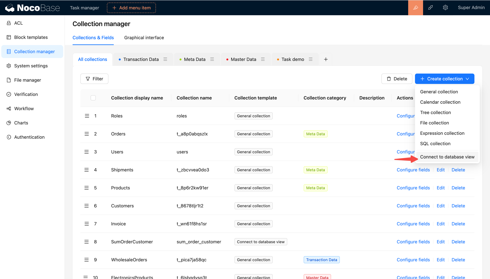
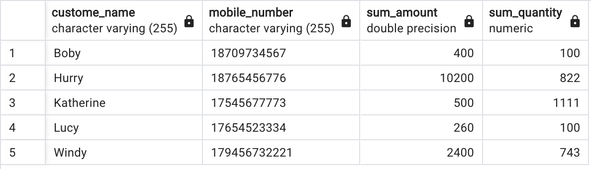
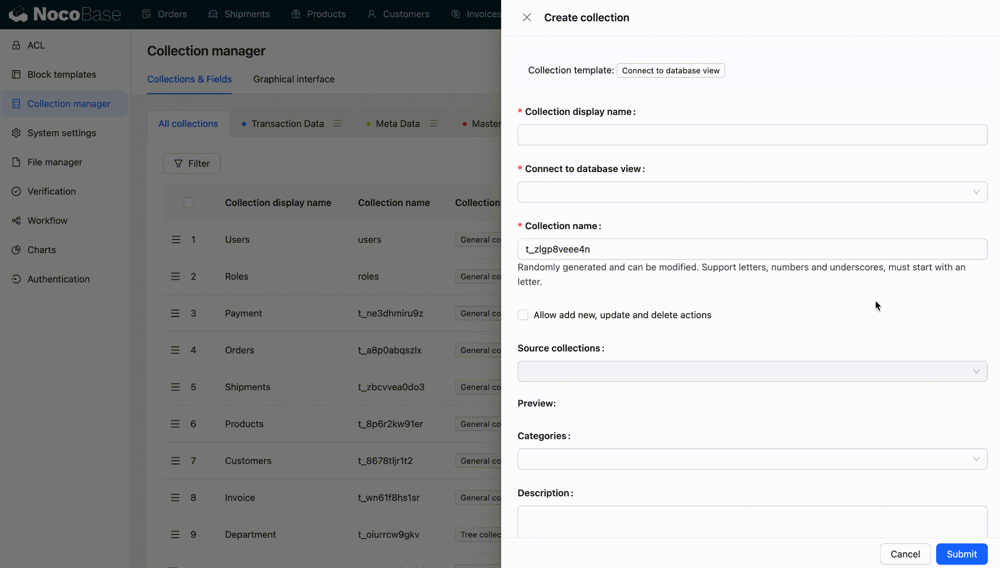
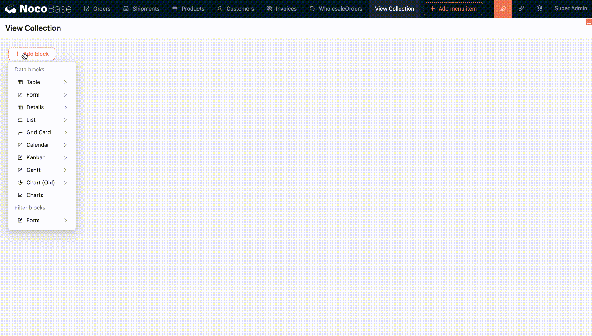
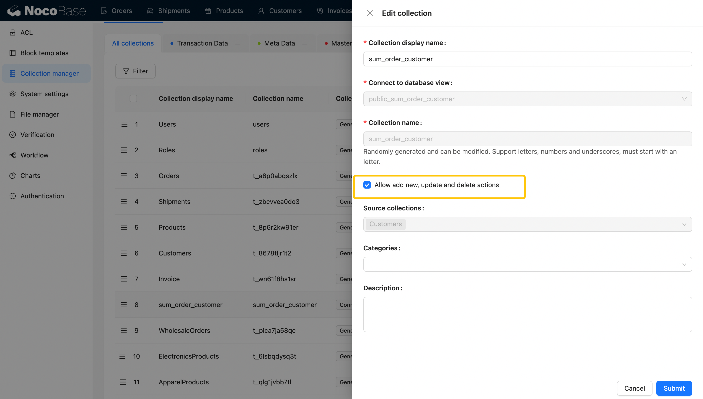

# 数据库视图



#### 基础概念

数据库视图是数据库中的虚拟表，它基于一个或多个数据库表的查询结果生成，具有与表相似的结构，但不存储实际数据。数据库视图允许用户以更简单、更抽象的方式访问和操作数据

将数据库中的视图与 Collection 连接是 NocoBase 提供的一种有效建表方式。通过在数据库中创建视图，可以在 Collection 管理中引用并映射为数据表，特别适用于统计场景。这种方式不仅提高了数据表的可维护性，在不同应用场景中还能灵活使用。

下面以订单管理系统中常见的统计业务场景为例

订单表和客户表有关联关系，统计每个客户的销售金额汇总和销售数量汇总，展示字段：客户名称、客户手机号、销售金额汇总，销售数量汇总

在数据库中创建视图：

```go
SELECT t2.f_69qv99n5p6i AS custome_name,
    t2.f_3vgt7ebynbs AS mobile_number,
    sum(t1.f_wb8ssap65e4) AS sum_amount,
    sum(t1.f_93gqtijh1tn) AS sum_quantity
   FROM t_a8p0abqszlx t1
     JOIN t_8678tljr1t2 t2 ON t1.f_0pmwq4unmbp = t2.id
  GROUP BY t2.f_69qv99n5p6i, t2.f_3vgt7ebynbs;
```

数据库中的视图：



在 NocoBase 中将上面视图映射为数据表（Collection）使用

- 支持自定义视图的列名（字段名）
- 来源字段：即源表的元字段，当字段未解析出源表来源字段时（聚合的字段无来源字段），支持指定字段的 interface
- 视图数据是否支持增删改操作（默认不支持）



#### 数据库视图在 UI 中的使用

- 创建区块

视图表与其他任意方式创建的数据表一样在所有区块中都能选中作为数据源



- Sync from database 支持调整视图表配置（若数据库中视图进行了调整，可重新连接视图同步数据）

调整视图表配置：支持配置增删改操作


