# 数据表与继承

## 数据表管理

数据表的增删改查及拖拽排序

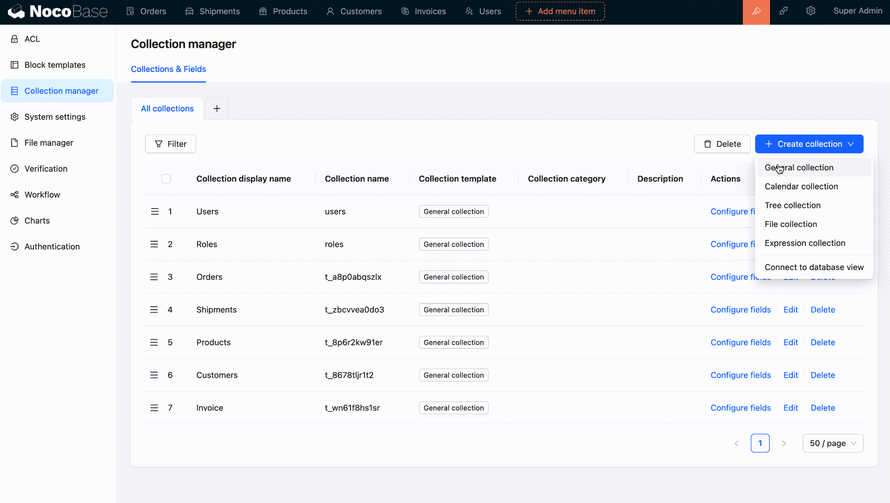

## 数据表字段管理

数据表字段的增删改，暂不支持字段排序

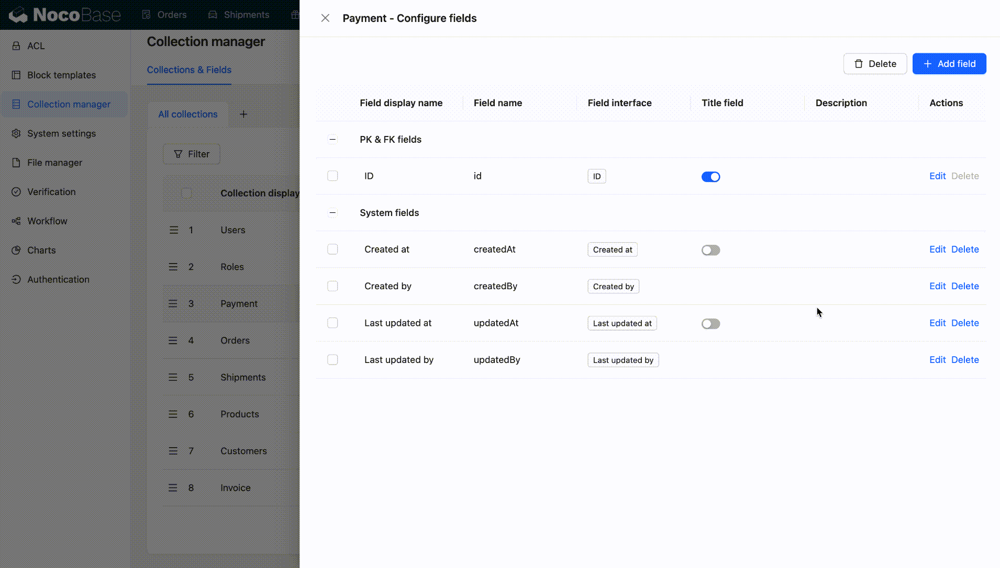

## 数据表分类管理

可以将数据表按照不同的标准进行组织，使数据的结构更加清晰降低数据管理的复杂性

数据表分类的增删改及排序

## 数据表继承

数据表继承是 PostgreSQL 数据库独有的功能（需要连接 PostgreSQL ），它允许在主表的基础上创建子表，子表继承了主表的结构、字段定义和索引。这个特性主要用于管理大量数据，实现数据分区和性能优化。每个子表可以存储特定条件下的数据，例如按时间分割数据，从而减少查询时的数据扫描量，提高查询性能。此外，主表和子表的查询透明化，用户可以像操作单个表一样查询整个继承表集合，简化了数据操作和查询的复杂性，使数据库更高效地处理大规模数据。

#### 单继承

在单继承模式中，一个表可以继承另一个表，子表继承了父表的结构、字段和约束。这种模式用于表示实体的层次结构，允许子表在保留通用属性的同时添加特定属性。

在订单系统中，配置"批发订单表"继承自主表 "订单"，用于处理批发订单，配置了批发客户特有的字段，如批发价格、批次号等。

商品表的继承关系也可以做如下梳理

1. 主表 "商品"（Products）：包含通用商品信息，如商品 ID、名称、价格、库存等。
2. 子表 "电子产品"（ElectronicsProduct）：继承自主表 "商品"，并添加了特定于电子产品的字段，如屏幕尺寸、操作系统等字段。
3. 子表 "服装产品"（ApparelProduct）：同样继承自主表 "商品"，但包含服装产品特有的属性，如尺寸、颜色、材质等字段。
4. 子表 "食品产品"（FoodProduct）：继承自主表 "商品"，用于处理食品产品，包括保质期、食品类型等字段。
5. 子表 "家具产品"（FurnitureProduct）：继承自主表 "商品"，包含家具产品的特定属性，如尺寸、材料等字段。

#### 多继承

多继承允许一个表同时继承多个父表的结构、字段和约束。这种模式用于具有多个关联的实体建模。

以订单、运单和商品进行数据建模为例，在这个系统中，有三个核心实体：订单、运单和商品。一个订单可以包含多个商品，一个订单可以对应多个运单（例如，部分商品运送到不同地点），同时一个运单可能涉及多个订单。这种多重关系可以使用一个子表（联接表）来实现，一个表具有多个父表（多继承）。

1. 父表 "订单"（Orders）：包含订单的基本信息，如订单 ID。
2. 父表 "运单"（Shipments）：包含运单号、运输方式信息等。
3. 父表 "商品"（Products）：包含商品的属性，如商品 ID、名称、价格等。
4. 子表"订单商品"（OrderProduct）：用于继承订单和商品。每个记录表示一个订单中的一个商品，同时记录了数量等信息。
5. 子表 "订单运单关联"（OrderShipment）：用于继承订单和运单。每个记录表示一个订单与一个运单的关系，同时记录了相关信息

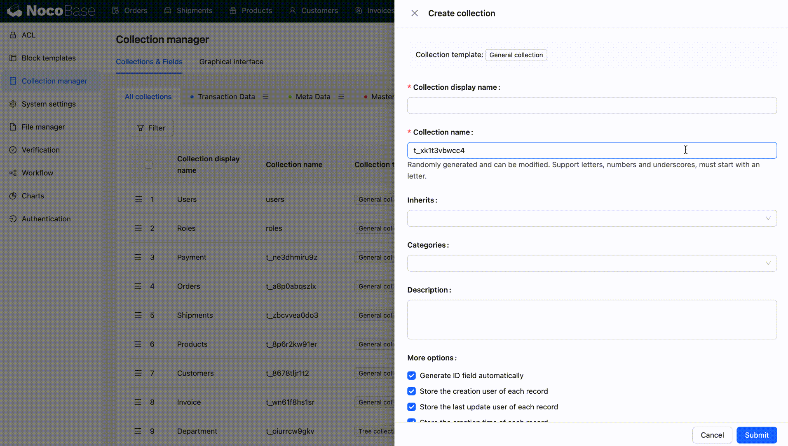

#### 字段重写

继承关系中子表可重新定义或覆盖从父表继承的字段，自定义字段属性以适应特定需求

##### 关系字段重写

如 A 多对多 B，A1 继承 A，B1 继承 B
则 A1 也关联 B，这时候 B 有所有（本身及所有子表）的数据，但是 A1 只需要看 B1 的数据，则可以 在 A1 中重写 把 B target 改成 B1。即在关系 A1.B 中，可以修改关联的目标表 B（可选范围为 B 和 B 的子表）为 B1

如图：批发订单表中重写商品关系字段（将目标表重写为电子商品表）

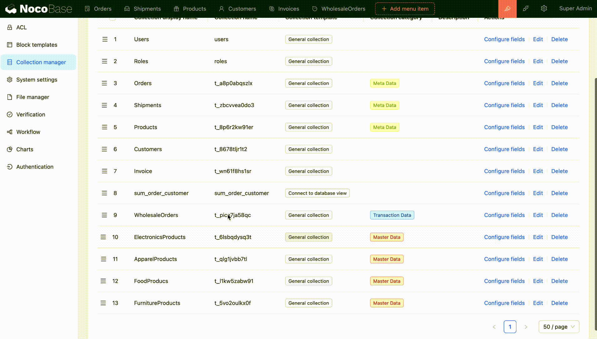

##### 可选项类型字段的重写

商品表（主表）中有可选项字段「尺寸」：服装商品可以定义重写为衣服尺寸（S、M、L），电子商品表则可以重写字段为「存储容量」（32GB、64GB、128GB）

#### 关系外键共享

关系外键共享是一种策略，允许多个表共享相同的外键字段，以建立表之间的关系。这在多个表需要引用相同实体时非常有用。在数据表继承的情况下，这个共享的外键可以用于确保每个子表与其他表之间的关系或引用，从而构建更复杂的数据模型

## 在 UI 中应用

### 数据表

作为区块的数据源使用

### 字段

数据区块的字段来源，不同的字段类型对应不同的字段组件

### 关系

- 关系字段组件
- 关系区块

### 继承

#### 配置字段包括继承的父表字段

子表在区块中使用时除了本表字段还有所有父表的字段供配置

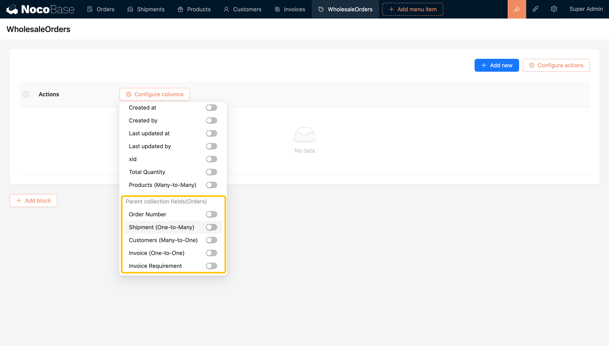

#### 添加操作可以启用子表

父表配置 TableOID(记录是由哪个表创建的数据)

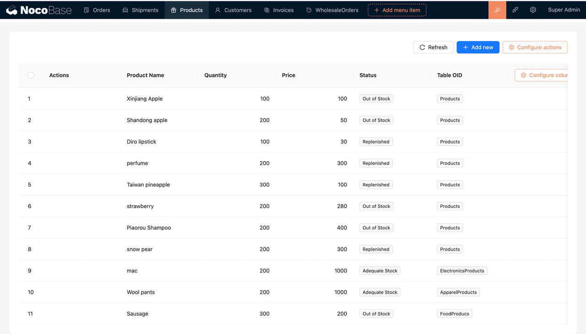

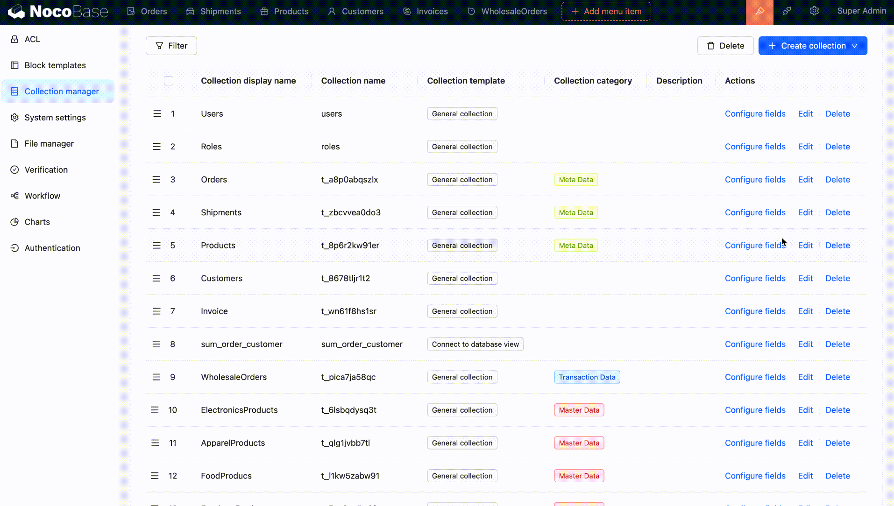

子表的数据都会汇聚在父表中

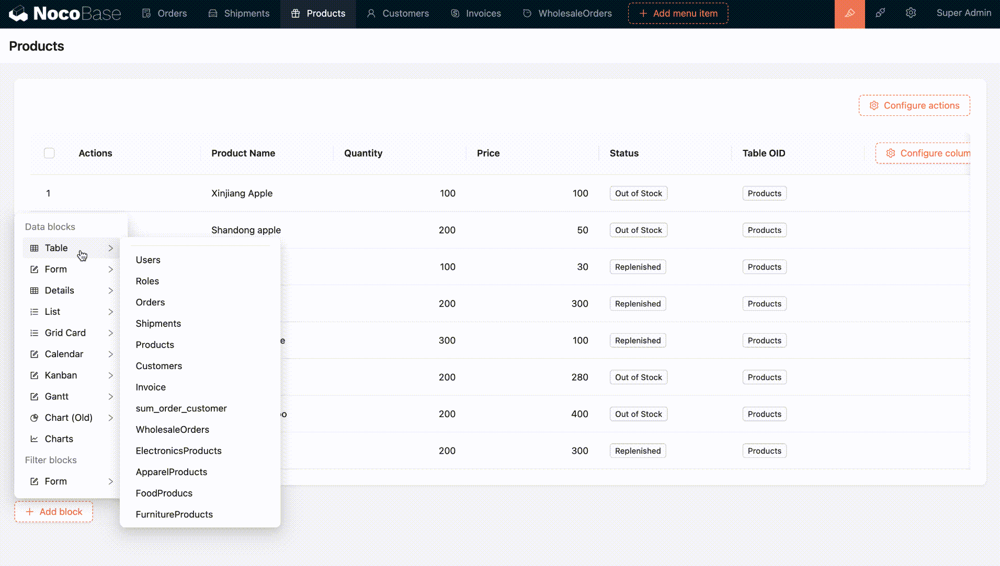

在父表中为子表配置添加操作

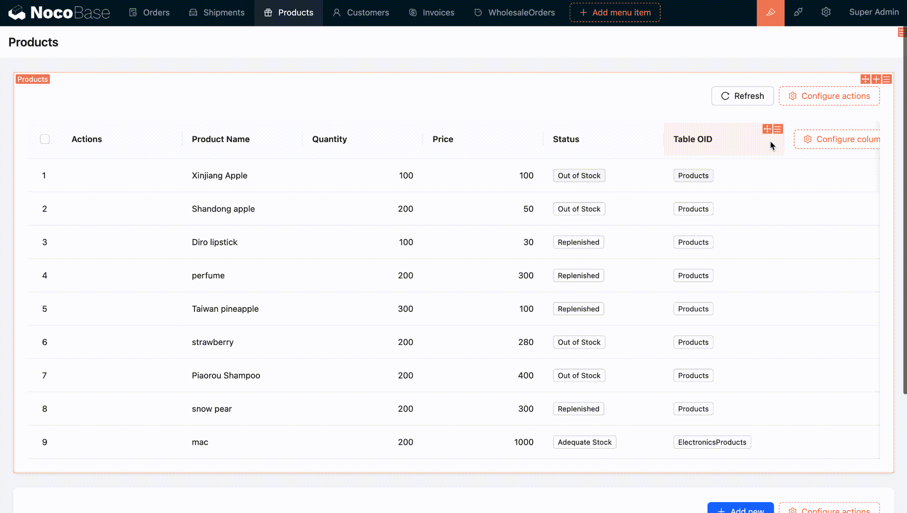

可选项为当前表的所有子表

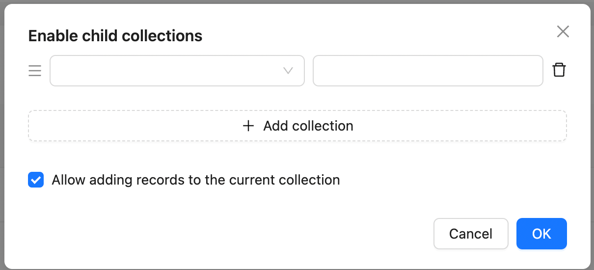

#### 继承表数据的查看与编辑（按 \_\_collection 显示）

UI 配置状态下可以为子表配置区块（表单/详情区块）

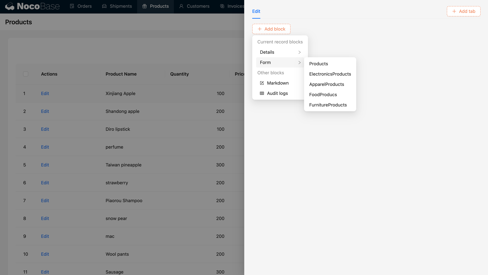

非 UI 配置状态下,按 \_\_collection 只显示对应数据表记录的区块

#### 关系数据的弹窗（按 \_\_collection 显示）

关系数据的详情在非 UI 配置状态下按 \_\_collection 仅显示对应数据的区块

#### 继承下的筛选联动

B 可以连接 A，B 的子表 B1 也可以连接 A
