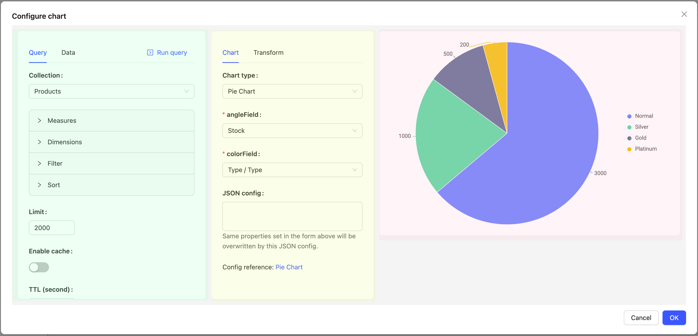
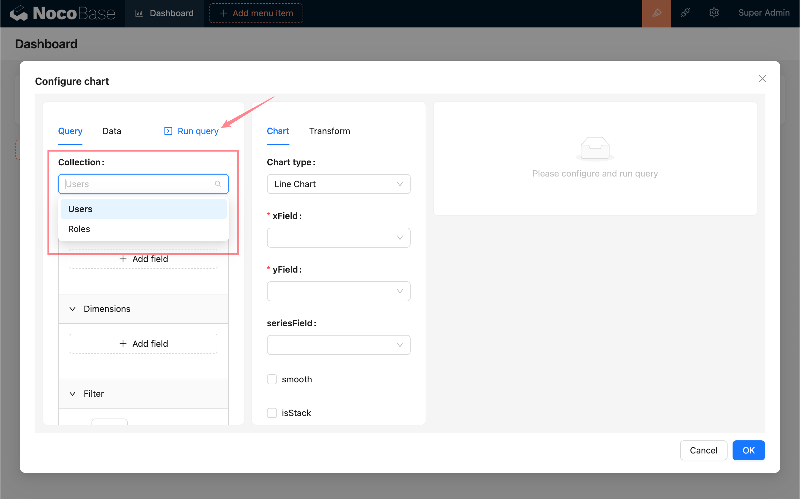
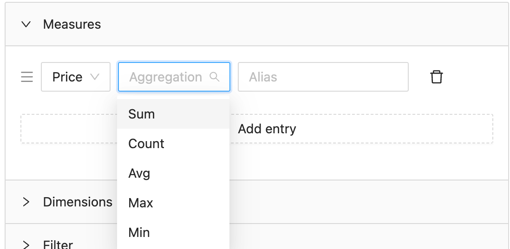
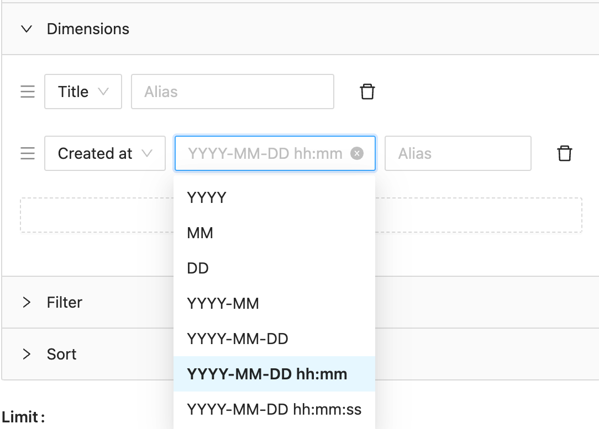
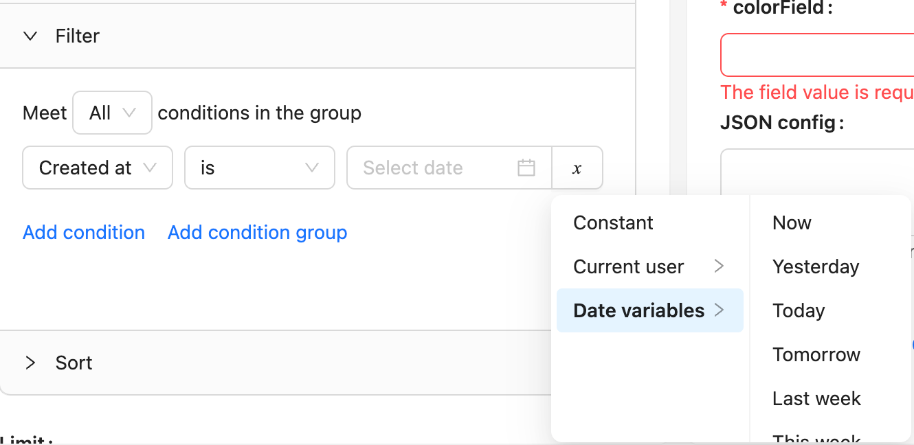
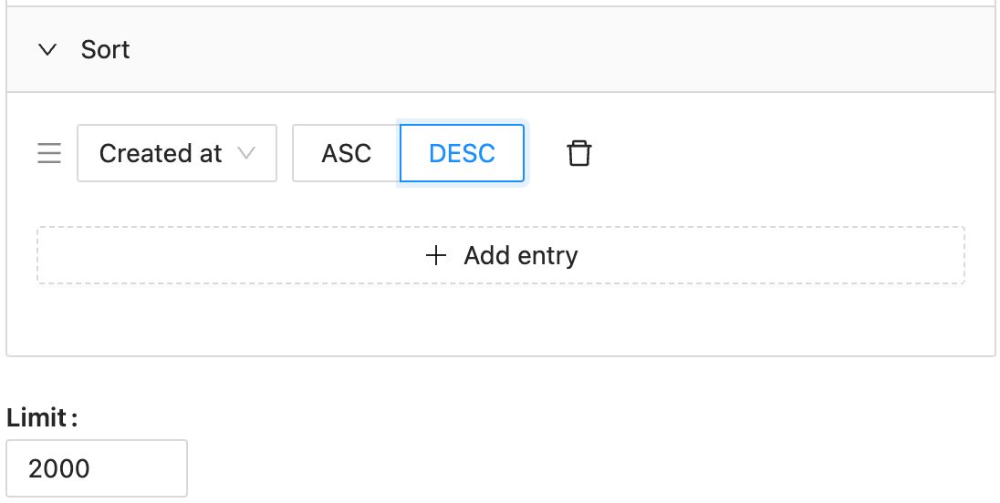
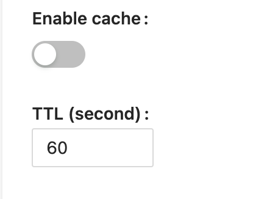
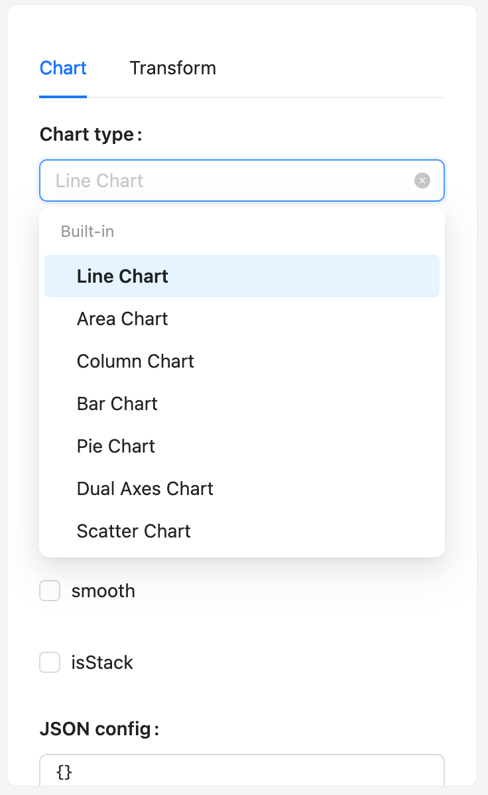
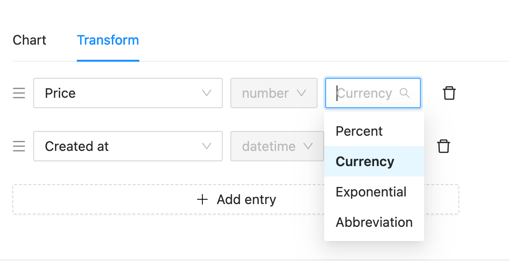

# 配置面板

图表的配置面板整体上划分为三个部分：数据配置、图表配置和图表预览。

## 数据配置

- 顶部下拉框代表当前正在配置的数据表 (Collection)，通过下拉菜单可以切换。
- 配置完成后，点击“执行查询” (Run query) 可以通过配置获取数据，“数据” (Data) 面板会展示数据。

### 度量 (Measures)

度量字段，通常是图表需要展示的核心数据。度量数据可以通过聚合函数进行统计，支持常用的数据库统计函数 `求和 (Sum)`,`计数 (Count)`,`平均值 (Avg)`,`最大值 (Max)`,`最小值 (Min)`. 度量字段可以有多个，可以设置别名。

### 维度 (Dimesions)

维度字段，通常是图表数据分组的依据。对于日期类型字段，支持如图所示的格式化方式，格式化通过数据库函数实现（例如：MySQL 对应 `date_format`），其他类型数据格式化见[数据转换](#数据转换)部分。

> **维度格式化 (Dimensions Format) VS 数据转换 (Transform)**
>
> - 维度格式化发生在获取最终数据之前，数据分组按照维度格式化后的值进行，通常在按时间段筛选数据时有此需求。
> - 数据转换对响应数据做进一步处理，诸如可读性处理，以展现恰当的数据，数据转换在前端进行。

### 筛选 (Filter)

筛选配置将对分组前的数据进行过滤。有“当前用户”和“当前日期”变量可供选择，给图表配置动态的筛选范围。

### 排序 (Sort) 和限制 (Limit)

默认数据集条数上限为 2000.

### 缓存

开启缓存后，图表将展示缓存的数据。

## 图表配置

- 图表类型 (Chart Type) - 用于展示的图表类型。NocoBase 使用 [G2Plot](https://g2plot.antv.antgroup.com/) 作为默认的图表库，想扩展使用其他图表库，可以参考[开发指南](../dev/index.md)。
- 基础配置 - 选择图表后，会出现相应的基础可视化配置，字段配置通常提供了下拉菜单供选择，选项中包含了 Collection 的基础字段和字段别名。
- JSON 配置 - 当基础配置不满足要求时，可以使用 JSON 配置其他图表属性。参考 [G2Plot 文档](https://g2plot.antv.antgroup.com/api/plot-api)。

## 数据转换

使用数据转换可以对接口响应的数据做进一步处理，目前支持转换处理的数据类型为 `number`,`date`,`time`,`datetime`, 对于不属于支持的数据类型的字段，可以手动选择为这几个类型，以使用对应的转换方法。
