# 使用手册（未订正）

## 文件存储管理

文件管理器插件是 NocoBase 内置核心插件，默认启用（无需进入插件管理界面开启），进入功能管理界面，默认存在一个本地文件夹的存储方式；管理界面可以新增编辑删除相应的存储服务信息。

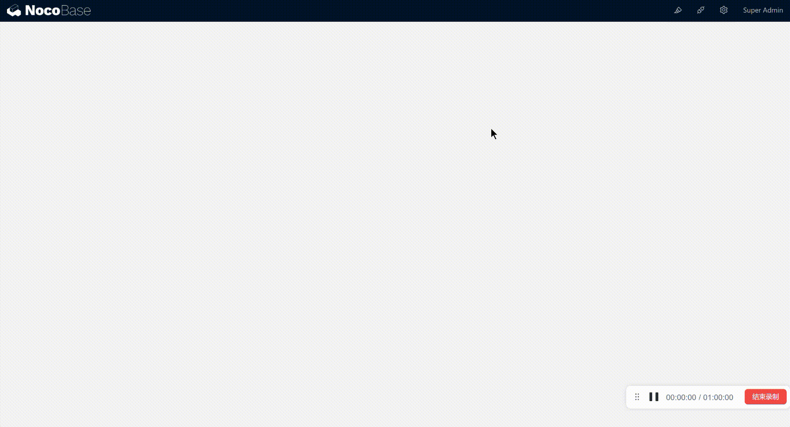

### 文件存储类型

文件存储可以增加以下类型存储服务：

#### local：本地

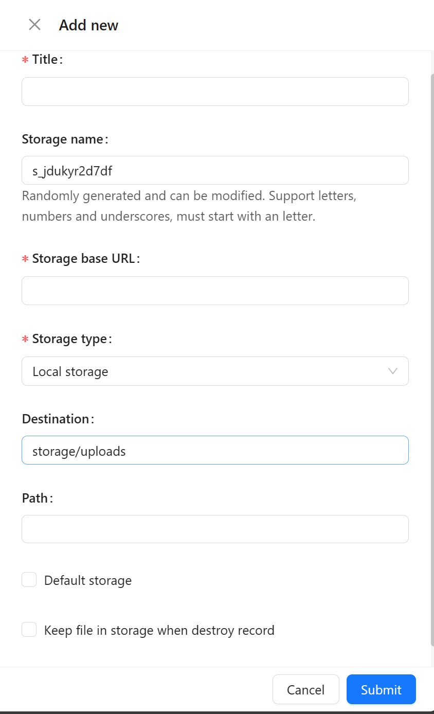

- <strong>Title</strong>: 存储服务标题
- <strong>Storage name</strong>: 存储空间标识，唯一不可修改
- <strong>Storage base URL</strong>：访问文件存储库 URL
- <strong>Storage type</strong>: 存储类型
- <strong>Path:</strong> 存储相对路径

- [ ] <strong>Default storage</strong>: 默认存储空间
- [ ] <strong>Keep file in storage when destroy record</strong>：删除记录时保留文件

#### oss：阿里云

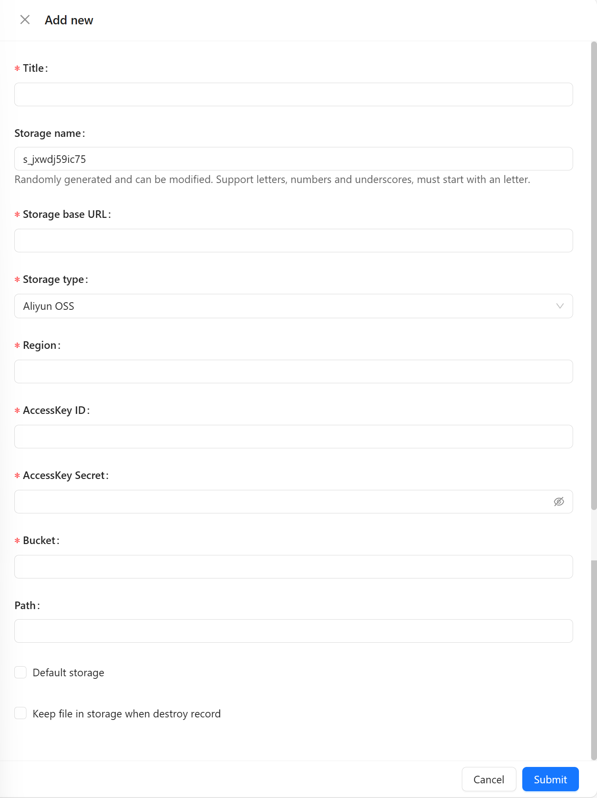

- <strong>Title</strong>: 存储服务标题
- <strong>Storage name</strong>: 存储空间标识，唯一不可修改
- <strong>Storage base URL</strong>：访问文件存储库 URL
- <strong>Storage type</strong>: 存储类型
- <strong>Region</strong>：区域
- <strong>AccessKey ID</strong>：阿里云 AccessKey
- <strong>AccessKey Secret</strong>：阿里云认证密钥
- <strong>Bucket</strong>：阿里云对象存储空间
- <strong>Path:</strong> 存储相对路径

- [ ] <strong>Default storage</strong>: 默认存储空间
- [ ] <strong>Keep file in storage when destroy record</strong>：删除记录时保留文件

#### s3：支持 amazon、cloudflare r2、minio

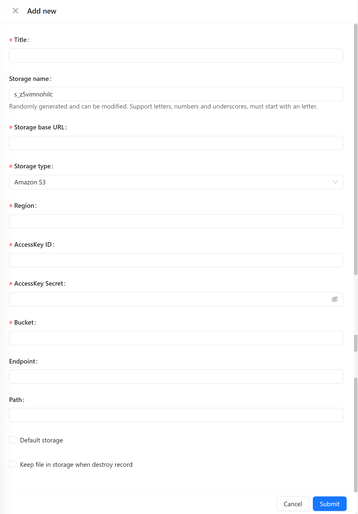

- <strong>Title</strong>: 存储服务标题
- <strong>Storage name</strong>: 存储空间标识，唯一不可修改
- <strong>Storage base URL</strong>：访问文件存储库 URL
- <strong>Storage type</strong>: 存储类型
- <strong>Region</strong>：区域
- <strong>AccessKey ID</strong>：s3 云 AccessKey
- <strong>AccessKey Secret</strong>：s3 云认证密钥
- <strong>Bucket</strong>：s3 云对象存储空间
- <strong>Endpoint</strong>：云存储端点
- <strong>Path:</strong> 存储相对路径

- [ ] <strong>Default storage</strong>: 默认存储空间
- [ ] <strong>Keep file in storage when destroy record</strong>：删除记录时保留文件

#### cos：腾讯云

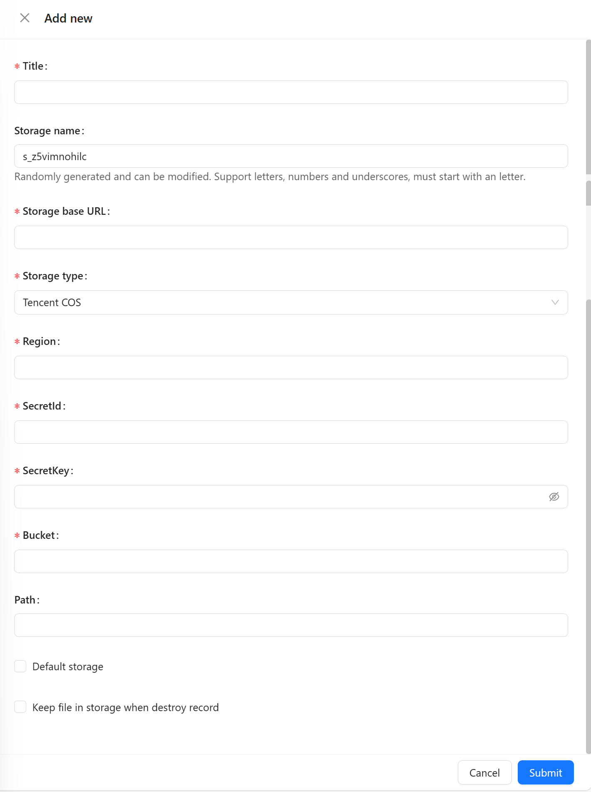

- <strong>Title</strong>: 存储服务标题
- <strong>Storage name</strong>: 存储空间标识，唯一不可修改
- <strong>Storage base URL</strong>：访问文件存储库 URL
- <strong>Storage type</strong>: 存储类型
- <strong>Region</strong>：区域
- <strong>Secretid</strong>：腾讯云身份标识
- <strong>SecretKey</strong>：腾讯云认证密钥
- <strong>Bucket</strong>：腾讯云对象存储空间
- <strong>Path:</strong> 存储相对路径

- [ ] <strong>Default storage</strong>: 默认存储空间
- [ ] <strong>Keep file in storage when destroy record</strong>：删除记录时保留文件

## 数据表模板及字段类型扩展

数据表主要由 plugin-collection-manager 插件提供，文件管理器插件基于 plugin-collection-manager 插件的扩展能力，增加了两种文件存储方式，附件字段和文件表。

### 附件字段

在已有的数据表中增加附件字段，再去区块中应用。

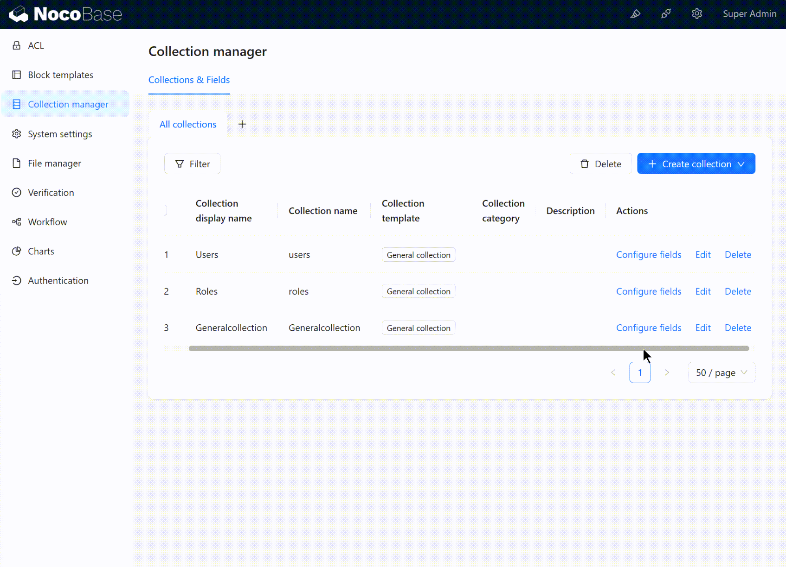

### 文件表

文件表在附件字段的基础把文件的元数据（文件名、扩展名、大小等）信息结构化存储在数据表，并把文件存储到文件存储对象；在数据表管理中增加文件表使用有两种方式：

方式 1 单独使用：可以上传、批量上传文件，管理文件资源；数据表管理中新建文件表，UI 页面中添加表格区块选择文件表，配置功能按钮。

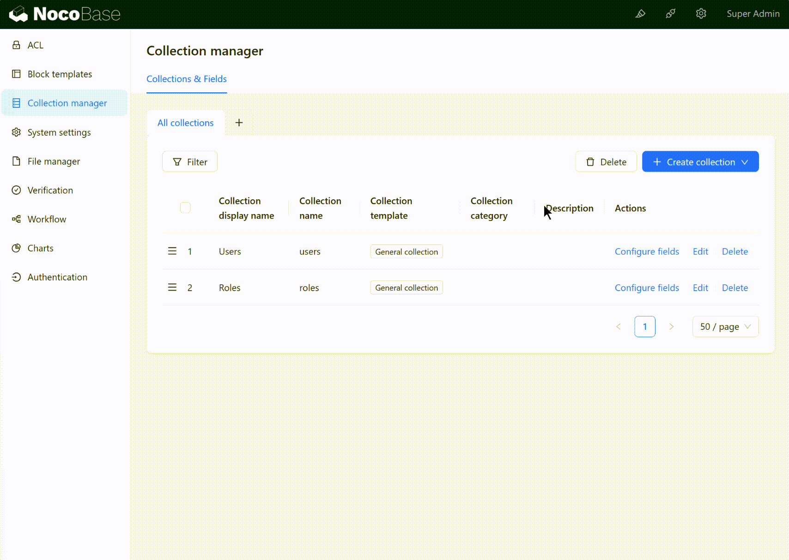

方式 2 关联使用：在具体的业务场景中作为业务的附件使用，如：员工，员工档案（学历学位资格证书等），数据表管理中新建员工表（普通表模板），员工档案表（文件表模板），建立员工多对多员工档案表关系，UI 页面中添加表单区块选择员工表，配置出关系字段，上传文件。

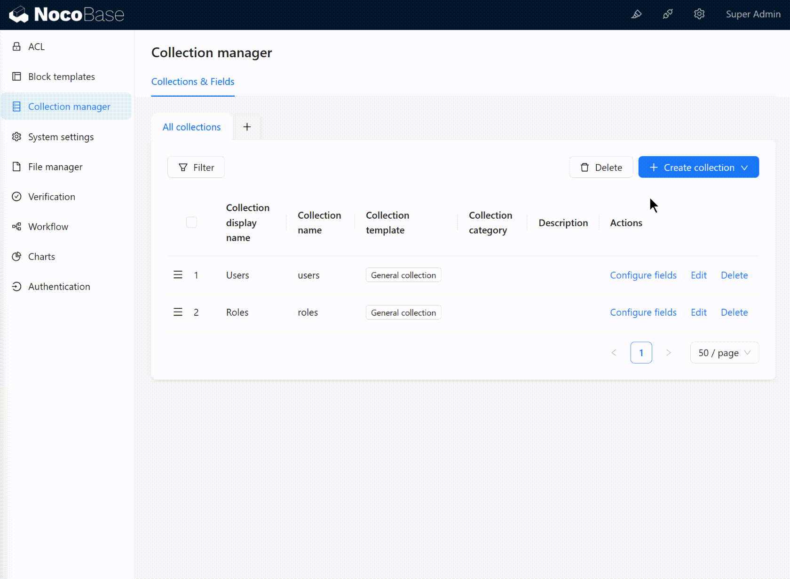

## 在 UI 里的应用

### 附件字段

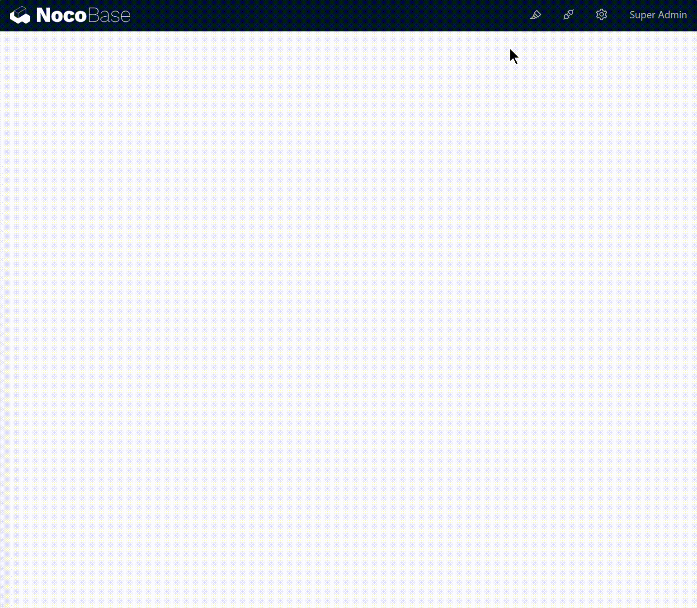

### 文件表

方式 1 单独使用：

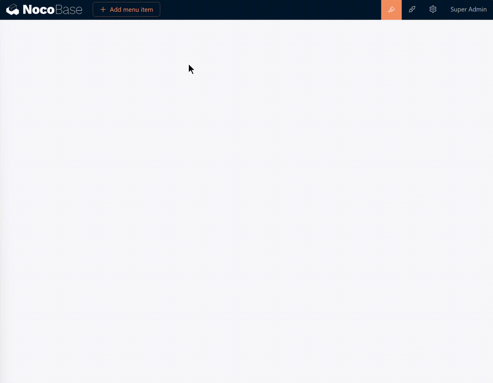

方式 2 关联使用：

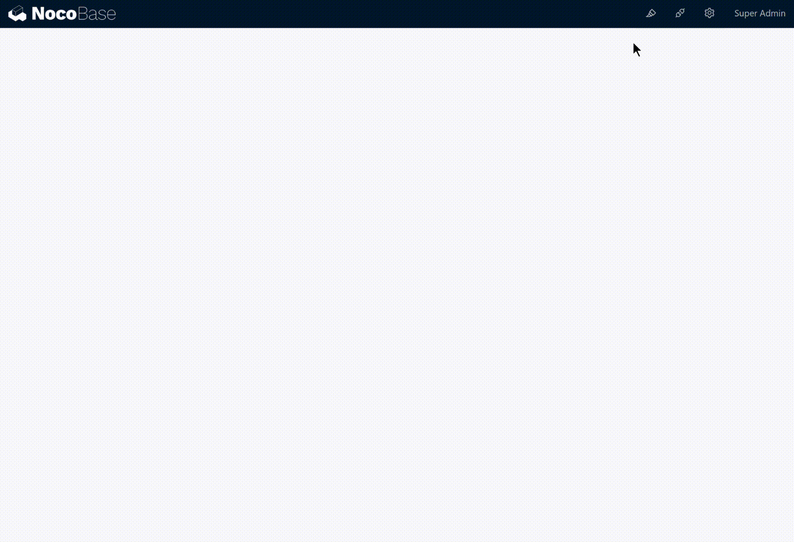
